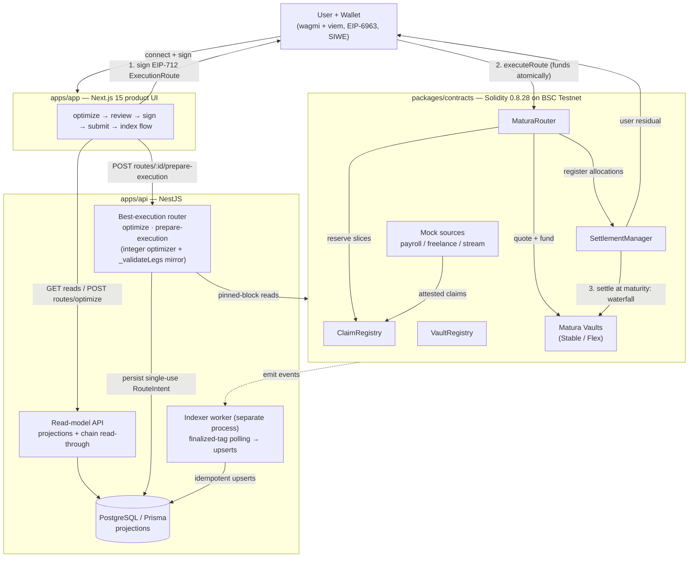

# Matura

**Matura is a best-execution liquidity router that aggregates verified future
payments, splits only the amount a user needs, and finds the most efficient
liquidity across competing onchain pools.**

> **Status: hackathon MVP prototype.** A demonstration on **BSC Testnet**
> (chain ID `97`). It is **not audited**, not licensed, and not
> production-ready; it does **not** legally transfer any receivable. It runs on
> synthetic demo data and a faucet-minted test token only. See
> [disclaimers](#security--regulatory--synthetic-data-disclaimers).

📖 **Full documentation:** **[docs.usematura.xyz](https://docs.usematura.xyz)** — concepts,
contracts, API, and the trust model. · 🔗 **Live:** [app](https://app.usematura.xyz) ·
[site](https://usematura.xyz)

---

## Contents

1. [The problem, the product, and why blockchain](#the-problem-the-product-and-why-blockchain)
2. [Architecture](#architecture)
3. [Monorepo map](#monorepo-map)
4. [Local quick start](#local-quick-start)
5. [BSC-Testnet deployment](#bsc-testnet-deployment)
6. [Demo scenarios A & B](#demo-scenarios-a--b)
7. [Contract responsibilities & trust assumptions](#contract-responsibilities--trust-assumptions)
8. [Security / regulatory / synthetic-data disclaimers](#security--regulatory--synthetic-data-disclaimers)
9. [Tests](#tests)
10. [Scope: implemented / mocked / future](#scope-implemented--mocked--future)
11. [Known limitations](#known-limitations)
12. [Independent deployments](#independent-deployments)

---

## The problem, the product, and why blockchain

### Problem

People and businesses routinely hold **future payments they have already
earned** — accrued payroll, an approved freelance-escrow payout, an onchain
token stream — but cannot access that value until it matures. Existing advance
products underwrite each claim in isolation, force the holder to assign an
entire receivable when only part of it is needed, and give no visibility into
whether the price offered is competitive.

### Product

Matura treats a holder's heterogeneous future payments as a single portfolio
and answers one question well: **fund the amount I need right now, as cheaply as
verifiably possible.** Concretely, it:

- **aggregates** verified future payments (Matura Claims) into one Matura
  Account;
- **splits** only the minimum face-value slice required to cover the requested
  advance — it never assigns a whole claim when part of it is enough;
- **routes** the request across **competing Matura Vaults** with genuinely
  different pricing and eligibility mandates, selecting the cheapest feasible
  combination via a deterministic best-execution optimizer;
- **funds** the user atomically in stablecoin through the Matura Router;
- at maturity, **settles** directly from the issuer's payment through the
  SettlementManager, distributing the financed portion to the vaults and
  returning the unassigned remainder to the user under a strict conservation
  check.

### Why blockchain is necessary

- **Verifiable claim provenance.** Each claim is an EIP-712 attestation signed
  by an allowlisted issuer and recorded onchain — the router prices against a
  claim whose origin and state anyone can independently verify, not a private
  ledger entry.
- **Atomic, non-custodial funding.** A multi-leg route across several vaults
  either funds completely in one transaction or reverts. Matura never holds a
  user key or user funds; every write is prepared as unsigned calldata / typed
  data and signed by the user's own wallet.
- **Trust-minimized settlement conservation.** The waterfall
  (`received = vault distributions + user residual + protocol fee`) is enforced
  by the contract, so no off-chain party can silently divert value.
- **Composable competing liquidity.** Vaults with distinct mandates quote the
  same request onchain, and the winning route recomputes each quote on-chain at
  execution — best-execution is provable, not asserted.

---

## Architecture

A pnpm + Turborepo monorepo. The wallet-connected app prepares a request; the
API's read-model and deterministic best-execution router select and validate a
route; the user signs it; the contracts fund and later settle it; a separate
indexer worker projects onchain events back into the read model.



The **optimize → prepare → sign → execute → settle** path runs left-to-right:
the app asks the router to optimize, the router persists a single-use
`RouteIntent` and returns signable typed data, the user signs and calls
`executeRoute`, and the SettlementManager settles at maturity. The **indexer
worker** is a distinct process that polls finalized blocks and projects events
into Postgres, so every read the app makes is served from a reconciled
projection.

Full design: [`docs/architecture.md`](docs/architecture.md),
[`docs/routing.md`](docs/routing.md),
[`docs/decisions.md`](docs/decisions.md).

---

## Monorepo map

| Path                         | Purpose                                                                                                                           |
| ---------------------------- | --------------------------------------------------------------------------------------------------------------------------------- |
| `apps/api`                   | NestJS orchestration + read-model: indexer worker, projections, non-custodial write-prep, best-execution router, SIWE auth.       |
| `apps/app`                   | Next.js 15 wallet-connected product (`app.usematura.xyz`) — the optimize→sign→submit flow, SIWE session, typed API client.        |
| `apps/landing`               | Next.js 15 static marketing site (`usematura.xyz`) — wallet-free, lint- and CI-grep-guarded to hold no wallet/chain code.         |
| `apps/docs`                  | Next.js 15 docs site (`docs.usematura.xyz`), Fumadocs — wallet-free; authored guides + a build-generated reference mirror.        |
| `apps/e2e`                   | Playwright: always-on landing suite + gated product happy-path (viem signer injected as an EIP-6963 provider).                    |
| `apps/e2e-stack`             | Cross-stack reconciliation e2e — boots node + Postgres + worker + API and reconciles events ↔ DB ↔ balances.                      |
| `packages/contracts`         | Hardhat 3 / Solidity 0.8.28 + OpenZeppelin 5.6.1 — the Matura Protocol contracts, deploy/seed/verify scripts.                     |
| `packages/chain`             | tsup dual CJS/ESM build: BSC-Testnet chain def, generated ABIs, per-chain deployment manifests, EIP-712 typed data, viem helpers. |
| `packages/shared`            | Framework-free Zod schemas + domain types, enum ordinals, and the pure integer best-execution optimizer.                          |
| `packages/ui`                | Tailwind v4 design tokens + low-level primitives shared by app, landing, and docs (wallet-free).                                  |
| `packages/eslint-config`     | ESLint 9 flat, type-aware (`strictTypeChecked` + `projectService`) — repo-wide no-`any`.                                          |
| `packages/typescript-config` | Shared strict `tsconfig` bases (base / library / nextjs / nestjs).                                                                |

---

## Local quick start

### Node 24 (keg-only, not the machine default)

Hardhat 3 needs an even-LTS Node (22.13+ / 24); the repo pins `<25`. Node 24 is
installed keg-only, so put it on PATH first:

```bash
export PATH="/opt/homebrew/opt/node@24/bin:$PATH"   # verify: node -v → v24.x
```

### Install and run the local chain + demo

```bash
pnpm install

# Terminal 1 — local Hardhat chain
pnpm --filter @matura/contracts node

# Terminal 2 — deploy → seed → verify against the local chain
pnpm --filter @matura/contracts demo:local

# Reset to a clean, freshly-seeded state at any time
pnpm --filter @matura/contracts demo:reset:full
```

> `demo:reset:full` (clean re-seed to a known state) and
> `smoke:bsc-testnet` (below) are **added in this same effort** — if a command
> is missing, pull `main`.

### Run the apps (dev)

```bash
pnpm --filter @matura/app dev        # product app  → http://localhost:3002
pnpm --filter @matura/landing dev    # marketing     → http://localhost:3001
pnpm --filter @matura/docs dev       # docs site     → http://localhost:3003
pnpm --filter @matura/api dev         # HTTP API      (nest start --watch)
pnpm --filter @matura/api worker:dev  # indexer worker (separate process)
pnpm --filter @matura/api db:migrate  # prisma migrate dev (needs Postgres)
```

### Pre-demo readiness check (BSC Testnet)

```bash
pnpm --filter @matura/contracts smoke:bsc-testnet   # readiness check before a live demo
```

Full deploy/seed/faucet flow: [`packages/contracts/README.md`](packages/contracts/README.md).

---

## BSC-Testnet deployment

Network: **BSC Testnet** (chain ID `97`). Deployment block: **133632667**.
Addresses come from the generated manifest
[`packages/chain/src/deployments/97.json`](packages/chain/src/deployments/97.json)
(written by the deploy script, never hand-edited).

| Contract / slot         | Address                                      | Explorer                                                                               |
| ----------------------- | -------------------------------------------- | -------------------------------------------------------------------------------------- |
| MockUSDT                | `0x160d49be56a24e637d4084867133650ED31c9377` | [view](https://testnet.bscscan.com/address/0x160d49be56a24e637d4084867133650ED31c9377) |
| IssuerRegistry          | `0xe28bF3D985f883605F4B384b5aea54006890b97B` | [view](https://testnet.bscscan.com/address/0xe28bF3D985f883605F4B384b5aea54006890b97B) |
| ClaimRegistry           | `0x4208B8336024649492D2E57493a551fC96Ed5aA4` | [view](https://testnet.bscscan.com/address/0x4208B8336024649492D2E57493a551fC96Ed5aA4) |
| VaultRegistry           | `0xF4d63f3d62c5d4D6122b6cb6C768f8d8D8daFC0e` | [view](https://testnet.bscscan.com/address/0xF4d63f3d62c5d4D6122b6cb6C768f8d8D8daFC0e) |
| MaturaRouter            | `0xaA685233Cf2334d53523fFaA368B36528f0cD955` | [view](https://testnet.bscscan.com/address/0xaA685233Cf2334d53523fFaA368B36528f0cD955) |
| SettlementManager       | `0x74c25a326542D55434527fB3E43DF3D4a9397783` | [view](https://testnet.bscscan.com/address/0x74c25a326542D55434527fB3E43DF3D4a9397783) |
| Stable Vault            | `0x897fa1b8651f21caCd5d4D50d740aF5CA6a137c5` | [view](https://testnet.bscscan.com/address/0x897fa1b8651f21caCd5d4D50d740aF5CA6a137c5) |
| Flex Vault              | `0x1853E27c413621Cf73A3B4aa69521dEaA48d276F` | [view](https://testnet.bscscan.com/address/0x1853E27c413621Cf73A3B4aa69521dEaA48d276F) |
| Payroll source          | `0x65A476F86b3d621ecB5353c3b4c3FBa0d24F3416` | [view](https://testnet.bscscan.com/address/0x65A476F86b3d621ecB5353c3b4c3FBa0d24F3416) |
| Freelance-escrow source | `0x510d2b9579025f275dD46C807e1e9Edb1b147b30` | [view](https://testnet.bscscan.com/address/0x510d2b9579025f275dD46C807e1e9Edb1b147b30) |
| Stream source           | `0x7d6b72f9443F4C0015B41097248AC598e74F59E8` | [view](https://testnet.bscscan.com/address/0x7d6b72f9443F4C0015B41097248AC598e74F59E8) |

Live addresses and per-deploy notes: `docs/deployment-runbook.md` (gitignored,
updated each deploy).

---

## Demo scenarios A & B

Money is **6-dp MockUSDT** base units; amounts below are shown in whole mUSDT.
All demo data is defined once in
[`packages/contracts/config/demo.ts`](packages/contracts/config/demo.ts) and the
vault mandates in
[`packages/contracts/config/vault-mandates.ts`](packages/contracts/config/vault-mandates.ts).

### Alice's portfolio (all ELIGIBLE after seed)

| Claim             | Type               | Face value                                  | Due              | Source                       |
| ----------------- | ------------------ | ------------------------------------------- | ---------------- | ---------------------------- |
| `alice-payroll`   | `PAYROLL`          | **20,000** mUSDT                            | 30 days          | Payroll (signed attestation) |
| `alice-freelance` | `FREELANCE_ESCROW` | **15,000** mUSDT                            | 45 days          | Freelance-escrow adapter     |
| `alice-stream`    | `STREAM`           | 20,000 deposit → **~10,000** vested at seed | ~30 days to stop | Stream adapter               |

The stream started 30 days ago over a 60-day schedule, so ≈50% (≈10,000 mUSDT)
has vested at seed time; the registered face is read from chain (vested minus
withdrawn), not asserted exact.

### The two competing vaults

| Vault        | Eligible claim types                 | Base discount | Max duration | Per-leg face        | Notes                                                                      |
| ------------ | ------------------------------------ | ------------- | ------------ | ------------------- | -------------------------------------------------------------------------- |
| Stable Vault | `PAYROLL`, `STREAM` (bitmap `0b101`) | **50 bps**    | 90 days      | 100 – 50,000 mUSDT  | Conservative, cheapest; excludes freelance escrow                          |
| Flex Vault   | all three types (bitmap `0b111`)     | **150 bps**   | 365 days     | 100 – 200,000 mUSDT | Broader mandate, higher discount; only vault that takes `FREELANCE_ESCROW` |

Because `FREELANCE_ESCROW` is not in Stable's supported-types bitmap, a freelance
claim can **only** route through Flex — while a payroll claim is eligible in both
and is therefore cheapest on Stable (50 bps base vs 150 bps).

### Request A — partial payroll slice (single leg, cheapest vault)

- `targetAdvance` = **4,800** mUSDT, `maxTotalFace` = 6,000 mUSDT,
  `eligibleClaims` = `[alice-payroll]`.
- The advance is well under the 20,000 face, so one partial slice of the payroll
  claim suffices. The optimizer picks the **cheapest** eligible vault — **Stable
  (50 bps base)** — and funds a single leg.

### Request B — multi-claim route across competing pools (two vaults, two sources)

- `targetAdvance` = **24,000** mUSDT, `maxTotalFace` = 40,000 mUSDT,
  `eligibleClaims` = `[alice-payroll, alice-freelance]`.
- The target exceeds any single claim's face, so no single claim's advance can
  reach it — the route **must** combine ≥2 claims. Payroll routes to **Stable**
  (cheapest for `PAYROLL`); freelance is `FREELANCE_ESCROW`, so it is
  **Flex-only**. The result spans **two sources and two vaults** — the
  best-execution-across-competing-pools story.

> Request B deliberately uses **payroll + freelance** (not the stream claim),
> so the scenario always seeds ELIGIBLE on testnet even under a
> `SEED_BENEFICIARY` override.

---

## Contract responsibilities & trust assumptions

Solidity 0.8.28 + OpenZeppelin 5.6.1; custom errors + NatSpec; CEI + SafeERC20 +
`ReentrancyGuardTransient`; OZ AccessControl role separation; no proxies.

| Contract                                           | Role                                                                                                                                                  |
| -------------------------------------------------- | ----------------------------------------------------------------------------------------------------------------------------------------------------- |
| `MockUSDT`                                         | Faucet-enabled test ERC-20 (6 decimals) — the single settlement token in this MVP.                                                                    |
| `IssuerRegistry`                                   | Issuer + signer allowlist and active status; the source of truth for who may attest.                                                                  |
| `ClaimRegistry`                                    | EIP-712 attestation intake, canonical claim state, financed-face accounting; slices are reserved (router) vs released (settlement).                   |
| `VaultRegistry`                                    | Enumerable registry of active Matura Vaults; the app enumerates vaults on-chain from here.                                                            |
| Matura Vaults (`LiquidityVault` ×N)                | Demo capital, per-vault mandate + pricing policy, quote calculation, funding accounting. Deployed as Stable and Flex.                                 |
| `MaturaRouter`                                     | Validates the signed EIP-712 `ExecutionRoute`, **recomputes each vault quote on-chain**, reserves slices, and funds the user atomically.              |
| `SettlementManager`                                | Maturity-gated settlement waterfall: accepts the issuer's payment and distributes vault allocations + user residual + fee under a conservation check. |
| Mock sources (payroll / freelance-escrow / stream) | Demo claim originators — a signed-payroll obligor, a `MockFreelanceEscrow`, and a stream adapter — that mint attested claims.                         |

**Trust assumptions (testnet MVP):**

- **Mock issuers attest.** Claims are only as trustworthy as the allowlisted
  demo signers; there is no real-world underwriting or off-chain enforcement.
- **Permissioned vaults.** Vault capital, mandates, and pricing are operator-set
  demo values, not an open LP market.
- **Mock stablecoin.** Funding and settlement move faucet-minted MockUSDT, not
  real value.
- **Role separation is a hard invariant.** The reserve (router) vs release
  (settlement) split means no single address can both reserve and release a
  slice.

Full posture: [`docs/threat-model.md`](docs/threat-model.md) and
[`SECURITY.md`](SECURITY.md).

---

## Security / regulatory / synthetic-data disclaimers

- **Testnet only.** BSC Testnet (chain ID `97`). No mainnet deployment, no real
  funds.
- **Synthetic data.** All claims, issuers, and balances are demo fixtures; no
  PII or real payment documents are stored — only hashes and synthetic metadata.
- **Not audited.** The contracts have not undergone a third-party security
  audit. Do not rely on them for anything of value.
- **No legal assignment.** Nothing here effects a legal transfer or assignment
  of any receivable. There is no KYC/KYB, no fiat on/off-ramp, and no consumer
  lending. This is an engineering demonstration, not a financial product.

---

## Tests

```bash
pnpm build | lint | typecheck | test                       # turbo, whole monorepo
pnpm --filter @matura/contracts contracts:test             # unit + integration + fuzz + gas
pnpm --filter @matura/contracts typecheck                  # hardhat compile && tsc --noEmit
pnpm --filter @matura/api test:int                         # Testcontainers integration (needs Docker)
pnpm --filter @matura/app test                             # vitest (tx reducer, chain bridge, money format)
pnpm --filter @matura/e2e test:e2e                         # Playwright: landing always; product needs E2E_STACK=1
pnpm --filter @matura/e2e-stack test:e2e:stack             # cross-stack reconciliation e2e (needs Docker)
pnpm --filter @matura/e2e check:bundle                     # assert built landing bundle has no wallet/chain code or secrets
```

CI order: build → lint → typecheck → test → contracts:compile → contracts:test →
ABI-freshness gate → manifest-freshness gate → demo-fixture-freshness gate.

**Current results:** see [`docs/test-report.md`](docs/test-report.md).

---

## Scope: implemented / mocked / future

**Implemented**

- Full onchain protocol: registries, two competing vaults, router, settlement
  manager, with EIP-712 attestations and a conservation-checked settlement
  waterfall.
- Deterministic best-execution router (bounded exact integer search + greedy
  fallback) with pinned-block re-validation via a shared off-chain
  `_validateLegs` mirror and single-use `RouteIntent`.
- Non-custodial write-preparation (unsigned calldata / EIP-712 typed data),
  SIWE auth, per-wallet rate limiting.
- Separate-process indexer worker projecting finalized events into
  Postgres/Prisma; read endpoints served from reconciled projections.
- Wallet-connected product app (optimize → review → sign → submit → index) and a
  static, wallet-free marketing site.
- Live BSC-Testnet deployment; local demo (`demo:local`), reset
  (`demo:reset:full`), and settlement (`demo:settle`) flows; cross-stack e2e.

**Mocked**

- Issuers and their attestations (allowlisted demo signers).
- Stablecoin (faucet-minted 6-dp MockUSDT).
- Claim sources (payroll obligor, freelance escrow, stream adapter).
- Vault capital, mandates, and pricing (operator-set demo values).

**Future**

- Real issuer integrations, KYC/KYB, and legal assignment of receivables.
- An open vault/LP market instead of permissioned demo vaults.
- Multi-token settlement (a deliberate future migration, not a config tweak).
- Optimizer scale beyond the current bounded exact search + greedy fallback.
- Fiat rails, mainnet deployment, and a third-party security audit.

---

## Known limitations

Stated plainly, not softened:

- **Mock issuers** — claims depend entirely on allowlisted demo signers.
- **Mock stablecoin** — funding/settlement use faucet-minted 6-dp MockUSDT.
- **Permissioned vaults** — no open LP deposits; capital and pricing are
  operator-set.
- **No legal assignment** of receivables and **no real KYC/KYB**.
- **No fiat rails.**
- **Limited optimizer scale** — bounded exact search with a greedy fallback.
- **Unaudited contracts.**
- **BSC-Testnet only.**

---

## Independent deployments

Three separate Next.js apps, deployed independently:

- **[`usematura.xyz`](https://usematura.xyz)** — the marketing / landing site
  (`apps/landing`): static, wallet-free, and CI-guarded to contain no wallet or
  chain code.
- **[`app.usematura.xyz`](https://app.usematura.xyz)** — the wallet-connected
  product app (`apps/app`): wagmi + viem (BSC Testnet only), SIWE session, and
  the full best-execution request flow.
- **[`docs.usematura.xyz`](https://docs.usematura.xyz)** — the documentation
  site (`apps/docs`): a Fumadocs site, static and wallet-free, covering the
  concepts, contracts, API, and trust model.
