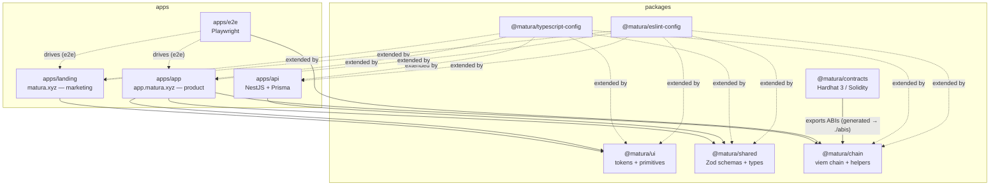
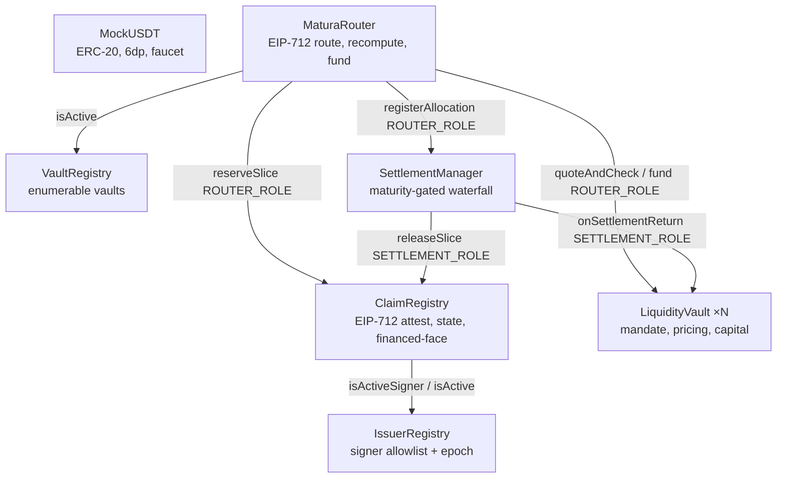

# Architecture

Matura is a pnpm + Turborepo monorepo. This document records the package
boundaries and why they exist. It describes the **foundation** — interfaces and
shells only; business contracts, routing, and settlement logic land in later work.

## Component map

## Packages

| Package                     | Responsibility                                                                                                                                                                                                                                                                                                        | Build                      | Consumed by                 |
| --------------------------- | --------------------------------------------------------------------------------------------------------------------------------------------------------------------------------------------------------------------------------------------------------------------------------------------------------------------- | -------------------------- | --------------------------- |
| `@matura/shared`            | Framework-free Zod schemas + inferred domain types (claims, quotes, routes, settlement, errors), branded value types.                                                                                                                                                                                                 | **tsup** (CJS+ESM+`.d.ts`) | api, app                    |
| `@matura/chain`             | BSC Testnet chain definition, address schema, deployment manifest, viem client factories, 6-decimal unit helpers, ABIs + EIP-712 typed-data. `sideEffects:false` so consumers tree-shake unused ABIs.                                                                                                                 | **tsup** (CJS+ESM+`.d.ts`) | app, e2e                    |
| `@matura/ui`                | Tailwind v4 design tokens (`globals.css`) + low-level primitives (button, badge, layout).                                                                                                                                                                                                                             | JIT (raw `.tsx`)           | app, landing                |
| `@matura/contracts`         | Hardhat 3 (Solidity + viem + `node:test`). Empty at foundation; compiles zero contracts.                                                                                                                                                                                                                              | Hardhat                    | (chain, later)              |
| `@matura/typescript-config` | Shared strict `tsconfig` bases (base / library / nextjs / nestjs).                                                                                                                                                                                                                                                    | —                          | all                         |
| `@matura/eslint-config`     | ESLint 9 flat config, type-aware (`strictTypeChecked`) for real no-`any`.                                                                                                                                                                                                                                             | —                          | all                         |
| `apps/api`                  | Orchestration + read-model: viem indexer worker → Prisma/PostgreSQL projections; read + non-custodial prepare endpoints; deterministic best-execution router (`routes/*`, pinned reads + shared `_validateLegs` mirror + single-use `RouteIntent`); SIWE auth; `/api/v1` + health; Swagger (dev).                     | nest (CJS)                 | `@matura/{chain,shared}`    |
| `apps/app`                  | Next.js 15 product app; wallet/network infra (wagmi + viem, EIP-6963) lives **only** here. Typed API client (`src/lib/api`), SIWE session, `bridge.ts` brand→viem, per-tx reducer + `useTxFlow`, react-query hooks (`src/lib/queries`). Routes: account / request (best-execution flow) / activity / vaults / issuer. | next                       | `@matura/{chain,shared,ui}` |
| `apps/landing`              | Next.js 15 marketing site; **static**, wallet-free (lint + CI-bundle-grep guarded). Approved copy IA + SEO/OG/sitemap/robots/JSON-LD; CSP + security headers.                                                                                                                                                         | next                       | `@matura/ui`                |
| `apps/e2e`                  | Playwright: always-on landing suite + gated (`E2E_STACK=1`) product happy-path via a Node-side viem signer injected as an EIP-6963 provider. Also a built-bundle wallet/secret-leak check.                                                                                                                            | —                          | `@matura/chain`             |

## Boundary rules (enforced)

- `@matura/shared` imports no NestJS / Next.js / Prisma / Hardhat — pure TS + Zod
  (lint-guarded). It is **built** (not JIT) because the CommonJS API `require()`s
  it at runtime.
- `apps/landing` **and `@matura/ui`** must not import `wagmi`, `viem`, `@matura/chain`, or
  `@tanstack/react-query` (lint-guarded in both, so a leak into a shared primitive is caught at
  the source), and a CI grep asserts the built landing bundle contains no wallet/chain code.
- Both Next apps forbid reading secret env vars (`DEPLOYER_PRIVATE_KEY`,
  `ISSUER_PRIVATE_KEY`, `DATABASE_URL`, `BSC_TESTNET_RPC_URL`) via lint.
- No generated ABI is hand-copied — `@matura/chain` exposes contract ABIs + EIP-712 typed data
  through its `./abis` and `./eip712` subpaths, consumed by `apps/app`.
- Base-unit amounts cross APIs as decimal strings; dates as ISO 8601; contracts
  use Unix seconds. Addresses are lowercase for DB lookup, case-preserved for display.
- Cross-domain links use `NEXT_PUBLIC_LANDING_URL` / `NEXT_PUBLIC_APP_URL`.
- No private keys in bundles, logs, committed files, or API responses.

## Smart contracts (P0)

Seven contracts in `@matura/contracts` (Solidity 0.8.28, OpenZeppelin 5.6.1),
built against a frozen set of interfaces so they compose cleanly. Trust
assumptions and mitigations: `docs/threat-model.md`.

**Flow.** An allowlisted issuer signs an EIP-712 `ClaimAttestation`
(`ClaimRegistry.registerClaim` → `ATTESTED`); a reviewer marks it `ELIGIBLE`.
`apps/api`'s **best-execution router** then selects the cheapest verifiable
`ExecutionRoute` for the user (pure integer optimizer in `@matura/shared`;
pinned-block collection + one shared off-chain `_validateLegs` mirror; single-use
`RouteIntent`) and hands back the typed data — see `docs/routing.md`. The
user signs that EIP-712 `ExecutionRoute`; `MaturaRouter.executeRoute` recomputes each
vault quote on-chain, reserves slices, and funds the user atomically
(`PARTIALLY_FUNDED`/`FUNDED`), registering allocations in `SettlementManager`. At
maturity anyone marks the claim `MATURED`; the issuer (or any payer) settles by
paying `faceValue (+ optional fee surcharge)`, which distributes financed face to
each vault, the residual to the beneficiary, the fee to the treasury, and marks the
claim `PAID` under a strict conservation check.

**Roles (OZ AccessControl).** `DEFAULT_ADMIN_ROLE` (deployer/multisig),
`ISSUER_ADMIN_ROLE`, `CLAIM_REVIEWER_ROLE`, `ROUTER_ROLE` (→ router),
`SETTLEMENT_ROLE` (→ settlement), `PAUSER_ROLE`. The reserve (router) vs release
(settlement) split is a hard invariant — no address holds both.

**Enum ordinals are law.** Solidity `ClaimTypes`/`ClaimStates` ordinals mirror
`@matura/shared` `CLAIM_TYPES`/`CLAIM_STATES`; parity tests
(`packages/contracts/test/EnumParity.test.ts` reads the Solidity source,
`apps/api/src/enum-parity.spec.ts` checks Zod ⇄ Prisma) keep the layers in sync.

**Single settlement token (P0).** `ClaimRegistry`, `SettlementManager`, and
`MaturaRouter` are each constructed with one MockUSDT address, and `AddressBook`
carries one token slot — the deployed topology is single-token even though
`Claim.token`/`VaultSummary.token` are per-entity. Multi-token is a deliberate
future migration (per-token router/settlement or a token dimension in the
manifest), not a config tweak.

**Artifacts.** `pnpm --filter @matura/contracts contracts:export-abis` regenerates
`@matura/chain/src/abis/*.ts` (`as const`) from compiled artifacts — never
hand-copied. Deployed addresses live in per-chain manifests
`@matura/chain/src/deployments/<chainId>.json` (written atomically by the deploy
script, Zod-validated, **never hand-edited**) + a codegen'd `deployments.generated.ts`;
`deployments.ts` exposes typed accessors (`getDeployment`/`getManifest`/`getNamedVaults`/
`getSources`). `AddressBook` carries the 6 core slots (incl. `vaultRegistry`) and the app
enumerates individual vaults on-chain via `VaultRegistry.getVaults()`; the manifest also
records the two named demo vaults and the source obligors as convenience pointers.

## Toolchain

- **Node 24 LTS** (pinned via `.nvmrc` + `engines`; Node 25 breaks Hardhat 3).
- pnpm 10 workspaces with a version **catalog**; Turborepo `tasks` pipeline.
- Type-aware ESLint enforces no-`any` repo-wide.
- `lefthook` pre-commit runs prettier + a guarded `gitleaks` scan; CI mirrors the
  full verification (build → lint → typecheck → test → contracts) on Node 24.
