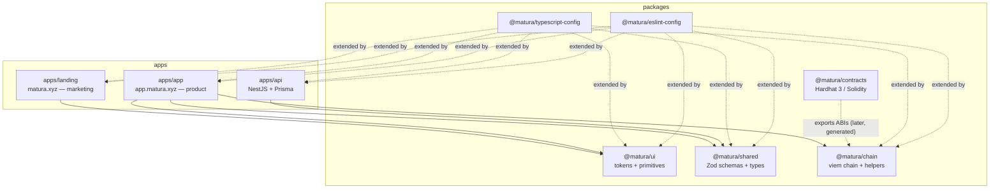

# Architecture

Matura is a pnpm + Turborepo monorepo. This document records the package
boundaries and why they exist. It describes the **foundation** — interfaces and
shells only; business contracts, routing, and settlement logic land in later work.

## Component map

## Packages

| Package                     | Responsibility                                                                                                        | Build                      | Consumed by    |
| --------------------------- | --------------------------------------------------------------------------------------------------------------------- | -------------------------- | -------------- |
| `@matura/shared`            | Framework-free Zod schemas + inferred domain types (claims, quotes, routes, settlement, errors), branded value types. | **tsup** (CJS+ESM+`.d.ts`) | api, app       |
| `@matura/chain`             | BSC Testnet chain definition, address schema, deployment manifest, viem client factories, 6-decimal unit helpers.     | JIT (raw `.ts`)            | app            |
| `@matura/ui`                | Tailwind v4 design tokens (`globals.css`) + low-level primitives (button, badge, layout).                             | JIT (raw `.tsx`)           | app, landing   |
| `@matura/contracts`         | Hardhat 3 (Solidity + viem + `node:test`). Empty at foundation; compiles zero contracts.                              | Hardhat                    | (chain, later) |
| `@matura/typescript-config` | Shared strict `tsconfig` bases (base / library / nextjs / nestjs).                                                    | —                          | all            |
| `@matura/eslint-config`     | ESLint 9 flat config, type-aware (`strictTypeChecked`) for real no-`any`.                                             | —                          | all            |
| `apps/api`                  | NestJS REST API, Prisma/PostgreSQL projections, `/api/v1` + health, Swagger (dev).                                    | nest (CJS)                 | —              |
| `apps/app`                  | Next.js 15 product app; wallet/network infra (wagmi + viem) lives **only** here.                                      | next                       | —              |
| `apps/landing`              | Next.js 15 marketing site; statically optimizable, wallet-free.                                                       | next                       | —              |

## Boundary rules (enforced)

- `@matura/shared` imports no NestJS / Next.js / Prisma / Hardhat — pure TS + Zod
  (lint-guarded). It is **built** (not JIT) because the CommonJS API `require()`s
  it at runtime.
- `apps/landing` must not import `wagmi`, `viem`, `@matura/chain`, or
  `@tanstack/react-query` (lint-guarded).
- Both Next apps forbid reading secret env vars (`DEPLOYER_PRIVATE_KEY`,
  `ISSUER_PRIVATE_KEY`, `DATABASE_URL`, `BSC_TESTNET_RPC_URL`) via lint.
- No generated ABI is hand-copied — `@matura/chain` will consume
  `@matura/contracts` artifacts through a dedicated `./abis` subpath (later).
- Base-unit amounts cross APIs as decimal strings; dates as ISO 8601; contracts
  use Unix seconds. Addresses are lowercase for DB lookup, case-preserved for display.
- Cross-domain links use `NEXT_PUBLIC_LANDING_URL` / `NEXT_PUBLIC_APP_URL`.
- No private keys in bundles, logs, committed files, or API responses.

## Toolchain

- **Node 24 LTS** (pinned via `.nvmrc` + `engines`; Node 25 breaks Hardhat 3).
- pnpm 10 workspaces with a version **catalog**; Turborepo `tasks` pipeline.
- Type-aware ESLint enforces no-`any` repo-wide.
- `lefthook` pre-commit runs prettier + a guarded `gitleaks` scan; CI mirrors the
  full verification (build → lint → typecheck → test → contracts) on Node 24.
