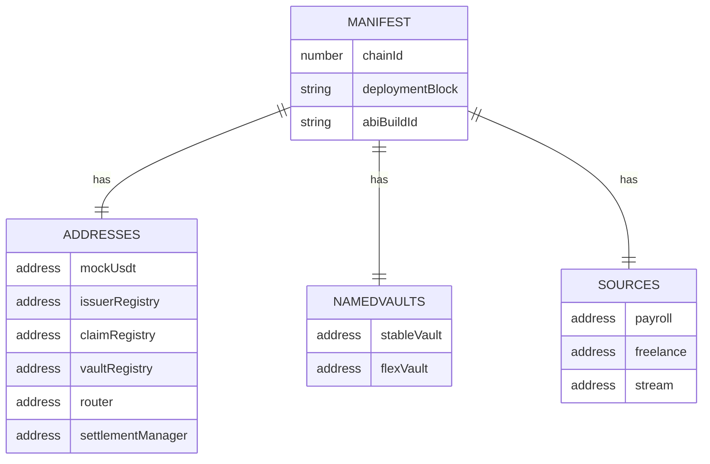
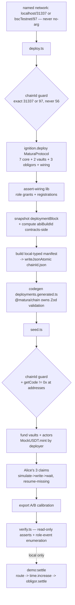
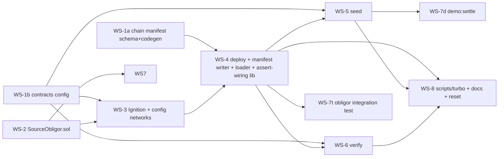

# ✨ feat: Repeatable Deployment & Seed System (Local + BSC Testnet)

## Enhancement Summary

**Deepened on:** 2026-09-25 · **Agents:** architecture-strategist, security-sentinel,
kieran-typescript-reviewer, code-simplicity-reviewer, best-practices-researcher,
framework-docs-researcher (all cross-checked against installed `.d.ts` + repo files).

### Key improvements folded in

1. **Manifest = JSON artifact + generated typed `.ts`** (not a runtime JSON import). Deploy
   writes the required atomic `<chainId>.json`; a codegen step emits a `deployments.generated.ts`
   (`as const`) that consumers import — mirroring the trusted `export-abis` pipeline. Avoids
   the NodeNext-vs-webpack JSON-import-attribute footgun and preserves viem literal typing.
2. **Package-boundary fix (prevents real rework):** `@matura/contracts` has **no `@matura/*`
   and no `zod` dependency** — its scripts must write via `fs` + local types and **never
   import `@matura/chain`**. `@matura/chain` owns the Zod schema, codegen, and validated read.
3. **Issuer-key handling hardened (security F1):** do **not** add `ISSUER_PRIVATE_KEY` to the
   default `bscTestnet.accounts`. Confine it to a seed-only network entry (keystore-backed,
   no `.env`), resolve it as a viem **local account** used only for `signTypedData`, and assert
   its address == the on-chain registered signer at the current `signerEpoch`.
4. **Verify role check upgraded (security F5):** enumerate `RoleGranted`/`RoleRevoked` events
   from `deploymentBlock` and assert the exact holder set for `ROUTER_ROLE` / `SETTLEMENT_ROLE`
   / `DEFAULT_ADMIN_ROLE` (incl. obligors hold none) — a true separation-invariant check.
5. **TS non-negotiables:** `satisfies VaultMandate` with `parseUnits` **bigints** (`100e6` is a
   `number` — a latent uint256 bug); validate at codegen, never annotate-and-trust; derive
   struct types via `ReadContractReturnType`/`getContractAt`; one `daysBetween(bigint,bigint):
number` conversion site; pass the const typed-data object **directly** to `signTypedData`.
6. **viem reliability (best-practice, replaces custom retry):** `simulateContract → writeContract
→ waitForTransactionReceipt`, assert `status === "success"`, **sequential** awaits (never
   `Promise.all`), and **transport-level** retry via `http({ retryCount, retryDelay, timeout })`
   - `fallback([...])` — not a hand-rolled retry layer.
7. **Obligor simplified + hardened (F2 + simplicity):** JIT **exact-amount** approval inside
   `settle()` (not constructor `max`), drop the redundant guard branch, document trust model.

### Conflicts resolved (deliberate overrides)

- **`abiBuildId` kept** despite the simplicity cut — it's an **explicit task requirement**
  ("ABI build identifier"). Implemented minimally: computed contracts-side, advisory-on-mismatch.
- **Parallel workstream DAG kept** despite the simplicity "collapse to ~4" note — the requester
  explicitly asked to "make it parallel." Streamlined where it didn't cost parallelism
  (config files merged, `claim-attestation` inlined, `assert-wiring` lib relocated to WS-4).

### New considerations discovered

- `network.create(name)` (not `connect`) in HH3 3.18; a **no-arg** connection is an ephemeral
  EDR chain (wiped at exit) — always pass the named network. Pin `--deployment-id` per env.
- Relocating `constants.ts`/`eip712.ts` touches **~10 test files** → land via re-export shims.
- Fail **closed** if a live-network keystore var is missing (never fall back to the junk mnemonic).

---

## Overview

A one-command-per-network deploy → seed → verify pipeline for **local Hardhat**
(chainId 31337) and **BSC Testnet** (97) that **never** hand-edits generated addresses.
Hardhat **Ignition** deploys and wires the full protocol (7 core contracts + **two named
vaults** + **three self-paying source-simulator obligors**); a post-deploy step writes a
**Zod-validated JSON manifest** atomically to `packages/chain/src/deployments/<chainId>.json`
and codegens a typed `deployments.generated.ts`; a separate imperative **viem seed script**
funds vaults/actors and registers **Alice's three EIP-712 claims**; a **verify script**
confirms the whole state; and a **local-only `demo:settle`** exercises the obligors
end-to-end (route → time-warp → self-settle).

Built to three requester constraints: **no `any`** (repo enforces `strictTypeChecked` +
`tsc --noEmit` with generated `artifacts/**/*.d.ts`), **parallelizable** (8 workstreams
with an explicit dependency DAG), and **tested** (new/updated unit + integration tests,
ABI-freshness kept green).

## Problem Statement

Deployment today is a single Ignition module for **one** vault, and populating
`@matura/chain/src/deployments.ts` is a **manual hand-edit** post-deploy — error-prone and
drift-prone. There is no seed flow, no verification, no two-vault demo, no manifest. This
feature replaces the manual edit with a machine-written, validated manifest and a
repeatable, idempotent, guard-railed pipeline.

**Resolved contradiction (was P0 in flow analysis):** "self-paying obligors" can only settle
a claim a route has _funded_ whose `dueDate` has _elapsed_ (`ClaimRegistry.markMatured`
requires `FUNDED`/`PARTIALLY_FUNDED` **and** `block.timestamp >= dueDate`). The seed
deliberately creates only **ELIGIBLE** claims and runs no routes, so obligors are inert in
seeded state. **Decision:** seed leaves honest eligible/queryable state; obligors are proven
by a dedicated integration test and exercised by a **local-only `demo:settle`** (needs EDR
time-warp). On testnet, obligors are deployed + funded but only exercised once the future
optimizer routes. "Self-settling" is a _local demo capability_, not a seeded-state guarantee.

## Proposed Solution

### The one architectural principle (states the package boundary)

> **The manifest is a generated, committed artifact flowing `@matura/contracts →
@matura/chain` by `fs` write — exactly like `export-abis`.** `@matura/contracts` (which has
> **no `@matura/*` and no `zod` dependency**) computes and writes with _local_ TypeScript
> types and **never imports `@matura/chain`**. `@matura/chain` owns the Zod schema, the
> codegen of the typed `.ts`, and the validated read surface consumed by apps.

This resolves three latent boundary violations the review caught (manifest Zod-validation in
`deploy.ts`, `getManifest` imports in `seed`/`verify`, `ABI_BUILD_ID` import) — all replaced
by contracts-side local types + fs, and chain-side validation.

### Deploy vs. seed split (confirmed)

- **Ignition (declarative, idempotent)** — deploy 7 core + Stable/Flex vaults + 3 obligors;
  grant every role; register both vaults; register issuer; `setIssuerAllowed` on both vaults;
  `setTreasury`. (No assertion inside Ignition — assertions are imperative; see below.)
- **`deploy.ts` (imperative)** — connect to the named network, guard chainId, run
  `ignition.deploy(module)`, read `.address` off returned viem instances, **assert wiring**
  (shared lib), snapshot `deploymentBlock`, compute `abiBuildId`, build a locally-typed
  manifest, `writeJsonAtomic` the `<chainId>.json`, then **codegen** `deployments.generated.ts`.
- **`seed.ts` (imperative viem)** — fund vaults + actors; register Alice's 3 claims
  (resume-missing idempotent); export A/B calibration params.
- **`verify.ts` / `demo-settle.ts`** — read-only assertions; local-only end-to-end settle.

### Manifest shape (Q1 resolved: separate sub-maps)

```jsonc
// packages/chain/src/deployments/97.json   (source artifact; 31337.json committed zero-seed)
{
  "chainId": 97,
  "deploymentBlock": "48211900", // string (bigint-safe; regex ^\d+$)
  "abiBuildId": "sha256:1a2b…", // advisory; computed contracts-side (Risk R8)
  "addresses": {
    // == existing 6-slot AddressBook (unchanged)
    "mockUsdt": "0x…",
    "issuerRegistry": "0x…",
    "claimRegistry": "0x…",
    "vaultRegistry": "0x…",
    "router": "0x…",
    "settlementManager": "0x…",
  },
  "namedVaults": { "stableVault": "0x…", "flexVault": "0x…" },
  "sources": { "payroll": "0x…", "freelance": "0x…", "stream": "0x…" },
}
```



**Storage & loading (converged recommendation from framework-docs + best-practices):**

- `deploy.ts` writes the atomic `packages/chain/src/deployments/<chainId>.json` (inside `src/`
  so it's in the tsc program + prettier-ignorable like `src/abis`).
- A codegen (in `@matura/chain`, invoked by deploy + re-runnable) reads the committed JSON(s)
  and emits `packages/chain/src/deployments.generated.ts`:
  `export const MANIFESTS = { … } as const satisfies Record<number, DeploymentManifest>`
  (prettier-ignored, **ABI-freshness-style CI gate**: regenerate → `git diff --exit-code`).
- `deployments.ts` (loader) imports the generated `.ts` (bundler-agnostic, literal-typed — no
  JSON-import-attribute pitfall), keeps `getDeployment(chainId): AddressBook` +
  `isDeployed(chainId)` semantics (tolerate zero-seed), adds `getManifest` / `getNamedVaults`
  / `getSources` / `getDeploymentBlock(chainId): bigint`. `AddressBook` stays **6 slots**
  (preserves the `contracts.ts` 1:1 ABI-parity invariant); `namedVaults`/`sources` are
  separate accessors. Update the `contracts.ts:28-31` comment to frame `namedVaults` as a
  labeling convenience (on-chain `getVaults()` stays authoritative). Reconcile the
  `deployments` record barrel export in `src/index.ts`.

### Deploy / seed flow



### Parallel workstream DAG (the "make it parallel" structure)



**Concurrency rounds:** R1 = {WS-1a, WS-1b, WS-2} · R2 = {WS-3} · R3 = {WS-4} ·
R4 = {WS-5, WS-6, WS-7t} · R5 = {WS-7d, WS-8}. (WS-7 split into the fixture-only integration
test `WS-7t` — round 4 — and the seed-dependent `demo:settle` `WS-7d` — round 5.)

---

## Implementation Workstreams

> **Conventions:** Solidity 0.8.28 + OZ 5.6.1, custom errors + NatSpec, CEI + SafeERC20; TS
> has **no `any`** and must pass `pnpm --filter @matura/contracts typecheck` (compiles first).
> viem maps **uint8/16/32 → `number`, uint256 → `bigint`**: `maxDurationDays` is `number`, all
> money is `bigint` via `parseUnits(x, 6)`. **`100e6` is a `number`, not a bigint** — never let
> the numeric shorthand into config. Run contracts commands under Node 24
> (`export PATH="/opt/homebrew/opt/node@24/bin:$PATH"`).

### WS-1a — Chain-side manifest schema + codegen _(no deps; package: @matura/chain)_

Files:

- `packages/chain/src/manifest.ts` — Zod `DeploymentManifest` (+ `NamedVaults`, `Sources`,
  `zeroManifest(chainId)`), reusing the **exported** `evmAddress`:
  ```ts
  export const DeploymentManifest = z.object({
    chainId: z.number().int(),
    deploymentBlock: z.string().regex(/^\d+$/),
    abiBuildId: z.string(), // advisory — NEVER a .refine (R8)
    addresses: AddressBook, // 6 slots, unchanged
    namedVaults: z.object({ stableVault: evmAddress, flexVault: evmAddress }),
    sources: z.object({ payroll: evmAddress, freelance: evmAddress, stream: evmAddress }),
  });
  export type DeploymentManifest = z.infer<typeof DeploymentManifest>;
  ```
- `packages/chain/src/addresses.ts` — **export `evmAddress`** (currently module-private) so
  the manifest reuses the one address validator (no drift).
- `packages/chain/scripts/gen-deployments.ts` (or extend `export-abis`) — read committed
  `src/deployments/*.json`, `DeploymentManifest.parse` each (fail build on malformed →
  satisfies "validated, not trusted"), emit `src/deployments.generated.ts`
  (`as const satisfies Record<number, DeploymentManifest>`); prettier-ignored + CI freshness gate.
- `packages/chain/src/deployments.ts` — loader over `deployments.generated.ts`: `getManifest`
  (throws if absent), `getDeployment(chainId): AddressBook` (returns `.addresses`, keep
  zero-seed throw), `isDeployed`, `getNamedVaults`, `getSources`, `getDeploymentBlock(chainId):
bigint` (single `BigInt()` site; `^\d+$` guarantees no throw). Cross-check
  `manifest.chainId === mapKey`. Optional dev-time `getCode != 0x` probe helper.
- `packages/chain/src/deployments/{31337,97}.json` — **committed zero-seed** (from
  `zeroManifest`; `deploymentBlock:"0"`, `abiBuildId:""`, `ZERO_ADDRESS` slots) so
  static-import/codegen never breaks the build.
- Update `packages/chain/src/index.ts` barrel + `__tests__/{deployments,contracts,addresses}.test.ts`
  and add a `manifest.test.ts` (Zod accepts valid / rejects malformed).

### WS-1b — Contracts-side config _(no deps; package: @matura/contracts)_

Files:

- `packages/contracts/config/vault-mandates.ts` — `STABLE_MANDATE`, `FLEX_MANDATE` typed with a
  hand-written interface + `satisfies` (the reliable gate — Ignition's arg typing is weaker):
  ```ts
  export interface VaultMandate {
    readonly supportedTypesBitmap: number;
    readonly baseDiscountBps: number;
    readonly durationBpsPerDay: number;
    readonly maxDurationDays: number; // uint32 → number
    readonly minFace: bigint;
    readonly maxFace: bigint;
    readonly liquidityCap: bigint;
    readonly claimTypePremiumBps: readonly [number, number, number]; // cardinality = CLAIM_TYPES.length
  }
  export const STABLE_MANDATE = {
    /* minFace: parseUnits("100",6), … */
  } as const satisfies VaultMandate;
  ```
- `packages/contracts/config/demo.ts` — merged demo scenario data: local actor label→index map
  (`deployer=0, issuerSigner=1, alice=2, …`), the shared **issuer identity** (`issuerAddress`,
  `signerAddress` — addresses only, never keys), and request **A/B** calibration constants.
- **Move** `test/helpers/constants.ts` + `test/helpers/eip712.ts` → `config/`, leaving **thin
  re-export shims** at the old paths (`export * from "../../config/…"`) so the ~10 existing test
  files keep working and parallel workstreams don't merge-conflict.

Mandate values (tunable; `base + premium ≤ MAX_DISCOUNT_BPS = 3000`, `minFace ≤ maxFace`):

| Field                  | Stable                        | Flex                      |
| ---------------------- | ----------------------------- | ------------------------- |
| `supportedTypesBitmap` | `0b101` (PAYROLL\|STREAM) = 5 | `0b111` (all) = 7         |
| `baseDiscountBps`      | 50                            | 150                       |
| `durationBpsPerDay`    | 3                             | 6                         |
| `maxDurationDays`      | 90                            | 365                       |
| `minFace`              | `parseUnits("100",6)`         | `parseUnits("100",6)`     |
| `maxFace`              | `parseUnits("50000",6)`       | `parseUnits("200000",6)`  |
| `liquidityCap`         | `parseUnits("500000",6)`      | `parseUnits("1000000",6)` |
| `claimTypePremiumBps`  | `[0, 0, 25]`                  | `[0, 75, 25]`             |

### WS-2 — SourceObligor contract + unit test _(no deps)_

Files:

- `packages/contracts/contracts/sources/SourceObligor.sol` — funded, permissionless self-payer.
  JIT **exact-amount** approval (security F2 + simplicity #5 — no constructor `max`, no
  redundant guard branch):
  ```solidity
  /// @notice Permissionless: mature (if needed) then settle a funded claim, approving the
  ///         exact settlement amount just-in-time. Trusts MockUSDT (standard ERC-20) and the
  ///         immutable, correctly-wired SettlementManager as the sole spender.
  function settle(bytes32 claimId) external {
      IClaimRegistry.Claim memory c = claimRegistry.getClaim(claimId);
      if (c.state == ClaimStates.FUNDED || c.state == ClaimStates.PARTIALLY_FUNDED) {
          claimRegistry.markMatured(claimId);            // reverts NotMatured if dueDate not reached
      }
      uint256 owed = c.faceValue + settlementManager.quoteFee(c.faceValue); // fee=0 today, robust to change
      token.forceApprove(address(settlementManager), owed);                 // SafeERC20
      settlementManager.settleClaim(claimId);            // pulls `owed` from this obligor; reverts if not MATURED/DELAYED
  }
  ```
  (If `SettlementManager` exposes no fee-quote view, compute `owed` from `feeBps()`; keep it
  one read. No `ReentrancyGuard` — `settleClaim` is `nonReentrant` and the token is trusted.)
- Add `"SourceObligor"` to `packages/contracts/scripts/export-abis.ts` `WANTED`; regenerate +
  commit ABIs. Expose `sourceObligorAbi` as a separate export (not an `AddressBook` slot, so the
  `contracts.ts` parity map is untouched).
- `packages/contracts/test/SourceObligor.test.ts` — ctor wiring; `settle` reverts for an
  ELIGIBLE (unrouted) claim and for a funded-but-not-due claim; happy path is WS-7t.

### WS-3 — Ignition extension + config networks _(deps: WS-1b, WS-2)_

Files:

- `packages/contracts/ignition/modules/MaturaProtocol.ts` — add `stableVault`/`flexVault`
  (WS-1b mandates) + `payrollSource`/`freelanceSource`/`streamSource` (`SourceObligor`,
  `(usdt, settlement, claimRegistry)`); grant `ROUTER_ROLE`→router + `SETTLEMENT_ROLE`→settlement
  on **both** vaults (unique ids); `registerVault` ×2; `registerIssuer(issuerAddress,
signerAddress, metadataHash)`; `setIssuerAllowed(issuer, true)` on both; `setTreasury`. Keep
  `--parameters` for a multisig admin/treasury. **Do NOT put assertions in the module** (Ignition
  is a declarative future-graph; a view returning false won't revert) — assertions live in
  `deploy.ts`.
- `packages/contracts/hardhat.config.ts` — add `localhost` (`type:"http", url:"http://127.0.0.1:8545",
chainId:31337`) and a **seed-only** `bscTestnetSeed` (`type:"http", url:configVariable(
"BSC_TESTNET_RPC_URL"), chainId:97, accounts:[DEPLOYER_PRIVATE_KEY, ISSUER_PRIVATE_KEY]`). Leave
  `bscTestnet` at `accounts:[DEPLOYER_PRIVATE_KEY]` so `deploy`/`verify` never decrypt the issuer
  key (security F1). Pin Ignition `deploymentId` per env (`matura-local`, `matura-bsctestnet`).
- `test/helpers/fixtures.ts` — add a `deployTwoVaultProtocol()` variant (WS-6/7 assert both
  vaults; it _is_ needed — drop the "if needed" hedge). Keep the single-vault fixture for
  existing tests.

### WS-4 — Deploy orchestration + manifest writer + assert-wiring lib _(deps: WS-1a, WS-3)_

Files:

- `packages/contracts/scripts/lib/network-guard.ts` — `assertChainId(publicClient, allowed:
readonly number[])`; exact-match per script; hard-stop on 56; **awaited before the first
  state-changing call** (incl. `mint`).
- `packages/contracts/scripts/lib/atomic-write.ts` — `writeJsonAtomic<T>(target, data)`:
  `O_EXCL` unique temp name in the same dir → `fsync` → `renameSync`; bigint→string replacer as
  defense-in-depth (a _validated_ manifest has no bigint fields — parse-then-write is primary).
- `packages/contracts/scripts/lib/abi-build-id.ts` — `computeAbiBuildId(): string` sha256 over
  the sorted exported ABI file contents (contracts-side; `deploy.ts` calls it — **no import of
  `@matura/chain`**).
- `packages/contracts/scripts/lib/assert-wiring.ts` — **shared** on-chain wiring assertions
  (reused by `verify.ts`): enumerates each required grant/registration and reports the exact
  missing item + remediation. (Lives in WS-4 because `deploy.ts` needs it in round 3.)
- `packages/contracts/scripts/lib/read-manifest.ts` — fs-read + `JSON.parse` of
  `../../chain/src/deployments/<id>.json` behind a **local** TS type (seed/verify use this;
  they must not import `@matura/chain`).
- `packages/contracts/scripts/deploy.ts` — `network.create()` (honors `--network`; **never**
  no-arg) → `assertChainId` → `ignition.deploy(MaturaProtocol, { deploymentId })` → read
  `.address` off returned viem instances → `assertWiring` → snapshot `deploymentBlock` (preserve
  prior committed value on idempotent re-run via `read-manifest`; else MockUSDT deploy-tx receipt
  block) → `computeAbiBuildId` → build local-typed manifest → `writeJsonAtomic` → invoke the
  chain-side `gen-deployments`. Logs addresses + tx hashes; **never secrets** (no raw error dumps).

### WS-5 — Seed script _(deps: WS-1b, WS-4)_

Files:

- `packages/contracts/scripts/seed.ts` (attestation helpers **inlined** — single caller):
  - guard chainId (31337 or 97) + `getCode(addr) != 0x` at manifest addresses;
  - resolve issuer signer: **local** deterministic account on 31337; on 97, the local account
    from the seed-only network (`getWalletClients()[1]`), and **assert** its address ==
    `issuerRegistry.currentSigner(issuer)` at `currentEpoch(issuer)` before signing (F-B);
  - **fund** vaults to `liquidityCap` + actors via **deployer** `MockUSDT.mint` (mint is
    deployer-gated; amounts exceed the 10k faucet cap); fail **closed** if a live keystore var
    is missing (never fall back to the junk mnemonic);
  - register Alice's 3 claims (payroll `parseUnits("20000",6)`/+30d, freelance
    `parseUnits("15000",6)`/+45d, stream `parseUnits("10000",6)`/+60d) **resume-missing**: probe
    `getClaim(claimId).state` → nonexistent ⇒ register + `markEligible`; `ATTESTED` ⇒
    `markEligible`; `ELIGIBLE` ⇒ skip; else ⇒ conflict, fail clearly. Conflict-equality compares
    `faceValue`(bigint `===`)/`claimType`(number)/`beneficiary`(`getAddress`-normalized)/
    `externalIdHash` — **excludes `dueDate`** (R8);
  - build attestation from the const `CLAIM_ATTESTATION_TYPES` passed **directly** to
    `signTypedData`; read `signerEpoch`/`nonce` live (bigint); `verifyTypedData` locally before
    writing (catch domain mismatch before 3 bad sigs);
  - `simulateContract → writeContract → waitForTransactionReceipt`, assert `status==="success"`,
    **sequential** awaits (no `Promise.all`); transport uses `http({retryCount,retryDelay,
timeout})` + `fallback([...])` (no custom retry layer);
  - log + export request A/B calibration.

### WS-6 — Verify script _(deps: WS-4; reads WS-5 state)_

Files:

- `packages/contracts/scripts/verify.ts` — read-only, exits non-zero on any failure:
  - **Mandates:** `getMandate()` on both vaults deep-equals WS-1b configs. `claimTypePremiumBps`
    comes back `readonly number[]` (no static length) — compare by length + elements.
  - **Balances:** vault balances ≥ configured liquidity; actor balances funded.
  - **Roles (F5 — true separation invariant):** enumerate `RoleGranted`/`RoleRevoked` from
    `deploymentBlock`→latest for `ROUTER_ROLE`/`SETTLEMENT_ROLE`/`DEFAULT_ADMIN_ROLE` on
    {claimRegistry, stableVault, flexVault, settlement}; reduce to current holders; assert ==
    intended set (router-only reserve, settlement-only release, admin-only), `router != settlement`,
    and **each obligor holds none** of these roles. Vaults `isRegistered && isActive` (note:
    `VaultRegistry.isActive`).
  - **Issuer allowlist (no getter):** `quoteAndCheck(issuer, PAYROLL, minFace, dueDate).ok` on
    both vaults.
  - **Claims:** Alice's 3 exist, `state === ELIGIBLE`, faces/types as configured (handle
    `CLAIM_STATES[state]` `undefined` under `noUncheckedIndexedAccess` — throw on out-of-range,
    no `!`).
  - **Calibration feasibility (pinned, no combination search — simplicity #7):** loop every
    single `(claim, eligible vault)` and assert `quoteAndCheck.advance < targetB`; assert the
    **one named pair** payroll+stream sums `≥ targetB`; assert one partial payroll slice on
    Stable `≥ targetA` — all via live `quoteAndCheck` (never TS bps math, R5).

### WS-7t — Obligor integration test _(deps: WS-2, WS-3, WS-4)_ · WS-7d — demo:settle _(deps: WS-5)_

Files:

- `packages/contracts/test/integration/ObligorSettlement.test.ts` (**WS-7t**, round 4 — the
  obligors' real acceptance) — deploy via fixture, route a claim to FUNDED,
  `networkHelpers.time.increase(...)`, `obligor.settle`, assert `PAID`, vault
  `onSettlementReturn`, beneficiary residual, `feeBps==0` path.
- `packages/contracts/scripts/demo-settle.ts` (**WS-7d**, round 5) — **local-only** (assert
  chainId 31337): sign Alice's `ExecutionRoute` with her deterministic local key →
  `router.executeRoute` → `networkHelpers.time.increase` past `dueDate` → `payrollSource.settle`
  → assert `PAID`. (Optional affordance; the integration test is the gating proof.)

### WS-8 — Scripts + turbo + docs + demo:reset _(deps: WS-4, WS-5, WS-6)_

Files:

- `packages/contracts/package.json` scripts (under Node 24): `node` (`hardhat node`),
  `deploy:local`/`seed:local`/`verify:local`, `demo:local` (chains deploy→seed→verify against a
  **pre-running** node; preflights reachability on `127.0.0.1:8545`/31337, fails clearly if
  absent), `demo:settle` (local-only), `demo:reset`, `deploy:bsc-testnet` (`--network bscTestnet`),
  `seed:bsc-testnet` (`--network bscTestnetSeed`), `verify:bsc-testnet`.
- `packages/contracts/scripts/demo-reset.ts` — **local-only** (refuse 97/56): delete
  `ignition/deployments/matura-local/` and reset `packages/chain/src/deployments/31337.json` to
  zero-seed (then re-run codegen). Prints "restart `hardhat node` for a clean chain."
- `turbo.json` — add a `deployments-fresh` gate task (`inputs: src/deployments/**`,
  `outputs: src/deployments.generated.ts`) alongside the ABI gate if graph-managed; scripts
  otherwise stay ad-hoc pnpm-filtered.
- Docs: update `packages/contracts/README.md` + `docs/deployment-runbook.md` (replace the manual
  `deployments.ts` edit with "commit the generated `97.json` + `deployments.generated.ts`"), and
  a **Faucet & BSC Testnet** section — link the official BNB testnet **tBNB gas faucet**, note
  `MockUSDT.faucet()` (≤10k) for users, and state that **testnet demo actors are public-key
  throwaway identities** (never hold value). **Do not automate faucet calls.**

---

## Calibration Methodology

Goal: **A** → a single _partial_ payroll slice suffices; **B** → ≥2 claims required. Contract facts:

- A claim may appear **once** per route (`_requireNoDuplicateClaims`) ⇒ "≥2 claims" ⇔ "no single
  claim's one legal leg reaches `targetAdvance_B`".
- `advance = face − ceil(face·totalBps/1e4)` ⇒ **`advance < face` always**.
- Partial slice requires `minFace ≤ partialFace < claim.faceValue`.

**Time-robust construction (avoids the drift the flow analysis flagged):**

- **Request A** — `targetAdvance_A = parseUnits("4800",6)`, `maxTotalFace = parseUnits("6000",6)`,
  eligible = payroll only. A partial payroll slice on **Stable** (cheapest ≈ 140 bps) needs
  `partialFace ≈ parseUnits("4870",6)`, satisfying `100e6 ≤ … < 20_000e6`. Advance only _rises_
  as `daysToDue` decays, so A stays satisfiable. Verify asserts via live `quoteAndCheck`.
- **Request B** — `targetAdvance_B = parseUnits("24000",6)`, `maxTotalFace = parseUnits("40000",6)`.
  Because `advance < face`, **the largest single-claim advance is bounded by the largest face =
  payroll `20_000e6` < `24_000e6`** — so **no single claim can _ever_ reach B**, independent of
  time or vault. Two claims (payroll ≈ `19_720e6` + stream ≈ `9_745e6`) clear it within
  `maxTotalFace` + liquidity. Freelance is Flex-only. Verify asserts each single `(claim,vault)`
  advance `< targetB` **and** the named payroll+stream pair `≥ targetB`.

> The optimizer doesn't exist yet, so "optimizer picks one partial slice" is not end-to-end
> assertable — verify asserts the **feasibility shape** above. `daysToDue` uses a single
> `daysBetween(from: bigint, to: bigint): number` helper (the one audited `Number()` site).

## Acceptance Criteria

### Functional

- [ ] `deploy:local` (against a running `hardhat node`) deploys 7 core + 2 vaults + 3 obligors,
      asserts wiring, writes a Zod-valid `31337.json`, and codegens `deployments.generated.ts`.
- [ ] `demo:local` runs deploy→seed→verify in one command and leaves a queryable chain; re-running
      is a safe no-op (idempotent) or fails clearly on conflicting state.
- [ ] Seed registers Alice's **3 ELIGIBLE claims** via the authorized signer at the **current
      `signerEpoch`**; re-run resumes missing only.
- [ ] `verify` confirms both mandates, balances, the **role-event-enumerated** separation invariant
      (incl. obligors hold no privileged role), issuer allowlist, Alice's 3 claims, and A/B feasibility.
- [ ] `demo:settle` (local-only) drives route → time-warp → `obligor.settle` → `PAID`.
- [ ] `deploy:bsc-testnet` + `seed:bsc-testnet` (via `bscTestnetSeed`) work on chain 97; `97.json` + `deployments.generated.ts` generated and committed; testnet stops at eligible state.
- [ ] `packages/chain` consumers load the manifest via typed helpers with **no `any`**.

### Non-Functional / Reliability

- [ ] Every deploy/seed/reset/demo-settle script asserts **exact** connected chainId before the
      first state-changing call; refuses 56; uses a **named** network (never no-arg).
- [ ] Writes: `simulateContract` pre-flight, `status==="success"`, sequential awaits, transport-level
      retry/`fallback` — mid-run failure is resumable via re-run.
- [ ] Manifest write atomic (`O_EXCL` temp + `fsync` + `rename`, same dir) and re-entrant
      independent of Ignition; codegen validates JSON before emitting `.ts`.
- [ ] Logs contain addresses + tx hashes only — **never secrets, never raw error objects**;
      `ISSUER_PRIVATE_KEY` from keystore, confined to `bscTestnetSeed`, never in `.env`.

### Quality Gates

- [ ] `pnpm --filter @matura/contracts typecheck` passes (no `any`; number/bigint correct;
      `satisfies VaultMandate`).
- [ ] `contracts:test` green (+ `SourceObligor.test.ts`, `ObligorSettlement.test.ts`).
- [ ] ABI-freshness gate green (`SourceObligor` in `WANTED`, ABIs committed); **deployments-fresh
      gate** green (`deployments.generated.ts` regenerated → `git diff --exit-code`).
- [ ] `@matura/chain` tests updated (loader, manifest Zod schema, 6-slot parity intact).

## Testing Plan

| Test                                           | Type        | Covers                                                                |
| ---------------------------------------------- | ----------- | --------------------------------------------------------------------- |
| `SourceObligor.test.ts`                        | unit        | ctor wiring; `settle` reverts on ELIGIBLE / not-due                   |
| `ObligorSettlement.test.ts`                    | integration | route→warp→`obligor.settle`→PAID + balances (WS-7t)                   |
| `packages/chain/__tests__/deployments.test.ts` | unit        | loader over generated `.ts`, zero-seed tolerance, chainId cross-check |
| `packages/chain/__tests__/manifest.test.ts`    | unit        | Zod accepts valid / rejects malformed                                 |
| `packages/chain/__tests__/contracts.test.ts`   | unit        | 6-slot AddressBook↔ABI parity intact                                  |
| verify script (CI smoke + local)               | e2e-ish     | full-state asserts incl. role-event enumeration + calibration         |

## Risk Analysis & Mitigation

| #      | Risk                                                      | Mitigation                                                                                       |
| ------ | --------------------------------------------------------- | ------------------------------------------------------------------------------------------------ |
| ARCH   | Scripts import `@matura/chain` (no such dep; no `zod`)    | Contracts write via fs + local types; chain owns Zod/codegen/read; `read-manifest.ts` for reads  |
| ARCH   | assert-wiring authored in WS-6 but needed in WS-4         | Shared `scripts/lib/assert-wiring.ts` lives in WS-4; WS-6 extends                                |
| ARCH   | Relocating helpers breaks ~10 test imports                | Re-export shims at old `test/helpers/*` paths                                                    |
| TS     | `100e6` numeric literal for a uint256 field               | `satisfies VaultMandate` + `parseUnits` bigints; number/bigint boundary via `daysBetween`        |
| TS     | Imported JSON trusted, not validated / attribute mismatch | Codegen `DeploymentManifest.parse` → typed `.ts`; consumers import `.ts`, not JSON               |
| SEC-F1 | Issuer key over-exposed in `bscTestnet.accounts`          | Seed-only `bscTestnetSeed` entry; local account; off-chain sign only; address-match assert       |
| SEC-F5 | Spot-check can't prove separation invariant               | Enumerate role events → exact holder set; obligors hold none                                     |
| SEC-F2 | Obligor infinite approval + public settle                 | JIT exact-amount `forceApprove`; document trust model; modest/JIT testnet funding                |
| SEC-F4 | Manifest shape-valid but wrong / TOCTOU                   | chainId cross-checks (filename/manifest/live); `getCode!=0x`; `O_EXCL`+`fsync`                   |
| R4/R6  | Calibration B drifts / not checkable                      | `targetB > max(face)` ⇒ time-invariant; verify feasibility via live `quoteAndCheck`              |
| R8     | Idempotency false conflict on `dueDate`                   | Exclude `dueDate` from conflict-equality                                                         |
| R10    | Hardcoded `signerEpoch`                                   | Read `currentEpoch(issuer)` live                                                                 |
| R12    | `MockUSDT.mint` deployer-gated                            | Fund via deployer key; document key→action mapping                                               |
| R13    | Missing manifest breaks build                             | Committed zero-seed `31337.json`/`97.json`; loader tolerates zero                                |
| R19    | Restarted node vs stale journal/manifest                  | `getCode!=0x` preflight; `demo:reset` clears journal + resets 31337.json                         |
| R20    | Lost testnet journal ⇒ duplicate protocol                 | Pin `--deployment-id matura-bsctestnet`; commit `97.json` + generated `.ts`                      |
| R23    | viem `reverted` receipts don't throw                      | Assert `status==="success"`; `simulateContract` pre-flight; sequential txs                       |
| R24    | Flaky public RPC                                          | Transport `http({retryCount,retryDelay,timeout})` + `fallback`; re-run resumes (no custom retry) |
| R8-abi | `abiBuildId` stale after ABI regen                        | Advisory `console.warn`, never fatal, never a Zod `.refine`                                      |

## Non-Goals

- Route optimizer / planner (seed only emits calibration params).
- Route execution in `seed` (only local-only `demo:settle` routes).
- Faucet automation (documented only). · BSC Mainnet (refused). · Multi-token settlement.
- Admin/treasury multisig migration (Ignition stays parameterized for it; out of scope).

## References

### Internal

- Brainstorm: `docs/brainstorms/2026-09-25-deployment-seed-system-brainstorm.md`
- Extend: `packages/contracts/ignition/modules/MaturaProtocol.ts`; pattern: `config/demo-mandate.ts`
- Reference flow: `test/helpers/fixtures.ts`, `test/integration/RouteToSettlement.test.ts`
- Manifest target: `packages/chain/src/{deployments,addresses,contracts,index}.ts`,
  `src/abis/`, `scripts/export-abis.ts`, `packages/chain/{package.json,tsconfig.json}`
- Contract surfaces: `ClaimRegistry.markMatured/getClaim/markEligible/currentEpoch`,
  `LiquidityVault.getMandate/fundableLiquidity/quoteAndCheck/setIssuerAllowed`,
  `VaultRegistry.registerVault/isActive/getVaults`,
  `IssuerRegistry.registerIssuer/currentEpoch/currentSigner/isAuthorizedSigner`,
  `SettlementManager.settleClaim/setTreasury/feeBps`, `MockUSDT.mint/faucet/forceApprove`
- Toolchain gotchas: `docs/solutions/build-errors/hardhat3-viem-node24-toolchain.md`
- Threat model (role-separation + atomic-vault invariants): `docs/threat-model.md`

### External (Hardhat 3.x / Ignition 3.x / viem — 2026)

- Ignition reconciliation / resume — https://hardhat.org/ignition/docs/advanced/reconciliation
- Ignition error handling / `wipe` / `--reset` — https://hardhat.org/ignition/docs/guides/error-handling
- Ignition deployment artifacts (`deployed_addresses.json`, `chain-<id>`) — https://hardhat.org/ignition/docs/advanced/deployment-artifacts
- Network Manager (`create`/`getOrCreate`, `connect` deprecated) — https://hardhat.org/docs/reference/network-manager
- Config variables / keystore — https://hardhat.org/docs/guides/configuration-variables
- Using viem with Hardhat 3 — https://hardhat.org/docs/plugins/hardhat-viem
- viem `simulateContract` — https://viem.sh/docs/contract/simulateContract
- viem `waitForTransactionReceipt` — https://viem.sh/docs/actions/public/waitForTransactionReceipt
- viem HTTP transport retry / `fallback` — https://viem.sh/docs/clients/transports/http.html
- viem `signTypedData` (local account) — https://viem.sh/docs/accounts/local/signTypedData
- wagmi CLI Foundry plugin (deploy-output→typed-addresses codegen precedent) — https://wagmi.sh/cli/api/plugins/foundry

### AI-assisted development notes

- Researched + deepened with Claude (repo-research, learnings, Ignition-3 docs, SpecFlow gap
  analysis, and a 6-agent deepen pass: architecture / security / TypeScript / simplicity /
  best-practices / framework-docs).
- **Human-review focus:** `SourceObligor.sol` (JIT approval + trust model); the manifest
  JSON→codegen→loader pipeline and its CI freshness gate; the issuer-key confinement
  (`bscTestnetSeed` + address-match assertion); and verify's role-event enumeration.
