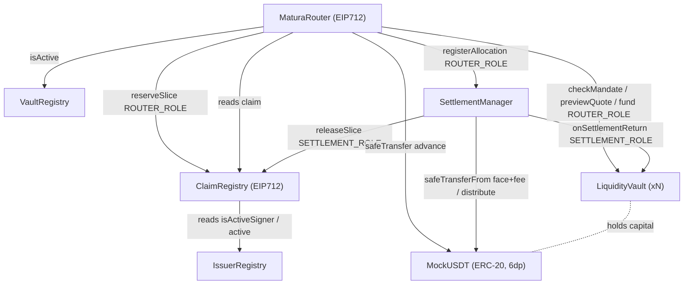
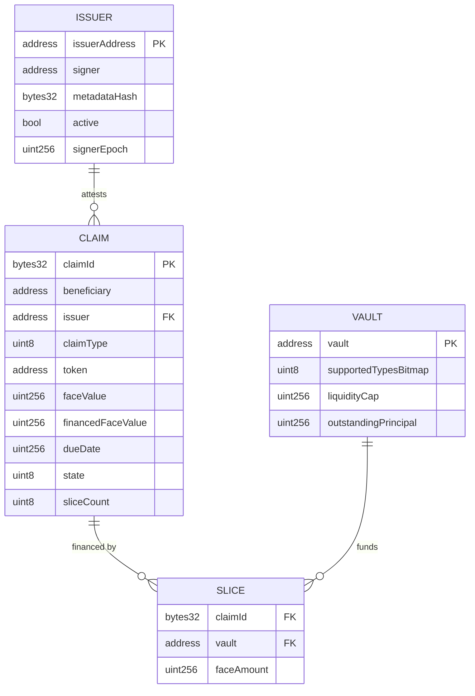
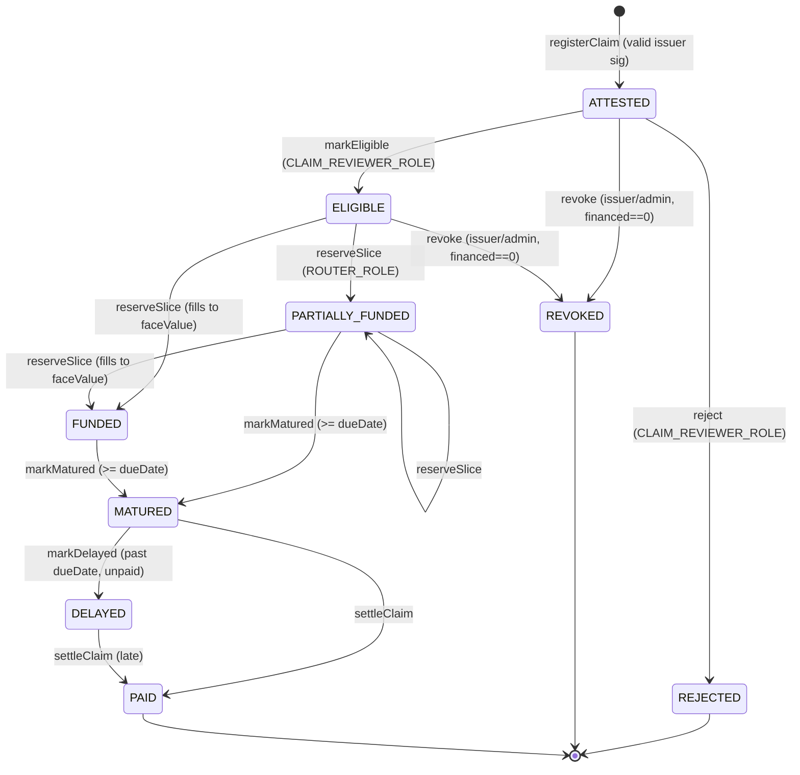
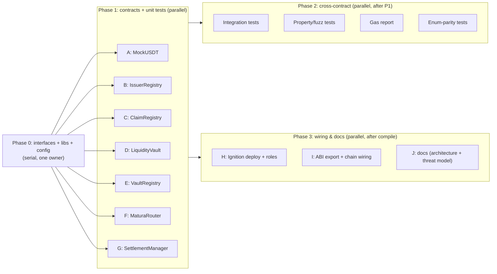

# ✨ Implement Matura P0 Smart Contracts

## Overview

Build the seven P0 Solidity contracts in `packages/contracts` that verify, price,
route, and settle Matura claims, plus their tests, deployment (Hardhat Ignition),
gas report, generated ABI/address export through `@matura/chain`, and the doc
updates (`architecture.md`, `threat-model.md`) that make them auditable.

The contracts conform to the domain already frozen in `@matura/shared` — enum
ordinals (`packages/shared/src/enums.ts:8,20`), struct shapes (`claim.ts`,
`route.ts`, `quote.ts`, `settlement.ts`, `issuer.ts`, `vault.ts`), and the
6-decimal `uint256` base-unit money convention (`docs/decisions.md:11-17`). Design
priorities, in order: **auditability > correctness > small surface >
generality**. No upgradeable proxies; immutable where practical; custom errors and
NatSpec everywhere (`README.md:116-128`).

This plan is structured for **parallel execution**: an interfaces-first Phase 0
freezes the Solidity ABI boundary so the seven contracts and their tests can then
be built as independent workstreams (see [Parallelization Plan](#parallelization-plan)).

> Source of decisions: the brainstorm doc plus four follow-up confirmations
> (state-machine depth, settlement gating, payout model, intra-route duplicate
> handling) and a SpecFlow gap analysis. All are baked into the specs below.

## Enhancement Summary

**Deepened on:** 2026-09-25 · **Agents:** security, architecture, simplicity/YAGNI,
gas/storage, data-integrity, TypeScript, Ignition+codegen (7 parallel) on top of
the 5 planning-phase research passes.

### Key improvements folded in

1. **Fixed a settlement-lockup bug (triple-confirmed BLOCKER).** Same vault
   funding the same claim across two routes produced mismatched
   `onSettlementReturn` calls → permanently unsettleable claim. Fix:
   `registerAllocation` aggregates per `(claimId, vault)`; settlement does one
   transfer + one return per unique vault.
2. **Fixed residual miscompute (HIGH).** `settleClaim` now snapshots
   `faceValue`/`financedFaceValue` into locals _before_ any state mutation;
   `financedFaceValue` is preserved (not zeroed) on release.
3. **Made conservation check meaningful (HIGH).** The vault term is now derived
   from actual `Σ allocation.faceAmount` and asserted `== financedFaceValue`
   (`ConservationViolation`) — the previous form was an algebraic tautology.
4. **Resolved 3 interface freeze-blockers** (see §Interface specs): `fund()` now
   receives `claimType`/`dueDate`; router gains `MandateRejected`; `Mandate` gains
   per-type premiums + view getters.
5. **Gas:** packed internal storage structs behind view getters (Claim 7→5, Issuer
   5→3, Mandate 6→4 slots), `ReentrancyGuardTransient` (EIP-1153 live on BSC),
   combined `quoteAndCheck` view (−1 STATICCALL/leg), calibrated gas targets.
6. **Verified Ignition module + ABI codegen** patterns against the installed
   toolchain (unique-`id` rule, role-hash parity, `hh3-artifact-1` filtering,
   custom 30-line export script).

### New considerations discovered

- **Shared-signer nonce collision:** forbid one signer backing two issuers (or
  namespace the nonce) — added to `IssuerRegistry`.
- **Post-deploy vault wiring window:** registering a vault must _atomically_ grant
  `ROUTER_ROLE`+`SETTLEMENT_ROLE`, else it creates unsettleable claims.
- **No vault withdraw = locked capital:** added an admin `withdraw` bounded by
  `availableLiquidity`.
- **`att.token` unconstrained:** validate `== settlementToken` at registration.
- **`network.connect()` deprecated** in HH 3.18 → use `network.create()`.
- Simplicity flagged collapsing the two ops roles and dropping on-chain
  `markDelayed`; **both kept (CONFIRMED)** — two distinct ops roles for least-privilege,
  and on-chain `DELAYED`/`markDelayed` to honor the "support delayed marking as state"
  requirement.

## Problem Statement

The monorepo foundation is scaffolded but `packages/contracts/contracts/` is empty
(only `.gitkeep`). The domain types, Prisma projections, address book, and
engineering invariants exist in TypeScript and expect on-chain counterparts that
emit matching events and enforce matching invariants. Without the contracts:

- there is nothing to deploy to BSC Testnet for the demo;
- `@matura/chain` `deployments.ts` holds only zero addresses and has no ABIs;
- the NestJS indexer has no events to project;
- the "Verify → Compare → Split → Route → Receive → Settle" narrative
  (`README.md:58-73`) is unrealized.

## Proposed Solution

Seven contracts under `packages/contracts/contracts/`, built against a frozen set
of interfaces, using OpenZeppelin 5.6.1 primitives (AccessControl, EIP712, ECDSA,
Nonces, SafeERC20, ReentrancyGuard, Pausable) on Solidity 0.8.28.

| #   | Contract            | Responsibility                                                                                   | OZ bases                                                           |
| --- | ------------------- | ------------------------------------------------------------------------------------------------ | ------------------------------------------------------------------ |
| 1   | `MockUSDT`          | Faucet ERC-20, 6 decimals, admin mint                                                            | `ERC20`, `AccessControl`                                           |
| 2   | `IssuerRegistry`    | Issuer + authorized-signer allowlist, `signerEpoch` rotation                                     | `AccessControl`                                                    |
| 3   | `ClaimRegistry`     | EIP-712 attestation verify, claim state machine, financed-face accounting, slice reserve/release | `EIP712`, `AccessControl`, `Nonces`                                |
| 4   | `LiquidityVault`    | Admin-funded isolated capital, mandate, deterministic pricing, exposure accounting               | `AccessControl`, `ReentrancyGuard`, `Pausable`                     |
| 5   | `VaultRegistry`     | Enumerable registry of vaults (active flag)                                                      | `AccessControl`                                                    |
| 6   | `MaturaRouter`      | Verify user EIP-712 route, recompute quotes on-chain, reserve + fund atomically                  | `EIP712`, `AccessControl`, `ReentrancyGuard`, `Pausable`, `Nonces` |
| 7   | `SettlementManager` | Maturity-gated settlement, waterfall distribution, conservation                                  | `AccessControl`, `ReentrancyGuard`                                 |

> **Reentrancy guard choice:** use OZ **`ReentrancyGuardTransient`** (EIP-1153
> transient storage) instead of classic `ReentrancyGuard` on the value-moving
> entrypoints. BSC has EIP-1153 live (Pascal upgrade, 2025), it saves ~2–5k gas
> per `executeRoute`/`settleClaim` and uses no persistent slot. **Pin this
> EIP-1153 (Cancun) requirement in NatSpec + the threat model** so any future
> non-1153 redeploy switches back to classic.

### Contract relationship diagram



### On-chain data model (ERD)



### Claim state machine (P0 live transitions)

Enum ordinals are frozen and must match `packages/shared/src/enums.ts:20`
(`ATTESTED=0 … REVOKED=10`). **Live** in P0: 9 of 11. **Reserved** (in enum for
parity, no on-chain producer in P0, documented as such): `DISPUTED`, `DEFAULTED`.



**Transition table (authority / guard):**

| From                      | To                      | Function                                     | Caller                               | Guard                                                                                                                                                                                  |
| ------------------------- | ----------------------- | -------------------------------------------- | ------------------------------------ | -------------------------------------------------------------------------------------------------------------------------------------------------------------------------------------- |
| —                         | ATTESTED                | `registerClaim`                              | anyone                               | valid EIP-712 sig by issuer's current signer+epoch; issuer active; `deadline>=now`; nonce unused; `claimId` & `externalIdHash` unused; `faceValue>0`; `dueDate>now`; valid `claimType` |
| ATTESTED                  | ELIGIBLE                | `markEligible`                               | `CLAIM_REVIEWER_ROLE`                | state==ATTESTED                                                                                                                                                                        |
| ATTESTED                  | REJECTED                | `reject`                                     | `CLAIM_REVIEWER_ROLE`                | state==ATTESTED (terminal)                                                                                                                                                             |
| ATTESTED/ELIGIBLE         | REVOKED                 | `revoke`                                     | issuer addr or `CLAIM_REVIEWER_ROLE` | `financedFaceValue==0` (terminal)                                                                                                                                                      |
| ELIGIBLE/PARTIALLY_FUNDED | PARTIALLY_FUNDED/FUNDED | `reserveSlice`                               | `ROUTER_ROLE`                        | `financed+face<=faceValue`; `sliceCount<MAX_SLICES_PER_CLAIM`                                                                                                                          |
| PARTIALLY_FUNDED/FUNDED   | MATURED                 | `markMatured`                                | anyone                               | `block.timestamp>=dueDate`                                                                                                                                                             |
| MATURED                   | DELAYED                 | `markDelayed`                                | anyone                               | `block.timestamp>dueDate` and unpaid                                                                                                                                                   |
| MATURED/DELAYED           | PAID                    | `releaseSlice` (called by SettlementManager) | `SETTLEMENT_ROLE`                    | conservation + transfers succeeded                                                                                                                                                     |

## Technical Approach

### Access-control roles

Defined with OZ `AccessControl`. `DEFAULT_ADMIN_ROLE` is the deployer (a multisig
in production; single key acceptable for testnet demo — noted in threat model).
Grants are explicit in the Ignition module ([Deployment](#deployment--role-wiring)).

| Role                  | Holder              | Grants the ability to                                                                                   |
| --------------------- | ------------------- | ------------------------------------------------------------------------------------------------------- |
| `DEFAULT_ADMIN_ROLE`  | deployer/multisig   | manage all roles; set vault mandates/fees/treasury                                                      |
| `ISSUER_ADMIN_ROLE`   | ops                 | register/deactivate issuers, rotate signers (`IssuerRegistry`)                                          |
| `CLAIM_REVIEWER_ROLE` | ops                 | `markEligible` / `reject` / `revoke` (`ClaimRegistry`)                                                  |
| `ROUTER_ROLE`         | `MaturaRouter`      | `reserveSlice` (`ClaimRegistry`), `fund` (`LiquidityVault`), `registerAllocation` (`SettlementManager`) |
| `SETTLEMENT_ROLE`     | `SettlementManager` | `releaseSlice` (`ClaimRegistry`), `onSettlementReturn` (`LiquidityVault`)                               |
| `PAUSER_ROLE`         | ops                 | pause/unpause `MaturaRouter` and `LiquidityVault`                                                       |

Role separation is a hard invariant: no address holds both `ROUTER_ROLE` and
`SETTLEMENT_ROLE` (reserve vs release must be different callers).

### EIP-712 domains (two, both chain-bound)

Each verifying contract inherits `EIP712` with its **own** name/version, so
`_hashTypedDataV4` folds in `block.chainid` + `address(this)` and neither domain
can accept the other's signatures (`README.md:120`). Never hand-roll the domain
separator; always recover through OZ `ECDSA` (low-`s`, `v∈{27,28}`, EIP-2098
rejected in 5.x).

**ClaimAttestation** — domain `EIP712("MaturaClaimRegistry","1")`, verifier =
`ClaimRegistry`:

```
ClaimAttestation(
  bytes32 claimId, address issuer, address beneficiary, address token,
  uint256 faceValue, uint256 dueDate, uint8 claimType,
  bytes32 externalIdHash, bytes32 evidenceHash,
  uint256 signerEpoch, uint256 nonce, uint256 deadline
)
```

`signerEpoch` binds the attestation to the issuer's current key generation; a
rotation (`IssuerRegistry.rotateSigner`) bumps the epoch and **instantly
invalidates all in-flight attestations** signed by the old key. `nonce` sequences
per-signer via OZ `Nonces._useCheckedNonce(signer, nonce)`.

**ExecutionRoute** — domain `EIP712("MaturaRouter","1")`, verifier =
`MaturaRouter`:

```
RouteLeg(bytes32 claimId, address vault, uint256 faceAmount, uint256 minimumAdvanceAmount)
ExecutionRoute(address user, uint256 targetAdvance, uint256 maxTotalFace,
               uint256 deadline, uint256 nonce, RouteLeg[] legs)
```

`nonce` is per-user via `Nonces._useCheckedNonce(user, nonce)`. `executionId` =
the EIP-712 digest of the route (unique, replay-tied). The payout recipient is
`route.user` bound in the signed struct — **never** derived from `msg.sender`
(front-running-safe; a relayer may submit but cannot redirect funds).

The TS typed-data builders (`test/helpers/eip712.ts`) must mirror these strings
exactly (field order + `uint256`/`address`/`bytes32` types); a unit test asserts
each on-chain `*_TYPEHASH` constant equals its `keccak256(...)` literal.

### Pricing (deterministic integer bps) — `MaturaPricing` library

Pure library, identical code path for `previewQuote` (view) and `fund` (state),
so preview and execution can never diverge.

```
daysToDue      = (dueDate - block.timestamp) / 1 days      // require dueDate > now
totalBps       = baseDiscountBps + durationBpsPerDay*daysToDue + claimTypePremiumBps[claimType]
require(totalBps <= MAX_DISCOUNT_BPS <= 10_000)            // reject, don't silently clamp
discountAmount = Math.mulDiv(faceAmount, totalBps, 10_000, Ceil)   // round UP (vault never undercharges)
advanceAmount  = faceAmount - discountAmount                        // rounds DOWN
```

Demo defaults: `baseDiscountBps=100`, `durationBpsPerDay=5`,
premium `{PAYROLL:0, FREELANCE_ESCROW:50, STREAM:25}`, `MAX_DISCOUNT_BPS=3000`.
Use OZ `Math.mulDiv` with explicit `Rounding` (no `x*bps/10000`, no `unchecked`).
Every division site documents its rounding direction and has a ±1-unit boundary
test.

### Settlement economics & conservation

At settlement the issuer (or any payer) settles the **full face**; the protocol
fee is a **surcharge on top** so the identity always holds with non-negative
integer terms even for a fully-financed claim:

```
protocolFee       = Math.mulDiv(faceValue, feeBps, 10_000, Ceil)     // feeBps default 0
amountReceived    = faceValue + protocolFee                          // exact pull via transferFrom
vaultDistribution = Σ allocation.faceAmount     // computed from the ACTUAL amounts pushed
require(vaultDistribution == financedFaceValue) // else ConservationViolation (catches drift; NOT a tautology)
userResidual      = faceValue - financedFaceValue                    // unfinanced face → beneficiary
// conservation (asserted, exact):
amountReceived == vaultDistribution + userResidual + protocolFee
// NOTE: snapshot faceValue & financedFaceValue into locals BEFORE releaseSlice mutates state.
```

This matches `SettlementReceipt` (`packages/shared/src/settlement.ts`). In the
demo (`feeBps=0`), `amountReceived == faceValue`. Rounding dust never touches
vault distributions (they equal exact financed face); `userResidual` is the
balancing remainder. A vault realizes its yield (`faceAmount − advance`) as an
increased balance when it receives its full financed face back.

> **Fee-model (CONFIRMED):** P0 charges the fee as an issuer surcharge
> (`amountReceived = faceValue + fee`) — integer-clean, never underflows for
> fully-financed claims. Fee-from-spread is explicitly future work. Default
> `feeBps=0` makes this moot for the demo.

### Settlement gating & payer (confirmed)

`settleClaim` is **maturity-gated**: requires claim state `MATURED` or `DELAYED`
(reached via permissionless `markMatured` once `block.timestamp>=dueDate`).
Accounting is **exact-pull** (`transferFrom(msg.sender, amountReceived)`) — no
balance-delta measurement, immune to donations/concurrency. Distribution is
**direct push** in a bounded loop (`≤ MAX_SLICES_PER_CLAIM`). Payer is
**permissionless** (anyone can pay the exact amount; normally the issuer).
`SettlementManager` is **not** under the router pause (settlement must never be
trapped by a pause).

> **Payer (CONFIRMED):** permissionless exact-pull — anyone may pay the exact
> amount (normally the issuer; also enables relayer/third-party repayment).
> Deterministic accounting, no auth branch on the settlement path.

### Interface specifications (the frozen Phase-0 boundary)

All custom errors, events, and NatSpec live on these. Signatures are the contract
between parallel workstreams — freeze them first.

```solidity
// interfaces/IIssuerRegistry.sol
interface IIssuerRegistry {
  struct Issuer { address issuerAddress; address signer; bytes32 metadataHash; bool active; uint256 signerEpoch; }
  event IssuerRegistered(address indexed issuer, address indexed signer, bytes32 metadataHash);
  event IssuerStatusChanged(address indexed issuer, bool active);
  event IssuerSignerRotated(address indexed issuer, address indexed oldSigner, address indexed newSigner, uint256 newEpoch);
  error IssuerAlreadyRegistered(address issuer);
  error IssuerNotRegistered(address issuer);
  error SignerAlreadyBound(address signer); // a signer may back only ONE issuer (nonce-collision guard)
  error ZeroAddress();
  function registerIssuer(address issuer, address signer, bytes32 metadataHash) external;
  function setIssuerActive(address issuer, bool active) external;
  function rotateSigner(address issuer, address newSigner) external;
  function getIssuer(address issuer) external view returns (Issuer memory);
  function isActive(address issuer) external view returns (bool);
  /// @notice True ONLY when `signer` is the issuer's CURRENT signer AND `signerEpoch`
  ///         equals the issuer's current epoch. Historical epochs are never valid
  ///         (this is what makes rotation instantly invalidate in-flight attestations).
  function isAuthorizedSigner(address issuer, address signer, uint256 signerEpoch) external view returns (bool);
  function currentEpoch(address issuer) external view returns (uint256);
}
// NatSpec: registerIssuer & rotateSigner MUST revert SignerAlreadyBound if `signer`
// is already bound to a different issuer — OZ Nonces is keyed by signer address, so a
// shared signer would let one issuer consume another's attestation nonce (griefing).
// stored `signerEpoch` may be narrowed (uint64/uint88) behind the view getter; the
// EIP-712 field stays uint256.
```

```solidity
// interfaces/IClaimRegistry.sol
interface IClaimRegistry {
  struct ClaimAttestation {
    bytes32 claimId; address issuer; address beneficiary; address token;
    uint256 faceValue; uint256 dueDate; uint8 claimType;
    bytes32 externalIdHash; bytes32 evidenceHash;
    uint256 signerEpoch; uint256 nonce; uint256 deadline;
  }
  struct Claim {
    address beneficiary; address issuer; uint8 claimType; address token;
    uint256 faceValue; uint256 financedFaceValue; uint256 dueDate; uint8 state; uint8 sliceCount;
  }
  event ClaimRegistered(bytes32 indexed claimId, address indexed issuer, address indexed beneficiary,
                        uint8 claimType, address token, uint256 faceValue, uint256 dueDate);
  event ClaimStateChanged(bytes32 indexed claimId, uint8 previousState, uint8 newState);
  event ClaimSliceReserved(bytes32 indexed claimId, uint256 faceAmount, uint256 financedFaceValue);
  event ClaimSliceReleased(bytes32 indexed claimId, uint256 financedFaceValue);
  // errors: InvalidSignature, IssuerInactive, SignatureExpired, DuplicateClaimId,
  //         DuplicateExternalId, ZeroFaceValue, DueDateInPast, InvalidClaimType,
  //         InvalidClaimState, OverAssignment, MaxSlicesExceeded, ClaimAlreadyFunded,
  //         NotClaimIssuer, TokenNotSettlement
  // NOTE: ClaimRegistry constructor takes `settlementToken`; registerClaim MUST revert
  //       TokenNotSettlement unless att.token == settlementToken (single-token MVP).
  // NOTE: releaseSlice sets state PAID but PRESERVES financedFaceValue (historical record
  //       the indexer needs); a `settled` flag guards double release. financedFaceValue is
  //       never zeroed. ClaimSliceReleased emits the preserved financedFaceValue.
  function registerClaim(ClaimAttestation calldata att, bytes calldata signature) external;
  function markEligible(bytes32 claimId) external;    // CLAIM_REVIEWER_ROLE
  function reject(bytes32 claimId) external;          // CLAIM_REVIEWER_ROLE
  function revoke(bytes32 claimId) external;          // issuer or CLAIM_REVIEWER_ROLE
  function markMatured(bytes32 claimId) external;     // permissionless, >= dueDate
  function markDelayed(bytes32 claimId) external;     // permissionless, past due
  function reserveSlice(bytes32 claimId, uint256 faceAmount) external;  // ROUTER_ROLE
  function releaseSlice(bytes32 claimId) external;    // SETTLEMENT_ROLE -> PAID
  function getClaim(bytes32 claimId) external view returns (Claim memory);
  function isFinanceable(bytes32 claimId) external view returns (bool); // ELIGIBLE | PARTIALLY_FUNDED
}
```

```solidity
// interfaces/ILiquidityVault.sol
interface ILiquidityVault {
  struct Mandate {
    uint8 supportedTypesBitmap; uint256 minFace; uint256 maxFace;
    uint256 maxDurationDays; uint256 liquidityCap;
    uint16 baseDiscountBps; uint16 durationBpsPerDay;
    uint16[3] claimTypePremiumBps; // per-type premium, indexed by ClaimType ordinal (per-vault pricing)
  }
  event VaultFunded(bytes32 indexed claimId, address indexed to, uint256 faceAmount, uint256 advanceAmount);
  event SettlementReturned(bytes32 indexed claimId, uint256 faceAmount, uint256 principalCleared);
  event MandateUpdated(uint256 liquidityCap, uint16 baseDiscountBps, uint16 durationBpsPerDay); // args, not empty
  event IssuerAllowed(address indexed issuer, bool allowed);
  event LiquidityWithdrawn(address indexed to, uint256 amount);
  // errors: MandateRejected, InsufficientLiquidity, LiquidityCapExceeded, ClaimTypeUnsupported,
  //         IssuerNotAllowed, FaceOutOfRange, DurationTooLong, DueDateInPast, ReturnMismatch
  function token() external view returns (address);
  function previewQuote(uint8 claimType, uint256 faceAmount, uint256 dueDate)   // public UI view
    external view returns (uint256 advanceAmount, uint256 discountAmount);
  /// @notice Router hot-path: one STATICCALL doing mandate check + quote together.
  function quoteAndCheck(address issuer, uint8 claimType, uint256 faceAmount, uint256 dueDate)
    external view returns (bool ok, uint256 advanceAmount, uint256 discountAmount);
  function availableLiquidity() external view returns (uint256);
  function outstandingPrincipal() external view returns (uint256); // for VaultSummary/indexer
  function liquidityCap() external view returns (uint256);
  function getMandate() external view returns (Mandate memory);
  // FREEZE-BLOCKER FIX: fund receives claimType+dueDate so it can recompute the identical
  // quote (vault stays decoupled from ClaimRegistry; ROUTER_ROLE supplies values it read from CR).
  function fund(bytes32 claimId, address to, uint8 claimType, uint256 faceAmount, uint256 dueDate)
    external returns (uint256 advanceAmount); // ROUTER_ROLE
  // onSettlementReturn is called EXACTLY ONCE per (claim,vault) with the vault's TOTAL financed
  // face for that claim (SettlementManager aggregates per vault first). Reverts ReturnMismatch
  // if faceAmount != faceByClaim[claimId]. Clears principalByClaim[claimId].
  function onSettlementReturn(bytes32 claimId, uint256 faceAmount) external; // SETTLEMENT_ROLE
  function setMandate(Mandate calldata m) external;              // DEFAULT_ADMIN_ROLE
  function setIssuerAllowed(address issuer, bool allowed) external; // DEFAULT_ADMIN_ROLE
  function withdraw(address to, uint256 amount) external;        // DEFAULT_ADMIN_ROLE, amount <= availableLiquidity
}
```

```solidity
// interfaces/IVaultRegistry.sol
interface IVaultRegistry {
  event VaultRegistered(address indexed vault);
  event VaultStatusChanged(address indexed vault, bool active);
  error VaultAlreadyRegistered(address vault);
  error VaultNotRegistered(address vault);
  function registerVault(address vault) external;              // DEFAULT_ADMIN_ROLE
  function setVaultActive(address vault, bool active) external; // DEFAULT_ADMIN_ROLE
  function isRegistered(address vault) external view returns (bool);
  function isActive(address vault) external view returns (bool);
  function getVaults() external view returns (address[] memory);
}
```

```solidity
// interfaces/ISettlementManager.sol
interface ISettlementManager {
  struct Allocation { address vault; uint256 faceAmount; }
  event AllocationRegistered(bytes32 indexed claimId, bytes32 indexed executionId, address indexed vault, uint256 faceAmount);
  event ClaimSettled(bytes32 indexed claimId, uint256 amountReceived, uint256 vaultDistribution,
                     uint256 userResidual, uint256 protocolFee);
  event TreasuryUpdated(address indexed treasury);
  event FeeUpdated(uint16 feeBps);
  // errors: NotMature, AlreadySettled, ConservationViolation, FeeTooHigh, ZeroAddress, MaxSlicesExceeded
  // BUG-FIX (settlement lockup): registerAllocation AGGREGATES per (claimId, vault) — if an entry
  // for that pair exists, ADD faceAmount to it instead of pushing a new row. getAllocations then
  // returns one entry per unique vault; MAX_SLICES bounds the UNIQUE-VAULT count.
  function registerAllocation(bytes32 claimId, bytes32 executionId, address vault, uint256 faceAmount) external; // ROUTER_ROLE
  // settleClaim MUST: (1) snapshot faceValue & financedFaceValue into locals BEFORE any mutation;
  // (2) pull amountReceived = faceValue + protocolFee via transferFrom(msg.sender);
  // (3) compute vaultDist = Σ allocation.faceAmount and REVERT ConservationViolation unless
  //     vaultDist == financedFaceValue (catches real allocation drift — not a tautology);
  // (4) push per unique vault + onSettlementReturn once each; residual to beneficiary; fee to treasury;
  // (5) claimRegistry.releaseSlice(claimId) LAST.
  function settleClaim(bytes32 claimId) external;   // maturity-gated, exact-pull, nonReentrant
  function setTreasury(address treasury) external;  // DEFAULT_ADMIN_ROLE
  function setFeeBps(uint16 feeBps) external;        // DEFAULT_ADMIN_ROLE, <= MAX_FEE_BPS (500)
  function getAllocations(bytes32 claimId) external view returns (Allocation[] memory);
}
```

```solidity
// interfaces/IMaturaRouter.sol
interface IMaturaRouter {
  struct RouteLeg { bytes32 claimId; address vault; uint256 faceAmount; uint256 minimumAdvanceAmount; }
  struct ExecutionRoute { address user; uint256 targetAdvance; uint256 maxTotalFace;
                          uint256 deadline; uint256 nonce; RouteLeg[] legs; }
  event RouteExecuted(bytes32 indexed executionId, address indexed user, uint256 totalAdvance,
                      uint256 totalFaceAssigned, uint256 totalCost);
  event RouteLegExecuted(bytes32 indexed executionId, bytes32 indexed claimId, address indexed vault,
                         uint256 faceAmount, uint256 advanceAmount, uint256 discountAmount);
  // errors: RouteExpired, InvalidRouteSignature, EmptyRoute, ZeroTargetAdvance, DuplicateClaimInRoute,
  //         VaultNotActive, BeneficiaryMismatch, TokenMismatch, ClaimNotFinanceable, IssuerInactive,
  //         AdvanceBelowMinimum, TargetAdvanceNotMet, MaxFaceExceeded, MaxLegsExceeded, MandateRejected
  function executeRoute(ExecutionRoute calldata route, bytes calldata signature) external; // nonReentrant, whenNotPaused
}
```

### `executeRoute` algorithm (CEI ordering)

1. **Checks:** verify EIP-712 route signature recovers to `route.user`; `now<=route.deadline`;
   `legs.length` in `[1, MAX_LEGS]`; `targetAdvance>0`; no duplicate `claimId` across legs
   (revert `DuplicateClaimInRoute`).
2. **Per leg (sequential, live reads):** cache `leg = route.legs[i]` to memory; load the
   claim **once** via `getClaim(leg.claimId)` (do not also call `isFinanceable` — derive
   from the returned `state`); assert `claim.beneficiary==route.user`,
   `claim.token==vault.token()`, `claim.state` financeable,
   `IssuerRegistry.isActive(claim.issuer)`, `VaultRegistry.isActive(leg.vault)`; one
   combined `(ok, advance, discount)=vault.quoteAndCheck(claim.issuer, claim.claimType,
leg.faceAmount, claim.dueDate)` (−1 STATICCALL vs separate mandate+quote), revert
   `MandateRejected` if `!ok`; assert `advance>=leg.minimumAdvanceAmount`; accumulate
   `totalFace`, `totalAdvance`, `totalCost`, and **per-vault reserved liquidity**
   (`reservedByVault[vault] += advance`) — then check
   `reservedByVault[vault] <= vault.availableLiquidity()` so two legs on one vault can't
   both pass against stale balance and revert in interactions.
3. **Bounds:** `totalFace<=route.maxTotalFace`; `totalAdvance>=route.targetAdvance`.
4. **Effects:** `Nonces._useCheckedNonce(route.user, route.nonce)`; per leg
   `ClaimRegistry.reserveSlice(claimId, faceAmount)` and
   `SettlementManager.registerAllocation(claimId, executionId, vault, faceAmount)`
   (which aggregates per `(claim,vault)`).
5. **Interactions (last):** per leg
   `vault.fund(claimId, route.user, claim.claimType, leg.faceAmount, claim.dueDate)` →
   `safeTransfer` advance to user (recomputes the identical advance internally).
6. **Emit** one `RouteExecuted` + one `RouteLegExecuted` per leg (with computed
   `advanceAmount`/`discountAmount` so the indexer can build `RouteLegProjection`).
   Whole tx reverts on any leg failure (atomicity).

`nonReentrant` guards `executeRoute`; the recompute-on-chain rule means no
caller-supplied advance is ever trusted.

### Shared libraries & constants

- `libraries/MaturaConstants.sol` — `MAX_SLICES_PER_CLAIM=8`, `MAX_LEGS=8`,
  `MAX_DISCOUNT_BPS=3000`, `MAX_FEE_BPS=500`, `BPS_DENOMINATOR=10000`.
- `libraries/ClaimEnums.sol` — `ClaimType` (uint8: PAYROLL=0, FREELANCE_ESCROW=1,
  STREAM=2) and `ClaimState` (uint8: ATTESTED=0 … REVOKED=10), plus bitmap helper
  `supports(uint8 bitmap, uint8 claimType)`. Ordinals **must** match
  `packages/shared/src/enums.ts`.
- `libraries/MaturaPricing.sol` — the pure pricing function above.
- Custom errors live per-contract in their interfaces (above); no shared bloat.

## Parallelization Plan

The critical constraint: **freeze interfaces first**, then everything fans out.
Each workstream owns a disjoint set of files, so agents can run in separate git
worktrees (`isolation: worktree`) and merge without conflicts. The only shared
edits are Phase 0 (interfaces + config) and must land before Phase 1 starts.



**Why F and G can start in Phase 1:** they depend only on the frozen interfaces;
their unit tests use minimal mock implementations of `IClaimRegistry`,
`ILiquidityVault`, `IVaultRegistry`, `IIssuerRegistry`. Real cross-contract
behavior is verified in Phase 2 integration tests. Mocks live in
`contracts/test-mocks/` (compiled, test-only).

**Workstream file ownership:**

| WS   | Owns (create)                                                                                                                                                                                                              | Depends on         |
| ---- | -------------------------------------------------------------------------------------------------------------------------------------------------------------------------------------------------------------------------- | ------------------ |
| 0    | `interfaces/*.sol`, `libraries/*.sol`, `test/helpers/{eip712,fixtures,constants}.ts`, `hardhat.config.ts` (register ignition plugin), `pnpm-workspace.yaml` (+fast-check), `packages/contracts/package.json` (+fast-check) | —                  |
| A    | `contracts/token/MockUSDT.sol`, `test/MockUSDT.test.ts`                                                                                                                                                                    | P0                 |
| B    | `contracts/IssuerRegistry.sol`, `test/IssuerRegistry.test.ts`                                                                                                                                                              | P0                 |
| C    | `contracts/ClaimRegistry.sol`, `test/ClaimRegistry.test.ts`, `contracts/test-mocks/MockIssuerRegistry.sol`                                                                                                                 | P0                 |
| D    | `contracts/LiquidityVault.sol`, `test/LiquidityVault.test.ts`                                                                                                                                                              | P0                 |
| E    | `contracts/VaultRegistry.sol`, `test/VaultRegistry.test.ts`                                                                                                                                                                | P0                 |
| F    | `contracts/MaturaRouter.sol`, `test/MaturaRouter.test.ts`, mocks for CR/LV/VR/IR                                                                                                                                           | P0                 |
| G    | `contracts/SettlementManager.sol`, `test/SettlementManager.test.ts`, mocks for CR/LV                                                                                                                                       | P0                 |
| INT  | `test/integration/RouteToSettlement.test.ts`                                                                                                                                                                               | A–G                |
| PROP | `test/properties/Invariants.property.test.ts`                                                                                                                                                                              | A–G                |
| GAS  | `test/gas/GasReport.test.ts` → writes `docs/gas-report.md`                                                                                                                                                                 | A–G                |
| PAR  | `test/EnumParity.test.ts`, `apps/api/test/enum-parity.spec.ts`                                                                                                                                                             | P0 (Sol enums)     |
| H    | `ignition/modules/MaturaProtocol.ts`                                                                                                                                                                                       | A–G compile        |
| I    | `scripts/export-abis.ts`, `packages/chain/src/abis/*`, `packages/chain/src/addresses.ts`, `deployments.ts`, `package.json`, `__tests__/addresses.test.ts`, `.env.example`, `turbo.json`                                    | A–G compile        |
| J    | `docs/architecture.md`, `docs/threat-model.md`                                                                                                                                                                             | design (this plan) |

## Implementation Phases

### Phase 0 — Freeze the boundary (serial, ~½ day)

- [ ] Add `fast-check` to `pnpm-workspace.yaml` catalog and to
      `packages/contracts/package.json` devDeps; `pnpm install`.
- [ ] Register `@nomicfoundation/hardhat-ignition-viem` (and `hardhat-verify`) in
      `hardhat.config.ts` `plugins`.
- [ ] Write all six interface files, three libraries, and the enum library with
      NatSpec + custom errors. Compile (zero implementations yet is fine — interfaces compile).
- [ ] Write `test/helpers/`: `constants.ts` (roles as `keccak256` viem values,
      demo params), `eip712.ts` (typed-data domain/type builders for
      `ClaimAttestation` and `ExecutionRoute`, matching the Solidity typehashes),
      `fixtures.ts` (deploy fixture skeleton using `network.connect()` +
      `loadFixture`).

### Phase 1 — Contracts + unit tests (parallel, WS A–G)

Each workstream: implement the contract against its interface, write its unit test
file (happy paths + every revert in [Test Plan](#test-plan)), get it green in
isolation with mocks. CEI + `nonReentrant` + `SafeERC20` throughout. Custom errors
only (no `require` strings). NatSpec on all public/external functions.

### Phase 2 — Cross-contract (parallel, after P1 merges)

- [ ] **Integration** (`RouteToSettlement.test.ts`): full deploy of all seven +
      one/two real vaults; end-to-end attest → review → route → settle; multi-claim
      atomic route; partial funding then settle; signer rotation mid-flight.
- [ ] **Property/fuzz** (`Invariants.property.test.ts`, fast-check
      `fc.asyncProperty`, `numRuns: 20-30`, fresh `loadFixture` per run): no
      over-assignment across random sequential routes; settlement conservation for
      random face/bps/fee.
- [ ] **Gas** (`GasReport.test.ts`): record `receipt.gasUsed` for `registerClaim`,
      `executeRoute` (1 leg), `executeRoute` (2 legs), `settleClaim`; write
      `docs/gas-report.md`.
- [ ] **Enum parity** (`EnumParity.test.ts` + `apps/api/test/enum-parity.spec.ts`):
      assert Solidity ordinals == shared `CLAIM_TYPES`/`CLAIM_STATES` == Prisma
      enums.

### Phase 3 — Deployment, export, docs (parallel, after compile)

- [ ] **H — Ignition** ([details](#deployment--role-wiring)).
- [ ] **I — ABI export & chain wiring** ([details](#abi--address-export-pipeline)).
- [ ] **J — Docs**: update `docs/architecture.md` (`C -. exports ABIs .-> CH`
      becomes real; add the contract relationship + state-machine sections);
      create `docs/threat-model.md` ([outline](#threat-model-outline)).

### ABI & address export pipeline

`@matura/chain` is JIT raw-TS (`packages/chain/package.json` exports map to
`./src/*.ts`), so ABIs must be **committed `.ts`**, not read from
`artifacts/` at runtime.

- [ ] `scripts/export-abis.ts` (~30 lines, zero-dep, run after `hardhat compile` via
      `tsx`; verified end-to-end against real HH3 artifacts): glob
      `artifacts/contracts/**/*.json`; parse each as `unknown` then a minimal zod schema
      `{ _format, contractName, abi: unknown[] }`; **filter** on
      `_format === "hh3-artifact-1" && Array.isArray(abi)` (HH3 has no `.dbg.json`; skip
      `build-info/`); **whitelist** only the 7 protocol contracts (excludes OZ bases +
      test mocks); emit `packages/chain/src/abis/<name>.ts` as
      `export const <name>Abi = [...] as const;` and a barrel `index.ts` re-exporting with
      `.js` specifiers (NodeNext ESM). Do NOT use `hardhat-abi-exporter` (HH2-only) or
      `@wagmi/cli` (single-file output, HH2-oriented) — the custom script fits the
      per-file `@matura/chain` layout exactly.
      Script: `"contracts:export-abis": "hardhat compile && tsx scripts/export-abis.ts"`.
- [ ] Add `"./abis": "./src/abis/index.ts"` to `packages/chain/package.json` `exports`.
- [ ] `packages/chain/src/addresses.ts`: add `vaultRegistry: evmAddress` to the
      `AddressBook` zod object **and** `zeroAddressBook` (`addresses.ts:14,33`).
      Keep `liquidityVault` OUT (vaults enumerated via `VaultRegistry.getVaults()`).
- [ ] Update `packages/chain/src/__tests__/addresses.test.ts` for the new key.
- [ ] `.env.example`: add `NEXT_PUBLIC_VAULT_REGISTRY_ADDRESS=""`.
- [ ] `turbo.json`: add `NEXT_PUBLIC_VAULT_REGISTRY_ADDRESS` to `build.env`; add a
      `contracts:export-abis` task (or fold into `contracts:compile` outputs) so
      Turbo tracks `packages/chain/src/abis/**`.
- [ ] `deployments.ts` stays the canonical address source; populate from Ignition
      output post-deploy (leave zero-seeded until a real deploy).

### Deployment & role wiring

`ignition/modules/MaturaProtocol.ts` (Hardhat Ignition + viem):

- [ ] Deploy `MockUSDT`, `IssuerRegistry`, `ClaimRegistry(issuerRegistry)`,
      `VaultRegistry`, N `LiquidityVault(mockUsdt, mandate...)`,
      `SettlementManager(claimRegistry, mockUsdt)`,
      `MaturaRouter(claimRegistry, vaultRegistry, issuerRegistry, settlementManager, mockUsdt)`.
- [ ] **Explicit role grants** (the security-critical wiring):
      `ClaimRegistry.grantRole(ROUTER_ROLE, router)`,
      `ClaimRegistry.grantRole(SETTLEMENT_ROLE, settlement)`,
      each `LiquidityVault.grantRole(ROUTER_ROLE, router)` +
      `grantRole(SETTLEMENT_ROLE, settlement)`,
      `SettlementManager.grantRole(ROUTER_ROLE, router)`,
      register each vault in `VaultRegistry`, seed vault liquidity via admin
      transfer, set `treasury`.
- [ ] Secrets via `configVariable()` / keystore (`DEPLOYER_PRIVATE_KEY`,
      `BSC_TESTNET_RPC_URL`) — never hardcoded (`hardhat.config.ts:13-14`).

**Ignition specifics (verified against ignition 3.1.8 / ignition-viem 3.1.6):**

- Import `buildModule` from `@nomicfoundation/hardhat-ignition/modules`.
- **Every duplicated `m.contract`/`m.call` needs a unique `id`** — the #1 Ignition
  authoring error. N vaults = `configs.map(c => m.contract("LiquidityVault", [...], { id: c.id }))`;
  each `grantRole` call gets `{ id: "cr_grant_router" }` etc.
- Dependency ordering is **automatic** when a Future is passed as an arg (e.g. the
  router Future into `grantRole`); use explicit `{ after: [...] }` only for ordering
  not expressed through data (e.g. seed-liquidity after registration).
- Role constants in the module: `keccak256(toHex("ROUTER_ROLE"))` (viem) — verified
  byte-identical to Solidity `keccak256("ROUTER_ROLE")`; `DEFAULT_ADMIN_ROLE = zeroHash`.
  Import them from `test/helpers/constants.ts` (single source shared with tests).
- **Constructors must grant `DEFAULT_ADMIN_ROLE` to `msg.sender`** (the deployer EOA
  that runs the module), or the wiring `grantRole` calls revert.
- **Vault wiring is atomic + ordered:** for every vault (initial AND any added later)
  grant `ROUTER_ROLE`+`SETTLEMENT_ROLE` **and** `VaultRegistry.registerVault` — never
  register a vault before `SettlementManager` holds `SETTLEMENT_ROLE` on it, else its
  funded claims become unsettleable. Provide an admin `wireVault` script/flow for
  post-deploy vaults that does grants-then-register in one sequence.
- Add an on-chain assertion (constructor guard or post-deploy check) that **no address
  holds both `ROUTER_ROLE` and `SETTLEMENT_ROLE`**.
- Deploy-in-test: `const { ignition } = await network.create(); const {...} =
await ignition.deploy(MaturaProtocol)` returns typed viem instances; wrap in
  `loadFixture` for isolation.

### Threat model outline

`docs/threat-model.md` sections: **Assets** (vault capital, user advances, issuer
attestation key, admin/role keys, claim integrity); **Trust assumptions**
(admin/multisig honest, issuer signer custody, MockUSDT is a standard 6-dp token,
single settlement token); **Threats × mitigations** (signature replay → distinct
EIP-712 domains + `Nonces` + `signerEpoch`; double-financing → `financedFaceValue`
cap + `externalIdHash`/`claimId` uniqueness; reentrancy → CEI + `nonReentrant` +
SafeERC20; over-assignment → atomic `reserveSlice` cap; gas griefing → `MAX_SLICES`/`MAX_LEGS`;
admin key compromise → role separation, DefaultAdminRules/timelock as future work;
paused settlement trap → settlement excluded from pause;
shared-signer nonce collision → one-signer-one-issuer enforced;
post-deploy vault wiring window → atomic grant-then-register (`wireVault`);
permissionless `markMatured` freezing a partial claim → documented accepted risk;
locked vault capital → admin `withdraw` bounded by `availableLiquidity`;
non-standard `claim.token` → validated `== settlementToken` at registration;
EIP-1153 dependency → `ReentrancyGuardTransient` requires Cancun/Pascal (BSC-only));
**Out of scope for P0**
(non-payment/default loss socialization, `DISPUTED`/`DEFAULTED` producers, public
LP deposits, fee-from-spread, upgradeability, oracles).

## Test Plan

Hardhat 3 + viem + `node:test` (`import { describe, it } from "node:test"`;
`const { viem, networkHelpers, ignition } = await network.create()` — note
`network.connect()` is **deprecated** in HH 3.18, use `create()`;
`viem.assertions.revertWithCustomError(...)` / `revertWithCustomErrorWithArgs(...)`
for OZ 5.x + our custom errors; `networkHelpers.time.increase` for maturity;
`loadFixture` per test). fast-check via `fc.asyncProperty` (awaited `fc.assert`,
`numRuns: 20-30`) with a fresh `loadFixture` inside the predicate.

**Per-contract reverts & happy paths:**

- **MockUSDT**: 6 decimals; faucet within cap; faucet over cap reverts; admin mint;
  non-admin mint reverts; transfer accounting.
- **IssuerRegistry**: register/getIssuer; duplicate register reverts; deactivate;
  rotateSigner bumps epoch + emits; `isAuthorizedSigner` old-epoch=false,
  new-epoch=true; zero-address reverts; non-role callers revert.
- **ClaimRegistry**: valid attestation → ATTESTED + events; **forged sig**
  (`InvalidSignature`); **expired** (`SignatureExpired`); **duplicate claimId**;
  **duplicate externalIdHash**; **replayed nonce** (`_useCheckedNonce`);
  inactive issuer; **signer rotated before register** (epoch mismatch); zero
  faceValue; past dueDate; invalid claimType; markEligible/reject/revoke authority
  - state guards; **revoke after financed>0 reverts** (`ClaimAlreadyFunded`);
    reserveSlice over-assignment (`OverAssignment`); `MAX_SLICES_PER_CLAIM+1`
    (`MaxSlicesExceeded`); reserveSlice from non-financeable state; markMatured
    before dueDate reverts, at/after passes; unauthorized `ROUTER_ROLE`/`SETTLEMENT_ROLE` calls.
- **LiquidityVault**: previewQuote determinism + rounding (±1 boundary); mandate
  rejects unsupported type / disallowed issuer / face out of range / duration too
  long; insufficient liquidity + liquidity-cap; fund only by `ROUTER_ROLE`;
  onSettlementReturn only by `SETTLEMENT_ROLE`; availableLiquidity before/after
  fund/return; pause blocks fund.
- **VaultRegistry**: register/getVaults; duplicate; setVaultActive; isActive
  reflects flag; non-admin reverts.
- **MaturaRouter**: single-leg happy path (claim→FUNDED, user funded,
  allocation+slice recorded, events); two-leg multi-claim atomic; partial funding
  (→PARTIALLY_FUNDED); **route expiry**; **nonce replay**; **forged route sig**;
  empty legs / zero target; **duplicate claimId in route**; beneficiary mismatch;
  token mismatch; inactive vault; inactive issuer; mandate rejection;
  advance-below-minimum; target-advance-not-met; maxFace exceeded; MAX_LEGS+1;
  **any-leg failure reverts whole tx**; over-assignment across two separate routes.
- **SettlementManager**: settle MATURED → PAID with correct residual + vault
  distribution + fee; conservation holds; **settle before maturity reverts**
  (`NotMature`); **double settlement reverts** (`AlreadySettled`); partial-claim
  settlement residual; fee boundary (0, MAX_FEE_BPS, rounding); setFeeBps>MAX
  reverts; treasury update; registerAllocation only by `ROUTER_ROLE`; DELAYED→PAID
  (late settlement); settlement callable while router paused.

**Property/fuzz (fast-check):**

- _No over-assignment_: random sequence of `(faceAmount)` reserves against a claim
  → `Σ reserved ≤ faceValue` always; the breaching reserve reverts.
- _Conservation_: random `(faceValue, financedFaceValue≤faceValue, feeBps≤MAX)` →
  `amountReceived == vaultDistribution + userResidual + protocolFee` exactly.

**Integration**: end-to-end across all contracts (see Phase 2).

**Enum parity**: Solidity ⇄ `@matura/shared` ⇄ Prisma ordinals.

## Deepening Insights

### Gas / storage (low-risk, auditability-preserving)

Pattern: keep a **packed internal storage struct** and assemble the frozen
`uint256`-shaped view struct in a getter — decouples gas from the frozen ABI.

- **Claim** 7→5 slots: `uint48 dueDate` (SafeCast on store; good past year 8.9M),
  pack `beneficiary`+`claimType`+`state`+`sliceCount`+`dueDate` into one slot;
  keep `faceValue`/`financedFaceValue` `uint256` (respect the money convention).
  ~2 cold SSTOREs saved on `registerClaim` (~44k).
- **Issuer** 5→3 slots: pack `active` + narrowed stored `signerEpoch` (uint64/88)
  into the address slot. EIP-712 `signerEpoch` stays `uint256`.
- **Mandate** 6→4 slots: pack `supportedTypesBitmap`+`baseDiscountBps`+
  `durationBpsPerDay`+`uint32 maxDurationDays` into one slot (money fields stay
  `uint256`). Mandate is SLOAD'd per leg — fewer slots helps the hot path.
- Fetch each claim once; keep the O(n²) in-memory duplicate-claim scan
  (`MAX_LEGS=8` ⇒ ≤28 comparisons, cheaper than storage dedup).

**Gas targets for `docs/gas-report.md`** (calibrate against these): `registerClaim`
< 220k; `executeRoute` 1-leg ~250k, 2-leg ~400k; `settleClaim` ~200k (record the
8-vault worst case too, ~+40–50k/vault). First attestation from a new signer and
first route from a user pay a cold nonce SSTORE (~22k).

### TypeScript (zero `any`, enforced by strictTypeChecked + projectService)

- **ABIs must be `as const`** (never `Abi`/`any[]`) — viem's entire inference chain
  keys off the literal tuple. The generated `abis/*.ts` carry `as const`; assert
  viem-`Abi` compatibility in a separate type-test, not in the emitted file.
- **`export-abis.ts`:** `JSON.parse` → `unknown` → minimal zod schema; never touch
  artifact fields as `any`. `fs.readFileSync(path, "utf8")` (string overload).
- **`eip712.ts`:** `domain`/`types`/`primaryType` all `as const`;
  `... as const satisfies TypedData` (keeps literals, unlike `: TypedData`); define
  the `RouteLeg` field tuple once and compose it into `ExecutionRoute` types; derive
  the encoded type-string for the typehash test from the same arrays (single source,
  no drift). Use viem `hashTypedData(...)` for `executionId` assertions.
- **fast-check:** let arbitraries drive predicate param types (`fc.bigInt` for
  uint256, not `fc.integer`+`BigInt`); `await fc.assert(...)`; `import fc from "fast-check"`.
- **Chain wiring:** add `vaultRegistry` to BOTH `AddressBook` (`addresses.ts:14`) and
  `zeroAddressBook` (`:33`) as a required field (compile error is the safety net);
  keep `./abis` exports separate from the address surface; `import type` for
  type-only imports; narrow with guards, never `!` (`no-non-null-assertion` is on).

## Acceptance Criteria

### Functional

- [ ] All seven contracts implemented per the interface specs; compile clean under
      Solidity 0.8.28 (no correctness-relevant warnings).
- [ ] Full state machine + transition authorities enforced with custom errors.
- [ ] Two EIP-712 domains verified; `signerEpoch` rotation invalidates in-flight sigs.
- [ ] Recompute-on-chain pricing; deterministic rounding; conservation exact.

### Quality gates

- [ ] `pnpm --filter @matura/contracts contracts:test` green (unit + integration +
      property + parity).
- [ ] Every revert listed in the Test Plan has a dedicated assertion.
- [ ] `docs/gas-report.md` records gas for `registerClaim`, `executeRoute`
      (1 & 2 legs), `settleClaim`.
- [ ] ABIs generated into `@matura/chain/abis` by script (no hand-copy);
      `AddressBook` includes `vaultRegistry`; `.env.example` + `turbo.json`
      reconciled; `packages/chain` tests pass.
- [ ] `docs/architecture.md` updated; `docs/threat-model.md` created.
- [ ] No `any` in any TS (enforced by `strictTypeChecked` + `projectService`);
      no `tx.origin`, `delegatecall`, arbitrary external calls, unchecked
      `ecrecover`, floating point, timestamp-equality assumptions, or silent rounding.

## Dependencies & Risks

- **Node 24 only** — Hardhat 3 breaks on Node 25; run `nvm use` first
  (`.nvmrc`, `docs/decisions.md:62-66`).
- **viem pinned `2.56.8`** (no semver on types); do not bump.
- **fast-check is net-new** — must be added to catalog + devDeps (only transitive today).
- **Address-source drift** — `deployments.ts` claims to be the sole address source
  yet `NEXT_PUBLIC_*_ADDRESS` env vars exist; keep both consistent when adding
  `vaultRegistry` (5 files, see [export pipeline](#abi--address-export-pipeline)).
- **Fee model & payer** — CONFIRMED: fee-as-surcharge + permissionless exact-pull;
  default `feeBps=0` neutralizes the fee in the demo.
- **Admin key** — single deployer key on testnet is an accepted demo risk;
  DefaultAdminRules/timelock/multisig noted as future work in the threat model.

## References & Research

### Internal

- Brainstorm: `docs/brainstorms/2026-09-25-matura-p0-contracts-brainstorm.md`
- Domain source of truth: `packages/shared/src/enums.ts:8,20`, `claim.ts`,
  `route.ts`, `quote.ts`, `settlement.ts`, `issuer.ts`, `vault.ts`, `ids.ts`,
  `address.ts`, `money.ts`
- Chain export: `packages/chain/package.json` (exports), `src/addresses.ts:14,33`,
  `src/deployments.ts:12`
- Contracts setup: `packages/contracts/hardhat.config.ts`, `tsconfig.json`,
  `package.json` (OZ `5.6.1`, viem `catalog:`, ignition/verify installed-not-wired)
- Indexer contract (event fields): `apps/api/prisma/schema.prisma`
  (`ClaimProjection`, `RouteExecution`, `RouteLegProjection`, `IssuerProjection`)
- Conventions: `docs/decisions.md`, `README.md:44-128`, `pnpm-workspace.yaml`
- Commit attribution: author `arjunamarcelino`, no Claude co-author trailer

### External (verified for the pinned stack)

- Hardhat 3 viem + node:test testing: https://hardhat.org/docs/guides/testing/using-viem
- hardhat-viem-assertions (custom-error asserts): https://hardhat.org/docs/plugins/hardhat-viem-assertions
- hardhat-network-helpers (time/loadFixture): https://hardhat.org/docs/plugins/hardhat-network-helpers
- Hardhat Ignition: https://hardhat.org/ignition/docs/guides/tests
- OZ 5.x AccessControl/ERC20/cryptography/utils:
  https://docs.openzeppelin.com/contracts/5.x/api/access ·
  https://docs.openzeppelin.com/contracts/5.x/api/utils/cryptography ·
  https://docs.openzeppelin.com/contracts/5.x/api/utils
- viem signTypedData / recoverTypedDataAddress: https://viem.sh/docs/actions/wallet/signTypedData.html
- fast-check with node:test: https://fast-check.dev/docs/tutorials/setting-up-your-test-environment/property-based-testing-with-nodejs-test-runner/
- EIP-712 replay best practices: https://forum.openzeppelin.com/t/eip-712-best-practices-nonce-changing-of-domain-ver/39366
- CertiK 2025 RWA report (key-compromise/oracle pitfalls): https://www.certik.com/resources/blog/2025-skynet-rwa-security-report

### AI-era note

Contracts drafted with Claude Code; all signature/replay logic, conservation
arithmetic, and role wiring require human review before any deploy. Property tests
(fast-check) are mandatory given rapid implementation, not optional.
