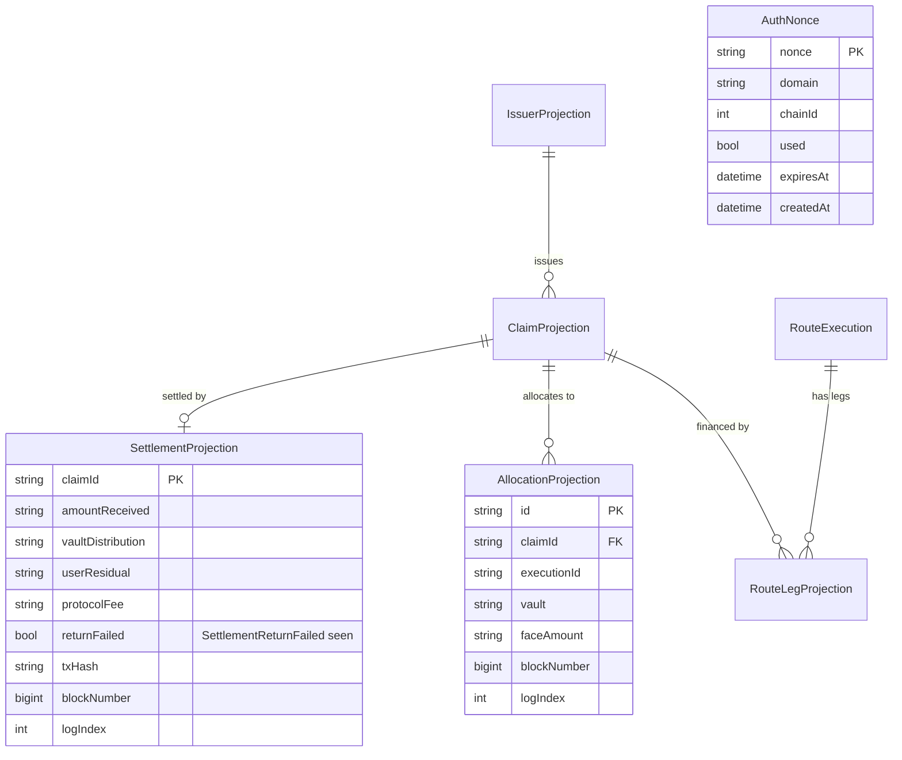

# ✨ feat: `apps/api` — Orchestration & Read-Model Service

## Enhancement Summary (deepened 2026-09-26)

Nine parallel review/research agents (architecture, security, TypeScript, simplicity,
data-integrity, performance, pattern-consistency + two framework-doc passes) hardened this
plan. **Read `## Deepen-Pass Enhancements` below before implementing — it supersedes several
original decisions.** Highest-impact changes:

1. **Two build blockers fixed** — `apps/api` tsconfig must use `moduleResolution: "node16"`
   (node10 ignores subpath `exports`); `DEMO_ISSUER_SIGNING_ENABLED` must use `z.stringbool()`
   (`z.coerce.boolean("false") === true` — fail-**open** on the most sensitive flag).
2. **Reorg rewind was unsound** → replaced with **detect-mismatch → full wipe → reindex from
   `deploymentBlock`** (windowed `DELETE WHERE blockNumber > x` corrupts mutable claim rows).
3. **Activity pagination was broken** (keyset over a mutable sort key) → **append-only
   `ActivityEvent` table**.
4. **EIP-712 home moved** `@matura/shared` → **`@matura/chain`** (keeps shared dep-free; three
   reviewers flagged the viem-in-shared boundary break). Pure-Zod DTOs still go to shared.
5. **Security**: build-exclude the issuer signer from prod; **global `WalletAuthGuard` +
   `@Public()`** (fail-closed); `PrepareStep` addresses/amounts **only from the manifest**.
6. **Simplifications adopted**: drop `AllocationProjection`, don't index vault events (plain
   TTL), hand-roll readiness (no `@nestjs/terminus`), defer `SettlementReturnFailed`.
7. **Performance**: viem transport `batch:true` (Multicall3 gated — absent on bare Hardhat);
   composite `[wallet, blockNumber, logIndex]` indexes; per-process Prisma `connection_limit`.

## Overview

Build the `apps/api` domain layer on the existing NestJS 11 (CommonJS + Jest) scaffold: a
**separate-process viem indexer** that projects authoritative on-chain state into Postgres,
a set of **read endpoints** served from those projections (with a read-through fallback to
chain for the ~1–2 s finality gap), and **write-preparation endpoints** that return typed
EIP-712 data + unsigned calldata for the user's wallet to sign (the API never holds a user
key). Wallet authorization is **SIWE** (viem-native, bearer JWT). Scope is the full slice
**minus the routing optimizer** (`RoutingModule` deferred to Prompt 5, not scaffolded — §F5).

The work is decomposed into a **foundation phase (WS-0)** that everything depends on, then
**8 parallelizable workstreams (WS-1…WS-8)**. WS-0 front-loads every shared-file change
(Prisma schema, env schema, EIP-712 relocation, `@matura/chain` build) so the parallel
streams each own a disjoint module directory and never collide on `schema.prisma` or
`env.validation.ts`. Module registration into `app.module.ts` / the worker bootstrap is the
one append-only merge point, handled at a final integration checkpoint.

**No `any` anywhere** (type-aware ESLint `strictTypeChecked` + `projectService`); money is
decimal base-unit **strings** at JSON boundaries; addresses lowercase; enum ordinals stay
parity-tested.

## Problem Statement

The scaffold has the Nest bootstrap, global pipes/filters/guards, the Prisma projection
schema, and the `@matura/shared` Zod domain layer — but **nothing populates or serves the
projections**. There is no indexer, no domain module, no auth, no prepare logic, and no
migrations. The chain is live (7 core contracts + 2 vaults + source obligors, deployed via
Ignition; seeded with Alice's 3 `ELIGIBLE` claims). This plan wires the API to that chain.

## Key Decisions (carried from brainstorm + research; all resolved)

| # | Decision | Source |
|---|----------|--------|
| D1 | `@matura/chain` gets a **tsup dual CJS/ESM+types build** (mirrors `@matura/shared`); `apps/api` depends on it | brainstorm RD1 |
| D2 | `RouteExecution.targetAdvance` populated by **decoding `executeRoute` tx calldata** (zero schema churn) | brainstorm RD2 |
| D3 | Activity = **merged, time-ordered stream**, **keyset pagination** on `(blockNumber, logIndex, source)` desc | brainstorm RD3 |
| D4 | Vaults **read live + short-TTL cache** (no projection table) | brainstorm RD4 |
| D5 | SIWE session = **`Authorization: Bearer <jwt>`**, viem-native `viem/siwe` (drop `siwe` pkg) | brainstorm RD5 + research |
| D6 | Indexer frontier = **`finalized` block tag**. On block-hash mismatch → **full wipe + reindex from `deploymentBlock`** (windowed rewind is unsound — see Deepen §Data-integrity) | user confirm + **revised** |
| D7 | EIP-712 typed data **relocated to `@matura/chain`** (viem-native; keeps `@matura/shared` dep-free). Pure-Zod DTOs go to `@matura/shared`. Contracts keeps its copy + parity test | brainstorm D6 + **revised (deepen)** |
| D8 | Test DB = **Testcontainers** (`@testcontainers/postgresql`) for integration; mocked Prisma for unit | user confirm |
| D9 | **Read-through fallback** on single-entity reads (`/claims/:id`, `/executions/:id`) + `finalizedThrough` marker on every read | user confirm |
| D10 | Eligibility (`ATTESTED→ELIGIBLE`) **out of scope**: prepares pre-check `isFinanceable`, return typed 409; no `markEligible` endpoint | user confirm |
| D11 | Router fn is **`executeRoute(ExecutionRoute, sig)`**; `executionId` = EIP-712 digest (computable at prepare) | contract research |
| D12 | Attestation nonce = **unordered used-set** (`isNonceUsed(signer, nonce)`); route nonce = **sequential** `nonces(user)` — never cross-wire | contract research |
| D13 | Prepares are **chain-truth pre-flights** mirroring every contract revert reason to a typed API error | SpecFlow |
| D14 | New Prisma models: **`SettlementProjection`, `AllocationProjection`, `AuthNonce`**; indexer also consumes `SettlementReturnFailed`, `IssuerSignerRotated`, `IssuerStatusChanged`, `MandateUpdated` | SpecFlow |

## Corrections to the original spec (must-read)

1. Router function is **`executeRoute`**, not `route`.
2. **`ClaimSettled` is on `SettlementManager`**, not `ClaimRegistry`.
3. ClaimRegistry has **no `nonces(address)`** getter — attestation nonces are an unordered
   used-set (`isNonceUsed(signer, nonce)`). The Router *does* use sequential `nonces(user)`.
4. Vaults expose on-chain **`quoteAndCheck`** (revert-free, `ok=false`) and `previewQuote`
   (can revert) — the API **never recomputes discounts**.
5. Settlement has **no receipt getter**; the four receipt amounts come only from the
   `ClaimSettled` event → they must be projected.
6. `settleClaim(claimId)` is **permissionless** but the payer must ERC-20 `approve`
   `faceValue + protocolFee` first (dynamic `feeBps`) → prepare emits a **two-step** flow.

---

## Deepen-Pass Enhancements (2026-09-26)

Concrete findings from the review/research agents, grouped by theme. Each item names the
workstream it modifies. Where an item revises an earlier decision, it says so — **these win.**

### A. Type-safety blockers (fix in WS-0, or the build/typecheck gate fails)

- **A1 — `moduleResolution` (WS-0a/0d).** `apps/api/tsconfig.json` extends `nestjs.json`
  which sets `moduleResolution: "Node"` (node10) — **node10 does not read package.json
  `exports`**, so `@matura/chain/clients`, `/contracts`, `/abis` subpath imports fail
  `tsc --noEmit`. Fix: override `apps/api` tsconfig to `module: "node16"` +
  `moduleResolution: "node16"` (CJS emit preserved — no `"type":"module"` on `apps/api`).
  Belt: also re-export the symbols `apps/api` needs (`contractAbis`, `vaultAbi`, the router ABI
  for D2) from the chain barrel so most imports use `.`.
- **A2 — fail-open boolean (WS-0d).** `DEMO_ISSUER_SIGNING_ENABLED: z.coerce.boolean()` makes
  `"false"` → `Boolean("false")` → **`true`**. Use `z.stringbool()` (Zod 4) or
  `z.enum(["true","false"]).transform(v => v === "true")`. Same for any other env boolean.
- **A3 — `.d.ts` `as const` gate (WS-0a).** D2's `decodeFunctionData` and all viem inference
  depend on tsup's `dts:true` preserving the `as const` ABI tuples. Make §0a's "verify" a **hard
  type-level test** (`tsd`/vitest type test asserting `decodeFunctionData({abi, data})` narrows
  `executeRoute` args[0].targetAdvance to `bigint`). If rollup-dts widens/OOMs on the large ABIs,
  fall back to `dts:false` + `tsc --emitDeclarationOnly` (or `experimentalDts`). Same assertion
  for the relocated `CLAIM_ATTESTATION_TYPES`/`EXECUTION_ROUTE_TYPES` (needed by `hashTypedData`).
- **A4 — no-`any` boundaries.** JWT: `jwt.verify` returns loose `JwtPayload` → validate with a
  shared `JwtPayloadSchema = z.object({ sub: EvmAddress, chainId: z.number().int() })` (WS-5).
  Keyset cursor: `JSON.parse(atob(...))` is `any` and `bigint` won't round-trip → encode a
  Zod envelope with `blockNumber` as a **string**, `source` as a literal union (WS-3). Prisma
  `BigInt` columns (`blockNumber`, cursor) throw on `res.json` → map through the DTO
  (`.transform(String)`); **never** monkeypatch `BigInt.prototype.toJSON` (WS-3).
- **A5 — nestjs-zod + branded types (WS-3/4).** `.brand()` mis-emits OpenAPI (nestjs-zod #75) →
  call `createZodDto` on the **unbranded** schema, brand at the type layer. `.refine()` is
  invisible to JSON-schema → document via `.meta({ description })`. Use the DTO `.Output` variant
  for responses that transform. Build responses via the schema's `.parse()`/a brand-mint helper,
  never object-literal + `as`. nestjs-zod 5.5 supports zod `^4` — confirmed compatible.
- **A6 — `noUncheckedIndexedAccess` + viem (WS-1/2/4).** Positional tuple returns
  (`quoteAndCheck`'s `(bool,uint256,uint256)`), `multicall` result elements
  (`{status,result}|undefined`), and `logs[0]` after sort are all `| undefined`. Destructure into
  guarded consts; hoist `log.args.*` to consts **outside** the upsert closure (documented
  hardhat3-viem gotcha). Type the demo wallet client as `WalletClient<Transport,Chain,Account>`.
- **A7 — `prisma-client` generator (WS-0c).** Set `moduleFormat = "cjs"` (matches `apps/api`;
  `esm` uses `import.meta.url` and breaks under CJS). Keep `output = "../src/generated/prisma"`,
  gitignored, `prisma generate` before build. Prisma 6 uses the bundled engine (no adapter);
  a future Prisma 7 bump needs `@prisma/adapter-pg`.

### B. Security hardening (WS-4/5 + WS-0d)

- **B1 — Build-exclude the issuer signer from prod (WS-1/4/0d), P0.** The demo signer mints
  `ClaimAttestation`s governing what claims can be registered — an attestation oracle. Give it the
  **same triple-gate as AdminModule**: a module conditionally imported only when
  `NODE_ENV!=="production"`; the signing route returns **404** in prod; **never construct the
  wallet client or load `ISSUER_PRIVATE_KEY` when `NODE_ENV==="production"`**. Keep the 0d refine
  as belt-and-suspenders. WS-8 e2e asserts 404 + key-not-loaded in prod mode.
- **B2 — Global `WalletAuthGuard` + `@Public()` (WS-5), P1.** Register the guard as `APP_GUARD`
  (fail-closed); opt out health/`/auth/*`/reads with a `@Public()` decorator. Route-by-route
  opt-in (as originally written for WS-8) silently ships unauthenticated prepares. Add a test
  enumerating controllers to assert every prepare route is non-public.
- **B3 — Acting wallet from JWT only (WS-4/5), P1.** Derive identity solely from `req.wallet`
  (JWT `sub`), never from body/param, for both the guard equality check and the leg
  `beneficiary==user` pre-flight. Normalize **both sides lowercase** via one shared util.
- **B4 — `PrepareStep` addresses/amounts are manifest+server-only (WS-4), P1.** `to`, spender,
  `verifyingContract`, and fee/amount fields come **only** from `getDeployment(chainId)` + server
  computation (`feeBps`, `faceValue`) — never echoed from the request, or the endpoint becomes an
  approval-drainer phishing builder. Unit-test each prepare: `to`/spender ∈ manifest, amounts ==
  server math. Build the EIP-712 domain's `chainId`/`verifyingContract` from config+manifest
  (anti cross-chain replay). `summary` is advisory; the wallet must show the real step.
- **B5 — SIWE hardening (WS-5).** Verify against the **nonce parsed from the signed message**;
  atomically consume that exact nonce **with expiry in one statement**
  (`UPDATE … WHERE nonce=$1 AND used=false AND expiresAt>now() RETURNING`); require the message
  carry an `expirationTime` within a max TTL; assert `fields.domain===SIWE_DOMAIN` and
  `fields.chainId===CHAIN_ID`; pin JWT `algorithms:['HS256']` on sign+verify.
- **B6 — Misc (WS-2/5/0d).** (Reindex is CLI-only now — no `ADMIN_TOKEN`/endpoint to harden; the
  CLI still floors `fromBlock ≥ getDeploymentBlock`.) Tight per-IP throttle on `/auth/nonce` + a
  periodic reaper for `used||expired` nonce rows.
  Validate every amount as `uint256String` (non-negative integer `[0,2^256-1]`) at the DTO edge.
  `reindex fromBlock ≥ getDeploymentBlock`. `.env` gitignored, `.env.example` placeholders only,
  `JWT_SECRET` CSPRNG-generated, **no `ISSUER_PRIVATE_KEY` in prod env**. Reads are unauthenticated
  by design (on-chain data is public) — accepted risk; note it.

### C. Data-integrity (WS-2/0c) — **revises D6**

- **C1 — Windowed rewind is unsound, P0.** `ClaimProjection.blockNumber` holds the *latest*
  event's block (mutable fold), not the claim's birth block, so `DELETE WHERE blockNumber >
  rewindPoint` deletes claims whose registration is final, and suffix-replay can't rebuild them
  (`ClaimStateChanged` carries no `faceValue`/`issuer`). **Replace with: on cursor-block-hash
  mismatch, wipe all projection rows (FK-safe order) + reset cursor to `getDeploymentBlock` +
  full replay.** Correct-by-construction under the `finalized` frontier (the only real trigger is
  a local `demo:reset`). Drop the `INDEXER_REWIND_DEPTH` knob. (Full reproject is O(chain-age) —
  acceptable for the MVP; noted as a future cliff.)
- **C2 — Append-only activity table, P1.** Keyset pagination over `ClaimProjection`'s *mutable*
  `(blockNumber, logIndex)` drops/dupes rows and can only show each claim's latest event. Add an
  **append-only `ActivityEvent`** model (`id`, `wallet`, `kind`, `claimId?`, `executionId?`,
  `blockNumber`, `logIndex`, `payload Json`, unique `[txHash, logIndex]`); the indexer writes one
  immutable row per relevant log; `/activity/:wallet` keyset-paginates this single table
  (`@@index([wallet, blockNumber, logIndex])`). Simpler *and* correct — replaces the 3-way UNION.
- **C3 — Single-writer lock, P1.** Take `pg_advisory_xact_lock(<indexerKey>)` at the top of the
  apply transaction so a stray second worker / the reindex CLI can't race the cursor. Document
  single-instance deployment.
- **C4 — No RPC inside the DB transaction, P1.** `getTransaction` (calldata decode for
  `targetAdvance`) and any `getBlock` must run **before** opening `$transaction` (Prisma interactive
  tx default `timeout` 5 s holds a connection). Raise `timeout`/`maxWait` for large batches; keep
  the tx body pure DB writes.
- **C5 — FK delete order (WS-0c).** The full-wipe must delete children before parents (or use
  `onDelete: Cascade`): legs/settlements before claims. `RouteLegProjection.claim onDelete:
  Restrict` would otherwise abort the wipe. Define `SettlementProjection→ClaimProjection` FK
  `onDelete` explicitly.
- **C6 — Migration drift gate (WS-0c).** Commit `prisma/migrations/**` + `migration_lock.toml`;
  reproducible path is `prisma migrate deploy` (never `db push`). Add a CI gate
  (`prisma migrate diff` schema-vs-migrations) mirroring the ABI/manifest-freshness gates.
- **C7 — Money strings never `ORDER BY` (convention).** `text` sorts lexically; all money
  comparison stays on-chain/BigInt. Add a schema comment; if ever sorted, add a numeric shadow col.
- Affirmed correct: cursor-after-rows in one tx; `financedFaceValue` last-writer-safe (events
  carry cumulative post-state); atomic nonce consume.

### D. Performance (WS-1/2/3 + WS-0c)

- **D1 — viem transport batching (WS-1).** Build the API/worker client with
  `http(rpcUrl, { batch: true })` (JSON-RPC batching — coalesces concurrent calls into one HTTP
  request; works everywhere incl. Hardhat). Add `batch: { multicall: true }` **only when
  Multicall3 exists** — it is **absent on a bare Hardhat node** (canonical `0xcA11…` not deployed),
  so gate it on chainId (BSC) or feature-detect. Add batching via an options param to the shared
  `createPublicClientFor` so deploy-script semantics are unchanged. This collapses prepare latency.
- **D2 — Prepares issue reads via `Promise.all`** (auto-batched by D1) instead of serial `await`s
  — executions-prepare is ~40–50 reads at 8 legs. Target 1–2 round-trips (WS-4).
- **D3 — Cache the finalized head + cursor (short TTL ≈ poll interval), one shared util in the
  `@Global` ChainModule**, consumed by the finalized-marker (WS-3), health readiness (WS-6), and
  frontier compute (WS-2). Removes a DB/RPC hit per read and per health probe, and fixes the
  triple-implementation drift the architecture review flagged.
- **D4 — Composite indexes in the WS-0c migration:** `ClaimProjection @@index([beneficiary,
  blockNumber, logIndex])`, `RouteExecution @@index([user, blockNumber, logIndex])`,
  `ActivityEvent @@index([wallet, blockNumber, logIndex])`. Denormalize `beneficiary` onto
  `SettlementProjection` (indexer has the claim) so paid-claim reads don't cross-join.
- **D5 — No N+1:** fetch settlement receipts / legs for a page of claims with one `findMany({
  where:{ claimId:{ in } } })`, stitch in memory (WS-3).
- **D6 — Calldata decode batching (WS-2):** when a range contains `RouteExecuted`, prefer one
  `getBlock({ includeTransactions:true })` over N `getTransaction` calls; else rely on D1's
  JSON-RPC batch. Confirm `targetAdvance` truly isn't in the event before paying this at all.
- **D7 — Per-process Prisma `connection_limit` in `DATABASE_URL`** (worker `=2`; API larger) so
  the two processes don't exhaust a small managed Postgres (WS-0d docs).
- **D8 — One `getLogs` per range** with `address[]` + full `events[]` + `strict:true` (not per
  contract/event); adaptive halving on range/result caps (WS-2). Poll 4 s is correct behind
  `finalized`; don't chase block time.

### E. Architecture & consistency (structure)

- **E1 — Module-per-concern, P0 (WS-3/WS-4).** Directory-disjoint ≠ module-disjoint: one
  `ClaimsModule` edited by both WS-3 (read) and WS-4 (prepare) reintroduces the collision the DAG
  claims to prevent. Split into `ClaimsReadModule`+`ClaimsPrepareModule`,
  `ExecutionsReadModule`+`ExecutionsPrepareModule`, `SettlementsReadModule`+
  `SettlementsPrepareModule` — each its own `*.module.ts`, both imported at WS-8.
- **E2 — `finalizedThrough := ChainCursor.lastProcessedBlock`** (the projection's true extent),
  **not** the chain's finalized head (which would advertise data not yet projected). Read-through
  `pending:true` rows are newer than the marker — state in D9 that the marker excludes them.
- **E3 — EIP-712 → `@matura/chain`, not `@matura/shared` (revises D7/WS-0b).** `eip712.ts` needs
  viem types; `@matura/shared` is deliberately dep-free (`address.ts` says so; deps = zod only).
  Put the typed-data in viem-native `@matura/chain` (API already deps it); put pure-Zod DTOs
  (`PrepareResponse`, SIWE, `JwtPayload`, cursor, `uint256String`) in `@matura/shared`.
  `@matura/contracts` **keeps its own copy** + a parity test asserting it reproduces the Solidity
  typehash `keccak256` — **no `contracts → @matura/*` module edge** (hard CLAUDE.md rule). Resolve
  this in WS-0, don't defer.
- **E4 — Ownership fixes:** `worker.module.ts` is WS-2-only (strike from WS-8). WS-7 RoutingModule
  has no import edge — executions-prepare takes the leg set directly (see F2). WS-3 is a **hard**
  dep on WS-1; wire the read-through fallback inline (5 lines in the claims handler), drop the
  "stub + rewire at integration" dance.
- **E5 — Envelope: move `verifyingContract` per-step** (multi-step flows target different
  contracts: USDT `approve` then SettlementManager `settle`); it already lives in `step.to` /
  `step.typedData.domain`. The `steps[]` abstraction otherwise earns its keep — keep it.
- **E6 — Consistency (WS-0/3/8):** exclude `*.int-spec.ts` from `collectCoverageFrom`; give
  `jest-integration.json` `rootDir:"."` to reach `src/**`. The full-`AppModule` e2e must inject
  the full env (today `jest-setup.ts` sets none, and `validateEnv` throws) — add a test-env setup.
  Address validation: use viem `getAddress` (strict EIP-55) consistently — shared
  `isChecksumAddress` is a relaxed regex, not real EIP-55; pass raw request input through
  `makeEvmAddress`, not `toNormalized` (which expects an already-branded value). Extend `EnvSchema`
  **before** `.refine()` (refine → `ZodEffects`, loses `.shape`/`.extend`). The conditional
  `AdminModule` import necessarily reads `process.env.NODE_ENV` directly (ConfigService isn't up at
  module-eval) — call it out so it's not mistaken for an oversight.

### F. Simplifications adopted (cut scope, keep the ACs)

- **F1 — Drop `AllocationProjection`** (WS-0c/2): its fields are a strict subset of the existing
  `RouteLegProjection`, and no read endpoint queries it. Removes a model, a decoder, constraints,
  and an int-spec. Skip the `AllocationRegistered` decoder. (If a per-claim allocation view is ever
  needed, read `getAllocations` live.)
- **F2 — Don't index vault events / no cache-invalidation channel** (WS-2/4): with no vault table
  (D4) the vault decoders persist nothing, and the cache lives in a different process than the
  indexer — invalidation is unbuildable as written. Use a **plain TTL** on the live vault-list
  read; 30–60 s mandate staleness is fine for the MVP.
- **F3 — Hand-roll readiness; no `@nestjs/terminus`** (WS-6): `@nestjs/terminus@12` is **ESM-only**
  (can't `require()` from CJS Nest 11; v11.1.1 would be the CJS pin). The repo already *deferred*
  Terminus (`docs/decisions.md`), and we need a custom cursor-freshness indicator regardless — a
  controller returning `{db, rpc, cursor}` with 200/503 is ~30 lines and one fewer ESM landmine.
- **F4 — Defer `SettlementReturnFailed`** (WS-2/0c): no read surface consumes it, and it's
  per-vault multi-shot (a single `returnFailed` bool loses fidelity and risks a NULL-money row if
  it lands before `ClaimSettled`). Drop it this slice; revisit with a child table when a
  reconciliation view needs it.
- **F5 — RoutingModule not scaffolded** (WS-7): the optimizer is Prompt 5 and has no caller now
  (executions-prepare takes the leg set directly). Note it as deferred in the Module Map; don't
  create an empty module. (Minor deviation from the brainstorm's module list — justified by YAGNI.)
- **Kept (earn their complexity):** the `steps[]` envelope (heterogeneous approve+settle /
  typed-data+tx), `SettlementProjection` (only source of receipt amounts), `AuthNonce` atomic
  consume, cursor-in-one-tx + cooperative drain, `INDEXER_MAX_BLOCK_RANGE`+adaptive halving,
  Testcontainers.
- **Decomposition note:** the 8-way split pays off only under genuine parallel execution. Single
  writer → collapse to sequential phases (Foundation → Chain → Indexer → Reads → Prepares+Auth →
  integrate). WS-7 is cut; WS-6 (health) is small enough to ride with WS-8. Realistic unit count
  ≈ 5 + integration.

### Framework specifics (copy-paste anchors)

- **nestjs-zod 5.5:** typed returns via `@ZodResponse({ status, type: Dto })`;
  `ZodSerializerInterceptor` as `APP_INTERCEPTOR`; `cleanupOpenApiDoc` (already wired);
  `.meta({ id })` for stable OpenAPI component names.
- **Throttler 6:** named buckets `{name:'default',limit:100}` + `{name:'auth',limit:5,
  blockDuration}`; `@SkipThrottle({auth:true})` on the controller, `@SkipThrottle({auth:false})` +
  `@Throttle({auth:{…}})` on the sensitive route. `@SkipThrottle()` (no args) skips only `default`.
- **Worker:** `createApplicationContext` + `enableShutdownHooks()`; poller implements
  `OnApplicationBootstrap` (store the loop promise, don't await) + `OnApplicationShutdown` (flip a
  flag, wake the sleep, `await this.loop`). `nest-cli.json entryFile` is single-valued → one build
  emits the whole `src` tree; run `node dist/worker.js` (prod) / `nest start --entryFile worker`
  (dev). CJS build → no `.js`-extension/`import.meta` pitfalls.
- **JWT guard:** a passport-free `CanActivate` is idiomatic (official Authentication chapter);
  `@nestjs/jwt` `verifyAsync` (pin `algorithms:['HS256']`) or `jose`; `@Public()` via
  `SetMetadata` + `Reflector.getAllAndOverride([handler, class])`.
- **viem:** `getBlock({blockTag:'finalized'})` (no `blockTag` on `getBlockNumber`); Hardhat
  resolves `finalized`→`latest` (zero buffer locally — guard for `finalized==latest`).
  `getLogs` plural `events` can't combine with `args`; `strict:true` narrows args-defined.
  `hashTypedData` == on-chain `_hashTypedDataV4` iff domain+type-order+primaryType match exactly.

## Architecture

### Two processes, one codebase, one database

```
┌─────────────────┐         ┌──────────────────────────┐
│  API process    │  reads  │  PostgreSQL projections  │  writes  ┌──────────────────┐
│ node dist/main  │────────▶│  (Prisma)                │◀─────────│  Worker process  │
│  - read modules │         │  Claim/Route/Settlement/ │          │ node dist/worker │
│  - prepare mods │         │  Allocation/Issuer/Cursor│          │  IndexerService  │
│  - AuthModule   │         │  /AuthNonce              │          │  (finalized poll)│
│  - HealthModule │         └──────────────────────────┘          └─────────┬────────┘
│  - read-through │                                                          │ getLogs
└────────┬────────┘                                                          ▼
         │ chain-truth pre-flight (getClaim/quoteAndCheck/nonces/…)   ┌────────────┐
         └───────────────────────────────────────────────────────────│ viem RPC   │
                                                                       │ BSC/Hardhat│
                                                                       └────────────┘
```

Both processes boot from `WorkerModule`/`AppModule` sharing `ChainModule` + `PrismaModule`.
API = `NestFactory.create` (HTTP). Worker = `NestFactory.createApplicationContext` (no HTTP,
`enableShutdownHooks`, cooperative-cancel poll loop).

### New Prisma models (ERD)



> **Note (deepen):** the ERD above is illustrative. Per the Deepen section, `AllocationProjection`
> is **cut** (§F1), `SettlementReturnFailed`/`returnFailed` is **deferred** (§F4),
> `SettlementProjection` gains a denormalized `beneficiary` (§D4), and an append-only
> **`ActivityEvent`** model is **added** (§C2) as the sole backing for `/activity`.

`SettlementProjection` unique `[txHash, logIndex]`; `ActivityEvent` unique `[txHash, logIndex]`,
`@@index([wallet, blockNumber, logIndex])`. `AuthNonce.consume` is an atomic
`UPDATE … WHERE nonce=$1 AND used=false AND expiresAt>now() RETURNING` (single-use, expiry-atomic,
replay-safe — §B5).

`RouteExecution`: keep `targetAdvance` (populated via calldata decode, D2); indexer writes
`status=EXECUTED` only — `PENDING`/`FAILED` reserved (documented, not written this slice).

### Prepare response envelope (shared DTO)

Every `*/prepare` returns the uniform envelope (new schema in `@matura/shared`):

```
PrepareResponse {
  chainId: number
  verifyingContract?: address        // for EIP-712 signing steps
  steps: PrepareStep[]               // e.g. [approve, settle] — ordered
  summary: string                    // human-readable
  finalizedThrough: string           // block number (decimal string)
}
PrepareStep {
  kind: "typed-data" | "transaction"
  to: address
  data: hex                          // encoded calldata (transaction) — optional for typed-data
  value: string                      // base-unit string, default "0"
  typedData?: { domain, types, primaryType, message }   // for kind="typed-data"
  expiry?: string                    // deadline (unix seconds string), where relevant
  nonce?: string                     // where relevant
}
```

### Workstream dependency DAG (for parallel execution)

```
                         ┌──────────── WS-0 FOUNDATION ────────────┐
                         │ 0a chain tsup build   0b EIP-712→shared │
                         │ 0c Prisma models+     0d env schema     │
                         │    migration+TC harness                 │
                         └───────────────┬─────────────────────────┘
              ┌───────────┬──────────────┼───────────────┬───────────────┐
              ▼           ▼              ▼               ▼               ▼
          WS-1        WS-7           (0c only)        WS-1 dep         WS-1+0c
        ChainModule  Routing stub    WS-3 Reads   ───▶ WS-4 Prepares   WS-6 Health
              │       (independent)   (+read-through soft-dep on WS-1)     │
              ├──────────────┬──────────────┐                             │
              ▼              ▼              ▼                             │
           WS-2          WS-5           WS-4                              │
        Indexer+Worker  Auth (SIWE)    Prepares                          │
        +Admin reindex  (guards WS-4)                                    │
              └──────────────┴──────────────┴─────────────┴──────────────┘
                                     ▼
                        INTEGRATION CHECKPOINT
             (register modules in app.module.ts + worker.module.ts,
              wire WalletAuthGuard onto WS-4 user-scoped prepares, full e2e)
```

**Parallel-safety rule:** WS-1…WS-8 each own a disjoint `src/<module>/` directory and their
own `*.spec.ts`. They do **not** edit `schema.prisma`, `env.validation.ts`, `@matura/chain`,
or `@matura/shared` (all frozen after WS-0). The only shared files touched post-foundation
are `app.module.ts` and `worker.module.ts` (append-only module registration) — deferred to
the integration checkpoint to avoid merge churn.

---

## Implementation Phases

### WS-0 — Foundation (blocks everything; do first)

Four sub-streams, internally parallel (disjoint files). **Gate:** `pnpm build lint typecheck`
green across the monorepo, initial migration committed, before any of WS-1…WS-8 start.

#### 0a — `@matura/chain` tsup dual build

- **Create** `packages/chain/tsup.config.ts` — multi-entry (one per current export) so all 8
  subpaths keep working:
  ```ts
  // packages/chain/tsup.config.ts
  import { defineConfig } from "tsup";
  export default defineConfig({
    entry: {
      index: "src/index.ts", chains: "src/chains.ts", units: "src/units.ts",
      clients: "src/clients.ts", deployments: "src/deployments.ts",
      addresses: "src/addresses.ts", "abis/index": "src/abis/index.ts",
      contracts: "src/contracts.ts",
    },
    format: ["esm", "cjs"], dts: true, clean: true, sourcemap: true,
    outExtension({ format }) { return { js: format === "esm" ? ".mjs" : ".cjs" }; },
  });
  ```
- **Modify** `packages/chain/package.json`: add `"build": "tsup"`, `tsup` devDep, `"files": ["dist"]`,
  and rewrite `exports` to conditional per subpath, e.g.:
  ```json
  "./contracts": { "types": "./dist/contracts.d.ts", "import": "./dist/contracts.mjs", "require": "./dist/contracts.cjs" }
  ```
  (repeat for `.`, `./chains`, `./units`, `./clients`, `./deployments`, `./addresses`, `./abis`).
  Add `main`/`module`/`types` pointing at `./dist/index.*`.
- **Verify** `as const` ABI literal types survive in `.d.ts` (viem inference). Confirm the
  Next.js `apps/app` + contracts scripts still resolve (they'll now consume built output).
- **Modify** `apps/api/package.json`: add `"@matura/chain": "workspace:*"` dependency.
- Turbo: `build.dependsOn: ["^build"]` already propagates — no `turbo.json` change needed
  beyond the new dep making `apps/api` build wait on chain. `dist/**` already in `build.outputs`.
- **Tests:** `packages/chain` keeps its `vitest`; add a smoke test that `require()`-ing the CJS
  build resolves `getDeployment`/`contractAbis` (proves CJS consumption works).
- **Learnings guard:** respect the ABI prettier-ignore + Node 24 keg-only prefix
  (`docs/solutions/build-errors/hardhat3-viem-node24-toolchain.md`).

#### 0b — Relocate EIP-712 typed data to `@matura/chain`; Zod DTOs to `@matura/shared` (revised — Deepen §E3)

- **Create** `packages/chain/src/eip712.ts` (move `CLAIM_ATTESTATION_TYPES`,
  `EXECUTION_ROUTE_TYPES`, `claimRegistryDomain`, `routerDomain`, and the domain constants
  verbatim). Chain is viem-native, so the viem types are already in-package. Keep
  `as const satisfies TypedData` and `.js` import specifiers. Add a `./eip712` subpath export
  (conditional types/import/require, per 0a). **Rationale:** `@matura/shared` is deliberately
  dependency-free (zod only); relocating viem-typed code there breaks that boundary — three
  reviewers flagged it. The API already depends on `@matura/chain`.
- **`packages/contracts/config/eip712.ts` keeps its own copy** (contracts must stay
  self-contained — no `@matura/*` module edge, hard CLAUDE.md rule). Add a **parity test**
  asserting contracts' copy reproduces the Solidity typehash `keccak256` (this also guards the
  `as const` shape A3 depends on). **No cross-package import** — the earlier "or import from
  shared" branch is dropped.
- **Create** `packages/shared/src/prepare.ts` — the pure-Zod `PrepareResponse`/`PrepareStep`
  schemas (envelope above, `verifyingContract` **per-step** per §E5) + `PreparedQuote`, SIWE DTOs
  (`SiweNonceResponse`, `SiweVerifyRequest`, `SessionResponse`), `JwtPayloadSchema`, the keyset
  `CursorSchema` (blockNumber as string, `source` literal union), and a `uint256String`
  refinement. All framework-free Zod — keeps the shared barrel dep-free. Export from index.
- **Tests:** `packages/shared` vitest — typed-data field-order snapshot; a test asserting the
  relocated `CLAIM_ATTESTATION_TYPES` matches the Solidity typehash string
  (`keccak256` of the canonical encoding) so drift is caught.

#### 0c — Prisma schema, migration, Testcontainers harness (D14, D8)

- **Modify** `apps/api/prisma/schema.prisma`: add `SettlementProjection` (with denormalized
  `beneficiary`, §D4), `AuthNonce`, and the append-only **`ActivityEvent`** (§C2). **Do NOT add
  `AllocationProjection`** (cut, §F1). Keep `RouteExecution.targetAdvance`. Add composite indexes
  from §D4 (`[beneficiary|user|wallet, blockNumber, logIndex]`). Define FK `onDelete` for
  full-wipe safety (§C5). Set the generator `moduleFormat = "cjs"` (§A7).
- **Generate** the initial migration: `pnpm --filter @matura/api exec prisma migrate dev
  --name init` → **commit** `apps/api/prisma/migrations/**` (reproducible; acceptance criterion).
- **Create** the Testcontainers harness:
  - `apps/api/package.json`: add `@testcontainers/postgresql` devDep.
  - `apps/api/test/db/postgres-testcontainer.ts` — spins a Postgres container, runs
    `prisma migrate deploy` against it, returns a connected `PrismaService`; teardown stops it.
  - `apps/api/test/jest-integration.json` — jest config with `testRegex: ".*\\.int-spec\\.ts$"`,
    longer `testTimeout` (container start), `maxWorkers: 1` (one container) or container-per-file.
  - `apps/api/package.json` script: `"test:int": "jest --config ./test/jest-integration.json"`.
  - CI note: integration job needs Docker; unit `test` job does not.
- **Tests (harness self-check):** an `int-spec` that migrates a fresh container and asserts all
  projection tables + `AuthNonce` exist.

#### 0d — Env schema extension (single edit, all keys)

- **Modify** `apps/api/src/config/env.validation.ts` — extend `EnvSchema` (Zod 4) with:
  ```
  CHAIN_ID: z.coerce.number().int()                         // 31337 | 97
  RPC_URL: z.url()
  JWT_SECRET: z.string().min(32)
  JWT_TTL_SECONDS: z.coerce.number().int().positive().default(900)
  SIWE_DOMAIN: z.string().min(1)                            // host bound into SIWE + verify
  SIWE_NONCE_TTL_SECONDS: z.coerce.number().int().positive().default(300)
  DEMO_ISSUER_SIGNING_ENABLED: z.stringbool().default(false)   // NOT z.coerce.boolean — §A2
  // (ADMIN_TOKEN removed — reindex is CLI-only, no HTTP endpoint to guard)
  INDEXER_CONFIRMATIONS: z.coerce.number().int().min(0).default(0)  // 0 → use `finalized` tag; >0 → head-N override
  INDEXER_MAX_BLOCK_RANGE: z.coerce.number().int().positive().default(1000)
  // INDEXER_REWIND_DEPTH removed — reorg handling is full-wipe+reindex (§C1), not windowed
  INDEXER_POLL_INTERVAL_MS: z.coerce.number().int().positive().default(4000)
  CURSOR_STALE_MS: z.coerce.number().int().positive().default(30000)
  CURSOR_MAX_LAG_BLOCKS: z.coerce.number().int().positive().default(200)
  // existing: NODE_ENV, PORT, DATABASE_URL, API_CORS_ORIGINS, ISSUER_PRIVATE_KEY
  ```
  Add a **cross-field refine**: `DEMO_ISSUER_SIGNING_ENABLED === true` requires
  `NODE_ENV !== "production"` **and** a non-empty `ISSUER_PRIVATE_KEY` → else throw at boot
  (fail-closed, D-boundary).
- **Modify** `apps/api/.env.example` with the new keys (no secrets).
- Env read via `ConfigService<Env, true>` everywhere (existing pattern) → no
  `turbo/no-undeclared-env-vars` violations.
- **Tests:** `config/env.validation.spec.ts` — valid env parses; missing `RPC_URL` throws;
  `DEMO_ISSUER_SIGNING_ENABLED=true` + `NODE_ENV=production` throws; short `JWT_SECRET` throws.

---

### WS-1 — ChainModule (blocks WS-2, WS-4, WS-5, WS-6)

**Owns:** `apps/api/src/chain/**`. **Depends:** 0a, 0b, 0d.

- `chain.module.ts` (`@Global()` — many modules consume it), `chain.service.ts`,
  `contracts.service.ts`, `chain.constants.ts`.
- `ChainService`: builds a viem **public client** from `RPC_URL`/`CHAIN_ID`
  (`createPublicClientFor` from `@matura/chain/clients`); optional **wallet client** for the
  demo issuer signer (only if `DEMO_ISSUER_SIGNING_ENABLED`); validates the deployment manifest
  on boot via `getDeployment(chainId)` (throws → fail fast) and exposes addresses.
- `ContractsService`: typed read helpers the rest of the app needs (bound via
  `@matura/chain/contracts` `contractAbis`):
  `getClaim`, `isFinanceable`, `isNonceUsed`, `getIssuer`, `isActive`, `currentEpoch`,
  `getVaults`, `getMandate`, `quoteAndCheck`, `previewQuote`, `fundableLiquidity`,
  `routerNonces`, `feeBps`, `getAllocations`, `isSettled`, `getFinalizedBlockNumber`
  (`getBlockNumber({ blockTag: "finalized" })` / `getBlock`).
- `noUncheckedIndexedAccess` + viem: assign destructured/tuple results to fresh narrowed
  consts before use in closures (learnings doc gotcha).
- **Tests:** `chain.service.spec.ts` — manifest-missing throws; demo-signer only built when
  enabled. Mock the transport (no live RPC in unit tests).

---

### WS-2 — IndexerModule + Worker + reindex CLI (biggest)

**Owns:** `apps/api/src/indexer/**`, `apps/api/src/worker.ts`, `apps/api/src/worker.module.ts`,
`apps/api/src/admin/**`. **Depends:** WS-1, 0c.

- **`indexer.service.ts`** — the poll loop (`OnApplicationBootstrap`):
  1. Compute frontier: `INDEXER_FRONTIER==="finalized"` → `getBlock({blockTag:"finalized"})`;
     else `head - INDEXER_CONFIRMATIONS`.
  2. **Reorg/reset check (revised — §C1):** re-fetch stored cursor block; if `chainBlock.hash
     !== cursor.lastProcessedBlockHash` → **full wipe + reindex from `getDeploymentBlock`**
     (delete ALL projection rows in FK-safe order, reset cursor), then replay. (Windowed
     `blockNumber > rewindPoint` rewind is unsound against mutable claim rows — see §C1. The only
     real trigger under a `finalized` frontier is a local `demo:reset`.) Take
     `pg_advisory_xact_lock` first (§C3).
  3. **Chunked `getLogs`** from `cursor+1` to frontier in `INDEXER_MAX_BLOCK_RANGE` windows,
     `strict:true`; **adaptive halving** on "range/results too large" RPC errors.
  4. **Sort** logs by `(blockNumber, logIndex)` before applying.
  5. **Apply + advance cursor in ONE `prisma.$transaction`** — cursor persisted only after rows.
     **Fetch/decode all calldata (the `RouteExecuted` `targetAdvance` decode) BEFORE opening the
     tx** — no RPC inside `$transaction` (§C4); raise the tx `timeout` for large batches. Also
     append one immutable `ActivityEvent` row per relevant log inside this tx (§C2).
- **`event-decoders/`** — one decoder per event → projection upsert (idempotent
  `upsert` on `[txHash, logIndex]` / natural keys). Events consumed (D14):
  `ClaimRegistered`, `ClaimStateChanged`, `ClaimSliceReserved`, `ClaimSliceReleased`
  (→ `ClaimProjection`; `financedFaceValue` taken from event payload = last-writer-safe);
  `RouteExecuted` (+ **decode `executeRoute` calldata** for `targetAdvance`, D2),
  `RouteLegExecuted` (→ `RouteExecution`/`RouteLegProjection`);
  `ClaimSettled` (→ `SettlementProjection`);
  `IssuerRegistered`/`IssuerStatusChanged`/`IssuerSignerRotated` (→ `IssuerProjection`).
  **Cut/deferred:** `AllocationRegistered` (§F1 — no `AllocationProjection`),
  `SettlementReturnFailed` (§F4 — deferred), and all vault events (§F2 — no vault table, plain TTL
  cache instead). Every consumed event also appends one `ActivityEvent` row (§C2).
- **Backfill:** first run starts at `getDeploymentBlock(chainId)` (learnings: key "already
  indexed" on cursor existence, **not** block number — block 0 is valid on fresh Hardhat).
- **`indexer-cursor.service.ts`** — read/write `ChainCursor` (`consumerName="indexer"`).
- **`worker.ts`** — `NestFactory.createApplicationContext(WorkerModule, {bufferLogs:true})`,
  `enableShutdownHooks()`, get `IndexerService`, start loop; **cooperative cancel** on
  `OnApplicationShutdown` (drain in-flight batch so the cursor tx commits — no torn cursor).
  Runs as `node dist/worker.js`. Keep `worker.ts` under `src/` (projectService/tsconfig include).
- **`worker.module.ts`** — imports `ConfigModule`, `PrismaModule`, `ChainModule`, `IndexerModule`.
- **Admin reindex — CLI-only (revised per user: dropped the HTTP endpoint).**
  - `admin/reindex.cli.ts` — `node dist/admin/reindex.cli.js [fromBlock]` for ops (resets cursor
    to target; idempotent full replay converges). Under `src/`. Validate `fromBlock ≥
    getDeploymentBlock(chainId)` (§B6). Contends for the same `pg_advisory_xact_lock` as the
    worker (§C3) so it can't race a running indexer.
  - **No `admin.controller.ts`, no `DevOnlyGuard`, no `ADMIN_TOKEN`, no conditional `AdminModule`
    import** — the HTTP surface and its prod-hardening are removed. Whoever runs `demo:reset` has
    shell access for the CLI.
- **Package scripts:** `"worker": "node dist/worker.js"`, `"worker:dev": "nest start --watch --entryFile worker"`,
  `"reindex": "node dist/admin/reindex.cli.js"`.
- **Tests:**
  - `indexer.service.spec.ts` (unit, mocked chain+prisma): decoder mapping per event type;
    log sort order; adaptive chunk halving.
  - `indexer.int-spec.ts` (Testcontainers): **idempotent re-index** (process same range twice →
    identical rows/`financedFaceValue`, no unique-constraint error); **cursor no-duplicate on
    restart** (simulate crash before cursor commit → replay, zero dupes); **reorg replay**
    (block N hash A then hash B → rewind + reproject → matches hash-B, hash-A rows gone);
    **out-of-order convergence** for reserve/release `financedFaceValue`; settlement +
    `SettlementReturnFailed` projection idempotency.

---

### WS-3 — Read modules (projection + read-through)

**Owns:** `apps/api/src/account/**`, `apps/api/src/claims/read/**`, `apps/api/src/executions/read/**`,
`apps/api/src/activity/**`, `apps/api/src/settlements/read/**`, `apps/api/src/common/pagination/**`,
`apps/api/src/common/finalized-marker/**`. **Depends:** 0c (projections), 0b (DTOs); **soft-dep**
WS-1 for read-through (stub the fallback, wire at integration).

- **DTOs** via `createZodDto(<shared schema>)` (new pattern; `ZodValidationPipe` +
  `cleanupOpenApiDoc` already global). Reuse `@matura/shared` `Claim`, `ExecutionRoute`,
  `SettlementReceipt`, `VaultSummary`.
- `GET /api/v1/account/:wallet` — portfolio: `ClaimProjection` by `[beneficiary,state]`;
  **normalize address** (`toNormalized`, EIP-55 validate → 400 on malformed); **empty wallet →
  200 empty** portfolio; response wrapped with `finalizedThrough`.
- `GET /api/v1/claims/:claimId` — validate `bytes32` (0x+64 hex → 400); projection lookup;
  **read-through fallback** to `ContractsService.getClaim` on miss, tag `pending:true`;
  unknown on-chain → 404. Include settlement receipt (from `SettlementProjection`) when `PAID`.
- `GET /api/v1/executions/:executionId` — `RouteExecution`+legs; read-through to nothing (no
  chain view) → **404 for prepared-but-unexecuted** id (documented, D-P1-10).
- `GET /api/v1/activity/:wallet` — **merged stream** across claim/route/settlement projections
  filtered to wallet; **keyset pagination** on composite cursor `(blockNumber, logIndex, source)`
  desc with a **source-table discriminator tiebreaker** (prevents cross-table page-boundary
  drop/dup, D-P2-14); `nextCursor:null` when exhausted; empty wallet → 200 empty page.
- `common/finalized-marker` — a small interceptor/util that stamps `finalizedThrough`
  (from `ChainCursor` or a cached finalized head) onto read responses.
- **Tests:**
  - Unit (mocked prisma): serialization (BigInt→string, ISO dates), address normalization,
    empty-set shapes, keyset cursor encode/decode + tiebreak determinism.
  - `reads.int-spec.ts` (Testcontainers): **seeded Alice claims visible** through
    `/account/:wallet` after indexing (acceptance criterion); pagination boundary at equal
    `blockNumber` drops/dups nothing; read-through returns `pending:true` for a projection miss
    (mock chain view).

---

### WS-4 — Prepare modules (chain-truth pre-flights)

**Owns:** `apps/api/src/issuers/**`, `apps/api/src/claims/prepare/**`, `apps/api/src/quotes/**`,
`apps/api/src/executions/prepare/**`, `apps/api/src/settlements/prepare/**`,
`apps/api/src/common/prepare/**` (envelope builder), `apps/api/src/common/errors/**`
(typed API errors). **Depends:** WS-1, 0b.

- **Typed error catalog** (`common/errors/`) — one Nest exception per contract revert reason,
  each mapped to a stable `ApiErrorResponse` code + HTTP status (409/422). Covers the full
  `IMaturaRouter` surface + registry/settlement/vault reverts (D13).
- `POST /api/v1/issuer/attestations/prepare` (IssuersModule) — build `ClaimAttestation` typed
  data: read **live `currentEpoch(issuer)`** for `signerEpoch`; generate a **random 256-bit
  nonce**, verify unused via `isNonceUsed(signer, nonce)` (retry on collision); set `deadline`;
  return typed-data step. Also `IssuersModule` projection reads (`GET`-side issuer info from
  `IssuerProjection`). If `DEMO_ISSUER_SIGNING_ENABLED` → optionally return the server signature
  (isolated, prod-rejected).
- `POST /api/v1/claims/registration/prepare` — encode `registerClaim(att, sig)` calldata;
  **pre-check** claim doesn't already exist on-chain (`getClaim` → 409 if present); validate
  `deadline` not past → 422; return typed-data (attestation) + transaction (registerClaim) steps.
- `POST /api/v1/quotes/preview` (QuotesModule) — call **`quoteAndCheck`** per vault (revert-free);
  on `ok=false`, read `getMandate` to explain *why* (unsupported type / face bounds / duration /
  issuer-not-allowed) → typed 422 with reason; return `PreparedQuote[]` (advance/discount per
  vault). **Vault list read live + short-TTL cache** (D4), invalidated on `MandateUpdated`/
  `VaultRegistered` signals from the indexer (or just TTL for MVP).
- `POST` executions prepare (ExecutionsModule, optimizer stubbed) — accept a caller-supplied leg
  set; **full pre-flight** mirroring `executeRoute` validation: per-leg `beneficiary==user`,
  `token` match, state ∈ {ELIGIBLE, PARTIALLY_FUNDED} (**pre-check `isFinanceable` → 409 if
  ATTESTED**, D10), issuer active, vault active, `quoteAndCheck.ok`, advance ≥ minimum, per-vault
  Σadvance ≤ **`fundableLiquidity()`** (not `availableLiquidity`); route-level no-dup claimIds,
  `totalFace ≤ maxTotalFace`, `totalAdvance ≥ targetAdvance`, `legs.length ∈ [1,8]`,
  `targetAdvance != 0`, `deadline` future; read sequential `nonces(user)`; **compute
  `executionId` = `hashTypedData(EXECUTION_ROUTE_TYPES)`**; return typed-data step. Each failed
  check → its typed error, never a signable tx that reverts.
- `POST /api/v1/settlements/:claimId/prepare` (SettlementsModule prepare, issuer demo) — require
  claim state ∈ {MATURED, DELAYED} → 409 `NotMature`; `isSettled` → 409 `AlreadySettled`; read
  **live `feeBps`**, compute `protocolFee = ceil(faceValue*feeBps/10000)`,
  `amountReceived = faceValue+protocolFee`; return **two steps**: ERC-20 `approve(settlementMgr,
  amountReceived)` + `settleClaim(claimId)`; summary states the fee. Demo signing gated as above.
- `common/prepare` — the `PrepareResponse` builder (stamps `chainId`, `finalizedThrough`,
  `verifyingContract`).
- **Tests (unit, mocked ChainService):** attestation embeds live epoch + unused nonce;
  registration 409 on existing claim; quote 422 with reason on mandate rejection; executions
  prepare emits each typed error for each simulated revert condition (≥ the P1-7 list);
  settlement approve amount = faceValue + live fee, 409 on non-MATURED / already-settled;
  `executionId` equals the router digest for a known route (golden vector).

---

### WS-5 — AuthModule (SIWE)

**Owns:** `apps/api/src/auth/**`. **Depends:** 0c (`AuthNonce`), 0d (JWT/SIWE env), WS-1
(public client for `verifySiweMessage` incl. EIP-1271). **Guards** WS-4 user-scoped prepares.

- `GET /api/v1/auth/nonce` — `generateSiweNonce()`; persist `AuthNonce` (domain, chainId,
  `expiresAt`, `used=false`); return nonce. Tighter throttle (mutation-class).
- `POST /api/v1/auth/verify` — `parseSiweMessage`; **atomically consume** the nonce
  (`UPDATE … WHERE nonce=$1 AND used=false RETURNING`; missing/used → 401);
  `publicClient.verifySiweMessage({ message, signature, domain: SIWE_DOMAIN, nonce, time: now })`
  (EIP-1271/6492 handled by viem); **independently assert `fields.chainId === CHAIN_ID`** (viem
  never checks chainId); `getAddress`-normalize; mint short-lived **JWT** (`sub=wallet` lowercased,
  `chainId` claim, `exp=JWT_TTL_SECONDS`, HS256 `JWT_SECRET`). Return `{ token, expiresAt }`.
- `wallet-auth.guard.ts` — verifies bearer JWT → `req.wallet`; a `@WalletParam()`/check util so
  user-scoped prepares **reject when JWT wallet ≠ target wallet** (403).
- Footguns baked in: pass `domain`+`nonce`+`time` to verify; atomic single-use nonce; chainId
  asserted; consistent lowercase address everywhere.
- **Tests:**
  - Unit: JWT sign/verify; guard rejects wallet-mismatch (403) and missing/expired token (401);
    chainId-mismatch rejected.
  - `auth.int-spec.ts` (Testcontainers): nonce **single-use** (replay → 401); **expired nonce**
    → 401; domain/chainId binding. Use a viem test private key to produce a real signature.

---

### WS-6 — HealthModule readiness

**Owns:** `apps/api/src/health/**` (extend existing). **Depends:** WS-1, 0c.

- **Hand-roll readiness — no `@nestjs/terminus`** (§F3: v12 is ESM-only, and the repo already
  deferred Terminus). A controller returning `{db, rpc, cursor}` with 200/503. Liveness stays
  `{status:"ok"}` (no external deps — a hung DB must not fail liveness).
- **Readiness:** DB check (`prisma.$queryRaw SELECT 1` — allowed; `Unsafe` variants are lint-banned,
  use `$queryRaw` tagged template), RPC check (`getBlockNumber`), and **cursor freshness vs the
  `finalized` head** (not `latest`, D-P2-15): unhealthy if `now - cursor.updatedAt > CURSOR_STALE_MS`
  or `finalizedHead - cursor.blockNumber > CURSOR_MAX_LAG_BLOCKS`.
- **Tests:** readiness green when cursor trails `latest` but tracks `finalized`; red on stale
  cursor / RPC down / DB down (mocked).

---

### WS-7 — RoutingModule (deferred, not scaffolded — §F5)

> Superseded by §F5: do **not** create an empty module now. Executions-prepare accepts the leg
> set directly (no `RoutingService` import), so a stub has no caller. Note RoutingModule as
> "deferred to Prompt 5" in the Module Map and skip this workstream. Original text kept below for
> context.

**Owns:** `apps/api/src/routing/**`. **Independent.**

- `routing.module.ts` + `routing.service.ts` returning a typed "optimizer not implemented until
  Prompt 5" (or a trivial passthrough that echoes a caller-supplied route for ExecutionsModule to
  consume). No HTTP surface required. Keeps the module map complete.
- **Tests:** trivial unit test asserting the stub contract.

---

### WS-8 — Integration checkpoint (after WS-1…WS-7)

**Owns (merge point):** `apps/api/src/app.module.ts`, `apps/api/src/worker.module.ts`, `main.ts`
(if guard wiring needed), `apps/api/test/*.e2e-spec.ts`.

- Register all API modules in `app.module.ts` (append imports). Register `WalletAuthGuard` as a
  global `APP_GUARD` with `@Public()` opt-out (§B2) — not route-by-route. Conditionally import the
  **issuer demo-signing module** only outside production (§B1). (No `AdminModule` — reindex is CLI.)
- Ensure `worker.module.ts` imports only what the indexer needs.
- **Full-stack e2e (`AppModule` + Testcontainers Postgres):** the happy path —
  SIWE login → `claims/registration/prepare` (mock user signs) → indexer projects → `/account`
  shows it; and the settlement demo path. Plus a demo-signing guardrail e2e (route 404 + key
  not loaded in prod mode, §B1).
- Establishes the **full-AppModule e2e convention** (none exists today; current e2e boots
  `HealthModule` in isolation).

---

## Acceptance Criteria

### Functional
- [ ] Seeded local claims (Alice's 3 `ELIGIBLE`) become visible via `GET /account/:wallet` after
      running the indexer (brainstorm acceptance).
- [ ] `GET /claims/:claimId` returns a projected claim; on projection miss within the finality
      gap, returns the chain-read claim tagged `pending:true`; unknown claim → 404.
- [ ] Every read response carries `finalizedThrough`.
- [ ] All `*/prepare` endpoints return the uniform `PrepareResponse` envelope (chainId,
      verifyingContract, steps with to/data/value, expiry/nonce, summary) and **never** a payload
      that would revert on submit for a condition checkable at prepare time.
- [ ] SIWE login issues a single-use-nonce-bound bearer JWT; user-scoped prepares reject
      wallet mismatch (403).
- [ ] Demo issuer signing is **hard-disabled in production** (module not imported, route 404,
      `ISSUER_PRIVATE_KEY` not loaded — §B1). Reindex is CLI-only (no prod HTTP surface).

### Non-Functional
- [ ] **No `any`** — `pnpm --filter @matura/api lint` + `typecheck` clean under
      `strictTypeChecked` + `projectService`.
- [ ] Money as decimal base-unit strings; dates ISO 8601; addresses lowercase; BigInt never leaks.
- [ ] Mutation/prepare/auth endpoints rate-limited (tighter than the global 100/60s).
- [ ] Indexer graceful shutdown drains the in-flight batch (no torn cursor).

### Quality Gates
- [ ] Prisma migrations committed + reproducible (`prisma migrate deploy` on a fresh container).
- [ ] OpenAPI (`/docs`, dev) accurately describes request/response DTOs (nestjs-zod +
      `cleanupOpenApiDoc`).
- [ ] Enum parity spec still green.
- [ ] `pnpm build lint typecheck test` green monorepo-wide; `test:int` green with Docker.
- [ ] **Restarting the indexer does not duplicate data** (proven by `int-spec`).

### Test matrix (must exist)
- [ ] Indexer: idempotent re-index; cursor no-dup on restart; reorg replay; out-of-order
      `financedFaceValue` convergence; settlement + `SettlementReturnFailed` idempotency.
- [ ] Auth: nonce single-use, expiry, domain/chainId binding, JWT expiry, wallet-mismatch 403.
- [ ] Prepare: registration 409 on existing claim; stale `signerEpoch` after rotation; quote
      mandate-rejection reason; each `IMaturaRouter` revert reason pre-flighted; settlement
      approve = faceValue + live fee, `NotMature`/`AlreadySettled` 409; nonce-used race
      (attestation unordered vs route sequential).
- [ ] Reads: malformed bytes32 → 400; non-checksummed address normalized or 400; zero-claim
      wallet → 200 empty; unsupported/unconfigured chainId → 400/409; keyset boundary no drop/dup.
- [ ] Config: env validation happy + each failure (incl. demo-signing-in-prod refine).

---

## Risks & Mitigations

| Risk | Mitigation |
|------|------------|
| Adding a `@matura/chain` build changes how Next.js `apps/app` + contracts scripts resolve it | Multi-entry tsup preserves all 8 subpaths + conditional exports; smoke-test CJS `require`; run `apps/app` build in CI |
| `@matura/contracts` self-containment | Resolved: EIP-712 lives in `@matura/chain`; contracts keeps its own copy + a typehash parity test — no `contracts → @matura/*` edge (§E3) |
| Public BSC RPC `eth_getLogs` range/result caps vary | Configurable `INDEXER_MAX_BLOCK_RANGE` + **adaptive halving** on range/result errors |
| `finalized` frontier means rewind rarely triggers (dead-code smell) | Keep it — it also recovers from local `demo:reset` chain wipes; test proves it fires on hash mismatch |
| Read-your-writes gap (~1–2 s) | Read-through fallback on single-entity reads + `finalizedThrough` marker (D9) |
| Nonce semantics mismatch (attestation set vs route sequential) | Separate helpers; explicit tests for both; never cross-wire (D12) |
| Torn cursor on crash | Cursor advance + upserts in one `$transaction`; cooperative shutdown drains batch |
| Testcontainers needs Docker in CI | Separate `test:int` job; unit `test` job stays Docker-free |

## Documentation Plan
- Update `apps/api/README.md` (or create) — run the API + worker locally, env keys, reindex CLI.
- Update root `CLAUDE.md` commands section (worker/reindex/test:int scripts).
- Add a `docs/solutions/` entry if the tsup-build-of-chain or Testcontainers harness surfaces a
  reusable gotcha (compound-engineering convention).
- Update `docs/architecture.md` API section (indexer worker + read-through contract).

## References

### Internal (file:line)
- Brainstorm: `docs/brainstorms/2026-09-26-api-orchestration-read-model-brainstorm.md`
- Prisma schema: `apps/api/prisma/schema.prisma` (models to extend)
- Scaffold: `apps/api/src/{main.ts,app.module.ts}`, `apps/api/src/config/env.validation.ts`,
  `apps/api/src/prisma/prisma.service.ts`, `apps/api/src/enum-parity.spec.ts`
- tsup template: `packages/shared/tsup.config.ts`, `packages/shared/package.json`
- Chain exports to preserve: `packages/chain/package.json` (8 subpaths), `src/{clients,contracts,deployments}.ts`
- EIP-712 to relocate: `packages/contracts/config/eip712.ts:1`, `packages/contracts/config/constants.ts:1`
- Contract interfaces: `packages/contracts/contracts/interfaces/{IClaimRegistry,IMaturaRouter,ILiquidityVault,ISettlementManager,IIssuerRegistry}.sol`
- Key sigs: `ClaimRegistry.registerClaim` (`ClaimRegistry.sol:54`), `isNonceUsed` (`:194`),
  `getClaim` (`:188`); `MaturaRouter.executeRoute` (`MaturaRouter.sol:70`), `nonces` (OZ),
  `executionId=digest` (`:199`); `SettlementManager.settleClaim` (`:96`), `feeBps` (`:178`);
  `LiquidityVault.quoteAndCheck` (`:109`), `getMandate` (`:208`), `fundableLiquidity` (`:187`);
  `IssuerRegistry.currentEpoch` (`:137`)
- Turbo: `turbo.json` (build `^build`, outputs `dist/**`)
- Learnings: `docs/solutions/build-errors/hardhat3-viem-node24-toolchain.md`,
  `docs/solutions/deployment-issues/hardhat3-deploy-seed-manifest-pipeline.md`
  (event-scan `fromBlock`/`deploymentBlock`, `.js`→`.ts` resolve hook, `noUncheckedIndexedAccess`+viem)

### External
- viem SIWE — verify: https://viem.sh/docs/siwe/actions/verifySiweMessage · create:
  https://viem.sh/docs/siwe/utilities/createSiweMessage · parse:
  https://viem.sh/docs/siwe/utilities/parseSiweMessage
- viem getLogs: https://viem.sh/docs/actions/public/getLogs · watchEvent (why not):
  https://viem.sh/docs/actions/public/watchEvent
- BSC finality / BEP-126 / `finalized` tag: https://docs.bnbchain.org/bnb-smart-chain/introduction/
- NestJS lifecycle / `enableShutdownHooks`: https://docs.nestjs.com/fundamentals/lifecycle-events
- Testcontainers Postgres: https://node.testcontainers.org/modules/postgresql/
- EIP-4361 (SIWE): https://eips.ethereum.org/EIPS/eip-4361 · EIP-1271:
  https://eips.ethereum.org/EIPS/eip-1271
