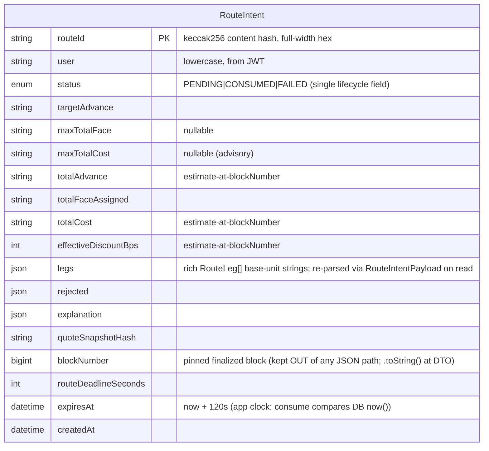
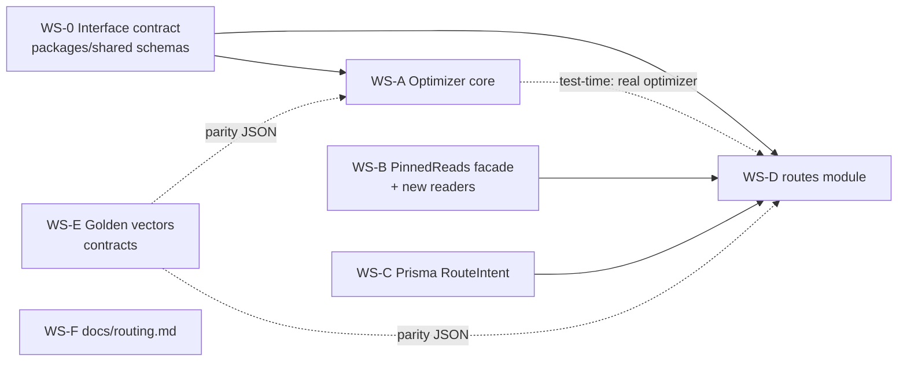

# ✨ feat: Deterministic Best-Execution Router

## Enhancement Summary

**Deepened on:** 2026-09-26 · **Agents:** 8 (kieran-typescript, architecture-strategist, security-sentinel,
performance-oracle, code-simplicity, data-integrity-guardian, best-practices-researcher,
framework-docs-researcher).

### Critical fixes folded in (were latent bugs in the first draft)

1. **[data-integrity C1] Intent revival bypass** — an unconditional `upsert` on the content-hash
   `routeId` could reset a `CONSUMED` intent to `PENDING` (single-use bypass). Now **`INSERT … ON
CONFLICT (routeId) DO NOTHING` + return existing row** (a collision is byte-identical by
   construction).
2. **[security H1] `minimumAdvanceAmount` is the only on-chain cost floor** — each prepared leg's
   `minimumAdvanceAmount` MUST equal the re-quoted advance (optionally − a documented slippage
   tolerance). Otherwise "advisory `maxTotalCost`" is unsafe.
3. **[security H2] DoS via fan-out** — hard-cap `claimIds.length` at the DTO **before** any chain
   read; reject oversized input `4xx` (not a silent greedy fallback).
4. **[architecture P1] `_validateLegs` was being encoded 4× in TS** (optimizer feasibility,
   collector reasons, `route-mirror`, and the _existing_ `executions-prepare`) — extract ONE shared
   per-leg predicate. Also: `executions-prepare` today is **missing** the token/issuer/vault-active
   checks (latent revert-fidelity gap).
5. **[architecture P1] Two missing chain readers** — `vaultRegistry.isActive(vault)` and vault
   `token()` are required by the mirror but absent from `ContractsService` and WS-B (`getVaults()`
   returns **all** vaults, not active-only).

### Key refinements

- **[performance P1] Greedy fast-path first.** Run O(n·log n) unconstrained greedy-by-rate; if it
  meets target in ≤ 8 legs it is **provably optimal → return immediately**. Enter the bounded exact
  search **only when greedy needs > 8 legs** (the C1 cap-binding case). Exact search is `O(n⁸)` under
  the cap (not `O(2ⁿ)`); `EXACT_SEARCH_MAX_CLAIMS = 16`, event-loop-blocking rationale documented.
- **[performance P0] Concurrent-wave collection** (mirror `executions-prepare` A/B/C `Promise.all` +
  viem `batch`) — ~10–20× latency (seconds → sub-second). Pinned `blockNumber` is fully compatible
  with batching (each `eth_call` carries its own block).
- **[typescript] Type the optimizer input** (`OptimizeInput`, not `unknown`) + a split
  `parseOptimizeInput`; real `z.discriminatedUnion("executable", …)` with a factored
  `RouteResultCore`; a bigint-only arithmetic module (no `number`/`1e4`/`Math.floor` in money paths);
  **brand only scalars**; **re-parse Prisma `Json` columns through Zod on read-back** (never cast to
  branded types); collapse the `status`+`consumed` dual state; `NormalizedAddress` for vaults before
  Map-keyed aggregation/hashing.
- **[architecture] Pinned-read facade** (`chain.at(blockNumber) → PinnedReads`) instead of threading
  an optional `blockNumber?` through ~8 methods (whose `undefined → latest` default reintroduces the
  exact non-determinism the feature removes).
- **[security M3] Surface `approximation: "exact" | "greedy"`** in the response — never silently
  return a sub-optimal route under the "cheapest route" headline.
- **[data-integrity H1] Opportunistic TTL prune** in `optimize()` (best-effort `deleteMany` of
  expired+consumed), mirroring `AuthNonce.issueNonce()` — no cron needed.

### Flagged for your decision (conflict with confirmed scope)

The **code-simplicity** reviewer recommends dropping the second endpoint + `RouteIntent` entirely
(reuse the existing `/executions/prepare`), and shipping pure greedy. This **conflicts with your
explicit spec** (both endpoints, persisted intents, quote-snapshot hash, brute-force fuzz) and your
confirmed decisions (exact search, consume-on-prepare) — and the security/data-integrity reviews
actively _validate_ the intent design. The performance greedy-fast-path already neutralizes the
algorithm objection. Kept as-is; see "Considered simplifications" and the decision at the end.

## Overview

Matura's core differentiator. Given a wallet's `targetAdvance` and its eligible unfunded claims, the
router deterministically selects the **cheapest verifiable route** — a set of `(claimId, vault,
faceAmount)` legs — that the on-chain `MaturaRouter.executeRoute` will independently accept. Two
new authenticated endpoints, backed by a **pure integer-only optimizer** in `packages/shared` and a
NestJS `routes` module in `apps/api`:

- `POST /api/v1/routes/optimize` — collect quotes → optimize → reconcile on-chain → persist a
  short-lived `RouteIntent` → return the route + rejected alternatives + deterministic explanation.
- `POST /api/v1/routes/:routeId/prepare-execution` — atomically consume the intent, re-validate
  against a fresh block, bind the router nonce, and emit the `ExecutionRoute` EIP-712 typed-data
  step (reusing the existing `executions-prepare` machinery).

This plan supersedes two claims in the brainstorm, based on the SpecFlow analysis:

1. **Algorithm** is a **bounded exact search + documented greedy fallback**, not pure greedy —
   greedy is _not_ optimal once the `MAX_LEGS = 8` cardinality cap binds.
2. **Block pinning is a new requirement** — the current read model reads at `latest` with no block
   argument, so determinism/snapshot-hash/parity are unachievable without threading a pinned
   `blockNumber` through the chain reads (**Workstream B**).

## Problem Statement

The existing `executions-prepare` service validates a **client-supplied** leg set — it does not
_choose_ legs. Users must hand-pick which claims and vaults to finance, and nothing guarantees the
selection is cheapest or even feasible on-chain. We need a server-side optimizer that:

- Meets `targetAdvance` at **minimum total assigned face/cost** (objective #1).
- Respects every on-chain constraint the router enforces (`_validateLegs` + route-level checks) so a
  returned route does not revert on any `_validateLegs`-checkable condition.
- Is **deterministic** (identical inputs → byte-identical route) and uses **integer base-unit
  arithmetic only** (no floats, no `any`).
- Produces a **verifiable explanation derived from the selected numbers**, plus machine-readable
  **rejected alternatives**.

## Proposed Solution

### Pipeline (both endpoints pin one finalized block for all reads)

```mermaid
sequenceDiagram
    participant C as Client (wallet, SIWE JWT)
    participant R as RoutesService (apps/api)
    participant Chain as ContractsService/ChainService (pinned reads)
    participant Opt as optimizeRoute() (packages/shared, pure)
    participant DB as RouteIntentService (Prisma)

    C->>R: POST /routes/optimize {targetAdvance, claimIds, maxTotalFace?/maxTotalCost?, deadlineSeconds}
    R->>Chain: getFrontierBlock() → pin blockNumber
    R->>Chain: paused(), getVaults(), per-vault getMandate()+fundableLiquidity(), per-claim getClaim()+isActive(), per-(claim,vault) quoteAndCheck()  [ALL @ blockNumber]
    R->>R: DoS cap claimIds; filter beneficiary==wallet; build QuoteSnapshot → quoteSnapshotHash (excl. routerNonce)
    R->>Opt: optimizeRoute({targetAdvance, caps, maxLegs:8, candidates})  [typed input]
    Opt-->>R: OptimizeResult — greedy fast-path (optimal, ≤8 legs) else bounded exact search
    alt executable
        R->>Chain: re-quote each SELECTED leg @ exact faceAmount [@ blockNumber] → set minimumAdvanceAmount = advance
        R->>R: off-chain mirror = shared evaluateLeg predicate + route-level aggregation (authoritative gate)
        R->>DB: prune expired/consumed; INSERT..ON CONFLICT(routeId) DO NOTHING {legs, snapshotHash, expiresAt=now+120s, PENDING}
        R-->>C: {routeId, executable:true, legs, aggregates(estimate@block), approximation, retainedFace, rejected[], explanation, expiresAt, finalizedThrough}
    else non-executable
        R-->>C: {executable:false, reasonCode, shortfallAdvance, maxAchievableAdvance, bestFeasiblePartial?, rejected[], explanation}
    end

    C->>R: POST /routes/:routeId/prepare-execution
    R->>DB: atomic consume (UPDATE ... SET status='CONSUMED' WHERE routeId AND user AND status='PENDING' AND expiresAt>now RETURNING)
    R->>Chain: fresh block → re-run mirror + routerNonce()  [on fail → status='FAILED', re-optimize error]
    R->>R: deadline = min(userRouteDeadline, now+300s); build ExecutionRoute message; executionId=hashTypedData(...)
    R-->>C: PrepareResponse { typed-data step, submitFunction:"executeRoute" }
```

### Key design decisions (confirmed)

| Decision              | Choice                                                                                                                                                                                                                                                                                                                                                      |
| --------------------- | ----------------------------------------------------------------------------------------------------------------------------------------------------------------------------------------------------------------------------------------------------------------------------------------------------------------------------------------------------------- |
| Optimizer algorithm   | **Greedy fast-path first** (O(n·log n), provably optimal + returned immediately when it meets target in ≤ 8 legs — every demo case). **Bounded exact search** (branch-and-bound, `O(n⁸)` under the cap) runs only when greedy needs > 8 legs; degrades to greedy above `EXACT_SEARCH_MAX_CLAIMS=16` with `approximation:"greedy"` surfaced in the response. |
| Router "simulation"   | **Off-chain mirror** of `_validateLegs` + route-level checks + `paused()` + slice-count, pinned to one finalized block; guarded by golden-vector parity tests. No contract change.                                                                                                                                                                          |
| Pricing source        | **Collect → linear-select → on-chain reconcile.** Selection uses the size-independent rate; final `advance`/`discount`/`minimumAdvanceAmount` for selected legs come from a re-quote via `quoteAndCheck`.                                                                                                                                                   |
| Endpoint auth         | **Both authenticated** via the global `WalletAuthGuard`; wallet from JWT (`@Wallet()`), never the body.                                                                                                                                                                                                                                                     |
| Intent lifecycle      | **Bind nonce once + consume-on-prepare** (atomic, mirrors `AuthNonce`). Second prepare of the same `routeId` → refused, re-optimize.                                                                                                                                                                                                                        |
| Optimizer home        | `packages/shared` (pure `bigint`, vitest + fast-check).                                                                                                                                                                                                                                                                                                     |
| Quote provenance      | **Server-fetched** from chain; client supplies only `claimIds`, `targetAdvance`, caps, `deadlineSeconds`. Claim metadata (issuer/type/dueDate/remaining) is re-read on-chain (untrusted client input).                                                                                                                                                      |
| One claim → one vault | Contract-enforced (`DuplicateClaimInRoute`, MaturaRouter.sol:162-172); no intra-route split.                                                                                                                                                                                                                                                                |
| `maxTotalCost`        | **Off-chain-advisory** — `ExecutionRoute` has no cost field on-chain. Enforced by the optimizer only; labeled as such in the response. Favorable drift makes it a safe upper bound.                                                                                                                                                                         |

## Technical Approach

### Architecture & new files

```
packages/shared/src/routing/       # files may be consolidated at implementer discretion
  candidate.ts           # RouteCandidate zod schema (scalars branded, not the object)
  optimize-io.ts         # OptimizeInput, RouteResultCore, RouteResult, NonExecutableResult,
                         #   OptimizeResult (discriminatedUnion), RouteIntentPayload, parseOptimizeInput
  reasons.ts             # REASON_PRECEDENCE (source of truth) → RejectionReason enum + rank()
  explanation.ts         # deterministic Explanation schema (numbers only, stable ordering)
  arithmetic.ts          # bigint-only ceilDiv (throws on 0n), advance(face,bps), ratio cross-multiply
  optimize.ts            # optimizeRoute(input: OptimizeInput): OptimizeResult   (PURE)
  index.ts               # (barrel add-ons re-exported from packages/shared/src/index.ts)
  __tests__/optimize.test.ts             # unit — full test matrix
  __tests__/brute-force-reference.ts     # exhaustive reference optimizer (test-only)
  __tests__/optimize.property.test.ts    # fast-check vs brute-force (optimality)
  __tests__/optimize.parity.test.ts      # golden-vector acceptance/aggregate parity

apps/api/src/routes/
  routes.module.ts       # 2-line module (relies on @Global Chain/Cursor/Prisma modules)
  routes.controller.ts   # @Post("optimize"), @Post(":routeId/prepare-execution") — authed
  routes.dto.ts          # OptimizeRequestDto, OptimizeResponseDto, PrepareExecutionResponse (createZodDto)
  quote-collector.ts     # concurrent-wave pinned collection; DoS cap; beneficiary==wallet filter → RouteCandidate[] + rejects
  evaluate-leg.ts        # SHARED _validateLegs predicate (used by collector, mirror, executions-prepare)
  route-mirror.ts        # thin — evaluateLeg + route-level aggregation (authoritative reconcile gate)
  route-hash.ts          # canonical serialization (throws on bigint) → quoteSnapshotHash + routeId
  routes.service.ts      # optimize() + prepareExecution() (explanation passed through from optimizer)
  route-intent.service.ts# createIfAbsent (ON CONFLICT DO NOTHING) + atomic consume + opportunistic prune
  routes.service.spec.ts
  quote-collector.spec.ts
  route-mirror.spec.ts           # + golden-vector parity
  route-hash.spec.ts

apps/api/src/common/
  prepare.serialize.ts   # EXTRACTED serializeMessage helper (shared by executions-prepare + routes)

apps/api/prisma/schema.prisma            # + model RouteIntent, + enum RouteIntentStatus (PENDING|CONSUMED|FAILED)
apps/api/prisma/migrations/<n>_route_intent/migration.sql   # via migrate diff (no-dev-DB, v6 flags)

packages/contracts/test/
  fixtures/route-golden-vectors.gen.ts   # generator: builds routes, dumps quoteAndCheck + accept/reject + aggregates
  fixtures/route-golden-vectors.json     # committed vectors (consumed by shared + api parity tests)
  RouteGoldenVectors.test.ts             # asserts on-chain executeRoute matches vector accept/reject

docs/routing.md                          # objective, constraints, complexity, why-MVP-appropriate
```

### Interface contract (the parallelization synchronization point)

`RouteCandidate` (one eligible `(claim, vault)` option, all money as `BaseUnitAmount` strings):

```ts
// packages/shared/src/routing/candidate.ts  (pseudocode)
// [typescript] Brand SCALARS only (BaseUnitAmount/ClaimId/NormalizedAddress) — NOT the object.
// vault is NormalizedAddress (lowercase) so Map-keyed per-vault aggregation + canonical hashing
// can't be corrupted by mixed case. dueDate is the single maturity source (tie-break derives from it
// via BigInt(dueDate) compare — no redundant maturityRank).
export const RouteCandidate = z
  .object({
    claimId: ClaimId,
    vault: NormalizedAddress,
    claimType: ClaimType,
    dueDate: z.string().regex(/^\d+$/), // unix seconds; drives duration + maturity tie-break
    remainingFace: BaseUnitAmount, // faceValue - financedFaceValue
    minFace: BaseUnitAmount, // mandate.minFace
    maxFace: BaseUnitAmount, // min(mandate.maxFace, remainingFace)
    vaultFundable: BaseUnitAmount, // fundableLiquidity(vault) snapshot
    rateBps: z.number().int().min(0).max(3000), // size-independent discount rate from the probe quote
    slicesRemaining: z.number().int().min(0), // MAX_SLICES_PER_CLAIM - sliceCount
  })
  .strict(); // no object-level .brand()
```

`OptimizeInput` / `RouteResult` / `NonExecutableResult`:

```ts
// packages/shared/src/routing/optimize-io.ts  (pseudocode)
export const OptimizeInput = z
  .object({
    targetAdvance: BaseUnitAmount,
    maxTotalFace: BaseUnitAmount.optional(),
    maxTotalCost: BaseUnitAmount.optional(), // advisory (no on-chain field)
    maxLegs: z.number().int().positive().default(8),
    candidates: z.array(RouteCandidate),
  })
  .strict();

// [typescript] Factor a shared core (no discriminant) so bestFeasiblePartial can reuse it without
// nesting an executable:true inside an executable:false. effectiveDiscountBps computed via bigint
// floor-div: Number((totalCost * 10_000n) / totalFaceAssigned) — the ONLY Number() in the module.
const RouteAggregates = z
  .object({
    totalAdvance: BaseUnitAmount,
    totalFaceAssigned: BaseUnitAmount,
    totalCost: BaseUnitAmount,
    effectiveDiscountBps: z.number().int(),
  })
  .strict();
const RouteResultCore = z
  .object({
    legs: z.array(RouteLeg), // rich RouteLeg from route.ts (adds advance/discount)
    retainedFace: z.array(z.object({ claimId: ClaimId, retained: BaseUnitAmount }).strict()),
  })
  .merge(RouteAggregates);

// Members are PLAIN z.objects with a literal discriminant + NO top-level .refine (required by
// z.discriminatedUnion). Cross-field invariants live in the optimizer / on nested schemas.
export const RouteResult = RouteResultCore.extend({
  executable: z.literal(true),
  approximation: z.enum(["exact", "greedy"]), // [security M3] disclose non-guaranteed best-exec
  rejected: z.array(RejectedAlternative),
  explanation: Explanation,
});
export const NonExecutableResult = z
  .object({
    executable: z.literal(false),
    reasonCode: RejectionReason,
    shortfallAdvance: BaseUnitAmount,
    maxAchievableAdvance: BaseUnitAmount,
    bestFeasiblePartial: RouteResultCore.optional(),
    rejected: z.array(RejectedAlternative),
    explanation: Explanation,
  })
  .strict();

// The single result type consumers narrow on:
export const OptimizeResult = z.discriminatedUnion("executable", [
  RouteResult,
  NonExecutableResult,
]);
export type OptimizeResult = z.infer<typeof OptimizeResult>;

// [typescript P0] Re-parse Prisma Json columns through THIS on read-back — never cast JsonValue to
// branded RouteLeg[]. Write side: `legs.map(l => ({...l})) satisfies Prisma.InputJsonValue`.
export const RouteIntentPayload = z
  .object({
    legs: z.array(RouteLeg),
    rejected: z.array(RejectedAlternative),
    explanation: Explanation,
  })
  .strict();
```

`RejectionReason` — **[typescript] single-source the precedence** (derive the enum from the ordered
array so they can't drift), giving a deterministic single reported reason when several apply:

```ts
// packages/shared/src/routing/reasons.ts
export const REASON_PRECEDENCE = [
  "NOT_OWNED_BY_WALLET",
  "UNSUPPORTED_CLAIM_TYPE",
  "ISSUER_INACTIVE",
  "VAULT_INACTIVE",
  "EXCEEDS_DURATION",
  "BELOW_MIN_LOT",
  "ABOVE_MAX_LOT",
  "INSUFFICIENT_LIQUIDITY",
  "NO_SLICES_REMAINING",
  "QUOTE_EXPIRED",
  "MAX_COST_EXCEEDED",
  "MAX_LEGS_REACHED",
  "HIGHER_MARGINAL_COST",
  "TARGET_UNSATISFIABLE",
  "NO_ELIGIBLE_CANDIDATES",
  "ROUTER_PAUSED",
] as const;
export const RejectionReason = z.enum(REASON_PRECEDENCE);
export type RejectionReason = z.infer<typeof RejectionReason>;
const rank = (r: RejectionReason) => REASON_PRECEDENCE.indexOf(r); // typed comparator
```

### `optimizeRoute` — bounded exact search (pure, integer)

```ts
// packages/shared/src/routing/optimize.ts  (pseudocode — bigint throughout, NO any)
// Input is TYPED (validated at the HTTP boundary by createZodDto); the pure core does not re-parse.
export function parseOptimizeInput(raw: unknown): OptimizeInput {
  return OptimizeInput.parse(raw);
}

export function optimizeRoute(input: OptimizeInput): OptimizeResult {
  // discriminated union
  const target = BigInt(input.targetAdvance);

  // 0. Normalize + sort candidates canonically (lowercase vault, ascending rateBps, then claimId).
  //    Group by claim; each claim keeps its eligible vaults sorted by rate. Rate compare WITHOUT
  //    floats via cross-multiplication. advance(face,bps) = face - ceilDiv(face*BigInt(bps), 10_000n)
  //    — the ONE reimplemented formula, in a bigint-only arithmetic module (ceilDiv throws on 0n).
  //
  // 1. GREEDY FAST-PATH (covers every demo case): allocate face across claims by ascending marginal
  //    rate, each claim to its cheapest liquidity-available vault (fallback to next-cheapest as a
  //    vault's per-vault fundable headroom is consumed — aggregate advances per vault, mirroring
  //    MaturaRouter.sol:150-160). Respect minFace (min-lot) + remainingFace. If this meets `target`
  //    using ≤ maxLegs legs, it is PROVABLY OPTIMAL under size-independent pricing →
  //    return { executable:true, approximation:"exact", ... } IMMEDIATELY. O(n log n).
  //
  // 2. BOUNDED EXACT SEARCH (only if greedy needed > maxLegs legs — the C1 cardinality-cap case):
  //    branch-and-bound over feasible claim subsets of size 1..maxLegs, using the greedy cost as an
  //    admissible LOWER BOUND to prune. Vault assignment stays GREEDY O(k·V) per subset — never
  //    enumerate assignments (V^k). Under the 8-leg cap this is O(n^8), not O(2^n). Guard:
  //    if eligibleClaims.length > EXACT_SEARCH_MAX_CLAIMS (=16) → single-pass greedy +
  //    approximation:"greedy" (a synchronous bigint search on the event loop; 16 ⇒ tens of ms worst).
  //    (Oversized *request* input is already rejected at the DTO before collection — see WS-D.)
  //
  // 3. Pick the FEASIBLE result minimizing totalCost, tie-broken by: fewer legs → earlier maturity
  //    → lexicographic (claimId, vault). Comparator returns number (never bigint).
  // 4. None feasible → NonExecutableResult { executable:false, reasonCode, shortfallAdvance,
  //    maxAchievableAdvance, bestFeasiblePartial? }. Empty candidates → NO_ELIGIBLE_CANDIDATES.
}
```

**`approximation` field:** `RouteResult` carries `approximation: "exact" | "greedy"`. The greedy
fast-path and the exact search both emit `"exact"` (both optimal); only the `> EXACT_SEARCH_MAX_CLAIMS`
degradation emits `"greedy"`, so clients can disclose that best-execution was not guaranteed.

**Overshoot rule (objective #4):** the marginal (last) leg draws exactly enough face to meet the
target; if that is below the vault's `minFace`, it rounds up to `minFace` (the smallest unavoidable
lot overshoot) or the subset is rejected if that breaks a cap. No allocation exceeds `remainingFace`.

### Off-chain mirror — ONE shared predicate, three consumers

**[architecture P1] Do not re-encode `_validateLegs` per module.** Extract a single per-leg predicate
`evaluateLeg(leg, chainState) → { ok: true } | { ok: false; reason: RejectionReason }` plus the
route-level aggregation, and have **all three** consumers use it: `quote-collector` (candidate
filtering + reason mapping), `route-mirror` (final reconcile gate), **and the refactored
`executions-prepare`** (which today is _missing_ the token/issuer/vault-active checks — a latent
revert-fidelity bug). Point the golden vectors (WS-E) at _this_ predicate. If touching
`executions-prepare` is out of scope, note the divergence and file a follow-up.

Must reproduce, **in order** (mirror of `MaturaRouter._validateLegs`, L108-160): beneficiary == user ·
`vault.token() == claim.token` (**needs a new vault `token()` reader**) · state ∈ {ELIGIBLE,
PARTIALLY_FUNDED} · `IssuerRegistry.isActive(issuer)` · `vaultRegistry.isActive(vault)` (**needs a
new `isVaultActive` reader** — `getVaults()` returns _all_ registered vaults, VaultRegistry.sol:71) ·
`quoteAndCheck.ok` · `advance ≥ minimumAdvanceAmount`. Route-level: no duplicate `claimId` ·
`legs.length ≤ 8` · **per-distinct-vault** reserved advance ≤ cached `fundableLiquidity()`
(aggregate!) · `totalFace ≤ maxTotalFace` · `totalAdvance ≥ targetAdvance`. **Additions beyond
`_validateLegs`:** router `paused()` (fail closed) and per-claim `slicesRemaining > 0`
(`reserveSlice` reverts in the effects phase — un-mirrorable otherwise).

**[security H1] `minimumAdvanceAmount` binding:** at reconcile, each selected leg is re-quoted at its
**exact** chosen `faceAmount`, and the prepared `minimumAdvanceAmount` is set to **that re-quoted
advance** (optionally − a documented slippage tolerance). This is the _only_ on-chain cost floor
(`ExecutionRoute` has no cost field), so it is what makes advisory `maxTotalCost` safe. Assert
`minimumAdvanceAmount == reQuotedAdvance` for every leg in a test.

**Re-mirror is the authoritative gate** (document in `docs/routing.md`): the optimizer's feasibility
logic is _advisory_; the on-chain re-quote + re-mirror at reconcile/prepare is authoritative, so any
optimizer bug surfaces as a spurious `NonExecutableResult` (false-negative), never as a route that
reverts. This lowers the correctness bar on the optimizer and clarifies why the (still-worth-fixing)
duplication is not a soundness hole.

**Explicitly out of mirror scope (documented in `docs/routing.md`):** effects-phase reverts inside
`reserveSlice`/`registerAllocation`/`vault.fund` beyond slice-count, and any nonce bump between
prepare and user submit (`InvalidAccountNonce`) — these are surfaced as _expected_ failures, not
bugs.

### ERD — new model



`RouteIntent` is standalone (**no FK** to the projection tables — the indexer full-wipes/reindexes
those, so a FK would cascade-delete or block the wipe; add a schema comment saying so, and noting
`RouteIntentStatus` ≠ the projection `RouteStatus`). Only `@@index([expiresAt])` (for the prune).
**[data-integrity C1] Create-or-ignore write** (no upsert — can't revive a consumed row):

```sql
INSERT INTO "RouteIntent" (...) VALUES (...) ON CONFLICT ("routeId") DO NOTHING;  -- then SELECT the row
```

**Atomic consume** (single lifecycle field; `"user"` double-quoted — reserved word):

```sql
UPDATE "RouteIntent" SET status = 'CONSUMED'
WHERE "routeId" = $1 AND "user" = $2 AND status = 'PENDING' AND "expiresAt" > now()
RETURNING *;   -- 0 rows → user-scoped classify → conflict / gone; NEVER a cross-user status oracle
```

**Hash spec [data L2]:** `routeId`/`quoteSnapshotHash` = `keccak256` (via viem
`keccak256(encodeAbiParameters(...))` or an RFC-8785-canonicalized `sha256`), **full-width hex** (no
truncation → no collision on the content-addressed PK), over a fixed field order with lowercase
addresses and base-unit strings; the canonical serializer **throws on any `bigint`/`undefined`** so
byte-identical determinism is enforced, not incidental. `routerNonce` is excluded (bound at prepare).

## Implementation Phases → Parallel Workstreams

**WS-0 is the only blocking prerequisite** (defines the shared types every other stream codes
against). Once it lands, A/D proceed; B/C/E/F are independent and start immediately.



### WS-0 — Interface contract (blocking, small) · `packages/shared`

- Add `src/routing/{candidate,optimize-io,reasons,explanation}.ts` (schemas only, no logic) — including
  `OptimizeResult` (discriminatedUnion), `RouteResultCore`, `RouteIntentPayload`, `REASON_PRECEDENCE`.
- Extend `src/index.ts` barrel with the new exports (`.js` specifiers, per repo convention).
- **Also freeze the apps/api-side interface signatures** WS-D codes against: the `PinnedReads` reader
  surface (incl. the two NEW readers `isVaultActive`, `vaultToken`, + `routerPaused`) and the
  `RouteIntentService` method shapes — so B/C/D can proceed truly in parallel.
- Deliverable: types compile + are importable by `apps/api` via the `@matura/chain`-style barrel.
- Success: `pnpm --filter @matura/shared build && typecheck` green.

### WS-A — Optimizer core (after WS-0) · `packages/shared`

- Implement greedy fast-path → bounded exact search, integer-only, in a bigint-only arithmetic module
  (`ceilDiv` throws on `0n`; ratio compares via cross-multiplication; comparators return `number`).
- Add `fast-check: catalog:` to `packages/shared` devDependencies. **Pin the major version** (v5
  removes `interruptAfterTimeLimit`; repo is on 3.23.2).
- **[best-practices] Property tests as three separate assertions** (not a `deepEqual` — the tie-trap):
  (1) **feasibility** — a pure predicate on (input, output), no oracle; (2) **optimality by value** —
  `objective(fast) === objective(brute)` (exact `===`, no epsilon — a bigint advantage); (3)
  **deterministic tie-break** — among the brute-force optima, assert the documented canonical one.
  `brute-force-reference.ts` uses **independent** naive arithmetic (no shared mulDiv/ceilDiv helpers —
  avoid oracle anchoring). Add metamorphic guards (scale-invariance, permutation-invariance,
  dominated-vault no-op). Build feasible portfolios **by construction** (`fc.bigInt`, not
  `integer().map(BigInt)`; avoid `.filter`). **Pin `seed` + `numRuns` (≥1000 in CI)** via
  `fc.configureGlobal` (default seed is `Date.now()` — non-reproducible); capture counterexamples into
  `examples` as a regression corpus.
- Tests: `optimize.test.ts` (matrix + the C1 cap-binding regression), `brute-force-reference.ts`,
  `optimize.property.test.ts`, `optimize.parity.test.ts` (WS-E vectors).
- Success: `pnpm --filter @matura/shared test` green; property test deterministic on a pinned seed.

### WS-B — Pinned-read facade + new readers (independent) · `apps/api/src/chain`

- **[architecture P2] Prefer a pinned-read context over threading `blockNumber?` through ~8 methods.**
  Add `ChainService.at(blockNumber: bigint): PinnedReads` returning a facade whose read methods take
  **no** block argument (they close over the pinned block). This makes "one block per request"
  _structural_ — the collector/mirror receive a `PinnedReads` and physically cannot read at `latest`
  (the `undefined → latest` default is the exact bug the feature removes). Localizes the viem
  `readContract({ blockNumber })` plumbing to one place.
- `PinnedReads` surface: `quoteAndCheck`, `fundableLiquidity`, `routerNonce`, `isIssuerActive`,
  `isFinanceable`, `getMandate`, `getClaim` (expose `sliceCount`, already on `OnChainClaim`), plus
  **two NEW readers required by the mirror**: `isVaultActive(vault)` (`vaultRegistry.isActive` — does
  not exist today) and `vaultToken(vault)` (`ILiquidityVault.token()` — does not exist today, for the
  `TokenMismatch` check; may be cached, invariant per vault). Add `routerPaused()` (router `paused()`).
- **List these readers in the WS-0 interface contract** so WS-D codes against them before WS-B lands.
- viem note: `blockNumber` is `bigint`; a client-level `batch.multicall` only coalesces reads sharing
  the **same** block context — so pinning the same block on every read is what enables aggregation.
- Success: existing `chain` specs updated + green; strict viem typing preserved (tuple destructure,
  `BaseError`/`ContractFunctionRevertedError`/`ContractFunctionZeroDataError` walk untouched).

### WS-C — Prisma `RouteIntent` + repo (independent) · `apps/api`

- Add `model RouteIntent` to `schema.prisma`. **[typescript/data-integrity] Collapse dual state:**
  use a single lifecycle field. Recommended: keep `status` enum `PENDING|CONSUMED|FAILED` and make
  the consume guard `WHERE status='PENDING' AND expiresAt>now()` — drop the separate `consumed`
  boolean (two sources of truth drift). Do **not** persist an `EXPIRED` status value (expiry is the
  `expiresAt > now()` predicate, never written). Add a schema comment: standalone table, **no FK** to
  projection tables (indexer full-wipe would cascade/block); and note `RouteIntentStatus` ≠ the
  projection `RouteStatus`.
- **[data-integrity C1] Create-or-ignore, never upsert.** The write is
  `INSERT … ON CONFLICT ("routeId") DO NOTHING` then return the existing row — a content-hash
  collision is byte-identical by construction, so this can never revive a `CONSUMED` intent.
- **[data-integrity H1] Opportunistic prune** at the top of `optimize()`: best-effort
  `deleteMany({ where: { OR: [{ expiresAt: { lt: now } }, { status: 'CONSUMED' }] } })`, mirroring
  `AuthNonce.issueNonce()` (auth.service.ts:38-66) — no cron. Keep `@@index([expiresAt])` for this
  delete; **drop `@@index([user])`** (no query uses it — consume/getForUser are PK lookups).
- Generate migration via the **no-dev-DB** pattern (v6 flags — see Toolchain Gotchas); commit
  `prisma/migrations/**` + never `db push`. Keep the SQL enum value order aligned with shared enums.
- `route-intent.service.ts`: `createIfAbsent(routeId, …)`, `consume(routeId, user)`,
  `getForUser(routeId, user)`. **[typescript/data-integrity M3]** if using raw
  `$queryRaw<Row[]>\`UPDATE … RETURNING …\``: keep `"user"`double-quoted (reserved word), supply an
explicit row generic (no`any`), and **re-validate `Json`/`bigint`columns with Zod on read-back**
(Prisma returns`Json`as a parsed object typed only as`Prisma.JsonValue`, `blockNumber`as`bigint`). Alternative: `updateMany`+`count===1`+ a follow-up PK read (mirrors`AuthNonce`
  exactly) — pick one and state it.
- Success: `pnpm --filter @matura/api db:generate` + a Testcontainers **`migrate deploy` from zero**
  as the reproducibility CI gate.

### WS-D — `routes` module (after WS-0; consumes B+C interfaces) · `apps/api`

- **[security H2] DoS guard first.** `routes.dto.ts` hard-caps `claimIds.length` (e.g. ≤ 20) and the
  collector caps total candidates (claims × vaults); oversized → `4xx` **before any chain read**.
  Stricter `@Throttle` on `optimize` than `prepare-execution` (optimize is far more expensive).
  (This is distinct from `EXACT_SEARCH_MAX_CLAIMS`, which only bounds the in-optimizer search.)
- **[performance P0] Concurrent-wave collection.** `quote-collector.ts` MUST fan out via `Promise.all`
  waves (mirror `executions-prepare` A/B/C, contracts.service reads), all pinned to one block via the
  WS-B `PinnedReads` facade — NOT a sequential `for/await` loop (that is 10–20× slower). This is an
  acceptance criterion, not an implementation detail.
- **[security M1] Ownership filter.** The collector filters candidates to `claim.beneficiary == wallet`
  (JWT) **before** issuing quotes (avoids IDOR info-leak via `rejected[]`); add a `NOT_OWNED_BY_WALLET`
  reason (or fold into `NO_ELIGIBLE_CANDIDATES`). `RouteCandidate` need not carry `beneficiary` — this
  is a collection-time filter, not optimizer logic.
- **[simplicity] `route-explanation.ts` is dropped** — the pure optimizer already emits `explanation`
  in `RouteResult`; the service passes it through. Files: `quote-collector.ts`, `route-mirror.ts`
  (thin — delegates to the shared `evaluateLeg` predicate), `route-hash.ts`, `routes.service.ts`
  (`optimize` + `prepareExecution`), `routes.controller.ts` (both `@Post`, authed), `routes.dto.ts`.
- Extract `serializeMessage` → `src/common/prepare.serialize.ts` (or co-locate in `@matura/chain`
  next to `EXECUTION_ROUTE_TYPES`); refactor `executions-prepare` to import it. **[typescript P0]** its
  JSDoc must state it produces the **response-only string view**; `executionId`/`hashTypedData` are
  ALWAYS computed from the **bigint** message — never the serialized one (wrong-but-plausible digest).
- Register `RoutesModule` in `app.module.ts`.
- `prepareExecution` reuses `routerDomain` + `EXECUTION_ROUTE_TYPES` + `hashTypedData` +
  `buildPrepareResponse`; **consume-first** (atomic, `INSERT…DO NOTHING`/`status='PENDING'` guard),
  then fresh-block mirror, then bind nonce + deadline. **[security L1/data M1]** on post-consume
  mirror failure → set `status='FAILED'` and return a distinct "re-validation failed, re-optimize"
  error (not a generic conflict). **[security M2]** classify consume 0-row failures only via a
  **user-scoped** `getForUser` (no status oracle); identical generic error for not-found vs
  wrong-user; differentiate expired-vs-consumed only for rows the caller owns. **[security L2]** reject
  at prepare if `deadline = min(userRouteDeadline, now+300s) ≤ now + margin`.
- **[data-integrity M4] Label estimates:** persisted/returned `advance`/`discount`/`effectiveDiscountBps`
  are estimate-at-`blockNumber`; tie them to `finalizedThrough` in the response so clients don't treat
  them as guaranteed outcomes (the on-chain recompute is authoritative).
- Tests: `routes.service.spec.ts`, `quote-collector.spec.ts`, `route-mirror.spec.ts` (+ WS-E parity),
  `route-hash.spec.ts`, and `test/routes.int-spec.ts` (Testcontainers: full optimize→prepare→consume,
  double-prepare conflict, expiry, **re-optimize-does-not-revive-consumed** [C1 regression],
  post-consume-mirror-fail → FAILED).
- Success: `pnpm --filter @matura/api test` + `test:int` green. **Note the WS-A→WS-D test-time edge:**
  the service/int specs exercise the real optimizer, so WS-D cannot _complete_ until WS-A lands (unit
  stubs suffice to start).

### WS-E — Golden-vector parity fixtures (independent, Node 24) · `packages/contracts`

- `fixtures/route-golden-vectors.gen.ts` builds representative routes, records `quoteAndCheck`
  outputs + the `_validateLegs` accept/reject decision + aggregates → `route-golden-vectors.json`.
- `RouteGoldenVectors.test.ts` asserts the real `executeRoute` accepts/reverts as the vector says.
- **Fixtures MUST cover:** partial-face legs, two-legs-same-vault aggregation, the
  `reserved == fundable` boundary and off-by-one, min-lot overshoot, slice-exhaustion, paused router,
  and **[architecture P3.7] multiple face sizes on one `(claim,vault)`** — assert the reimplemented
  `advance(face,bps)` matches on-chain `quoteAndCheck` across sizes, pinning the linearity assumption
  to reality (the property test shares the assumption, so only vectors catch a `ceilFee`/rounding
  non-linearity at the margin).
- **[best-practices] Vector-freshness CI gate** (regenerate + `git diff --exit-code`), mirroring the
  existing ABI-freshness and manifest-freshness gates; embed an ABI/contract fingerprint in the JSON
  so a stale mirror is detected at test time.
- Downstream (WS-A/WS-D parity tests) stub against a small inline vector, then swap to the JSON.

### WS-F — `docs/routing.md` (independent)

- Objective, constraints, the linear-pricing insight (state it as an **assumption** pinned by the
  multi-face golden vectors), the greedy-fast-path-then-exact algorithm + why it's correct and cheap
  at MVP scale (complexity, `EXACT_SEARCH_MAX_CLAIMS`, event-loop rationale), the **re-quote/re-mirror
  as authoritative gate** framing (optimizer feasibility is advisory), the mirror's scope + documented
  out-of-scope reverts (effects-phase, nonce bump), the "advisory `maxTotalCost`" + "favorable drift"
  notes, and the HTTP error semantics (`409` double-prepare, `410 Gone` expired-quote, `422`
  re-validation-failed) with the repo's coded-error envelope (`conflict`/`unprocessable`/`notFound`,
  - a `gone`/410 helper if added).

## Alternative Approaches Considered

- **Pure greedy-by-rate** (brainstorm's original): rejected — not optimal/feasibility-complete under
  the 8-leg cap (SpecFlow C1). Kept only as a documented fallback above the exact-search threshold.
- **Fully reimplement pricing in the optimizer** (compute advance/discount from `getMandate`): rejected
  — duplicates the whole Solidity formula (drift risk); we re-quote selected legs on-chain instead.
- **Add a view `previewRoute()` to `MaturaRouter`**: rejected for MVP — contract change + testnet
  redeploy inside the window; off-chain mirror + golden vectors gives equivalent confidence.
- **In-memory intent store**: rejected — Prisma `RouteIntent` matches the repo's `AuthNonce` TTL
  precedent, survives process restarts, and enables the atomic consume guard.

### Considered simplifications (deepen review) — kept, with rationale

The **code-simplicity** review recommended aggressive cuts. Adjudicated against your explicit spec +
confirmed decisions + the other reviewers:

- **"Drop the 2nd endpoint + `RouteIntent`; reuse `/executions/prepare`"** — **not applied.** Your spec
  mandates both endpoints, persisted intents with expiry, and a quote-snapshot hash; you confirmed
  consume-on-prepare; and the security + data-integrity reviews validate the intent design as
  load-bearing (single-use guard, IDOR defense). _Open to revisiting if you want the leaner shape._
- **"Ship pure greedy, drop exact search"** — **resolved, not cut.** The performance greedy-fast-path
  returns immediately when optimal (every demo case); the bounded exact search only runs when the
  8-leg cap binds. You keep provable optimality at ~zero cost for the common path.
- **"Drop golden vectors + brute-force harness"** — **not applied.** Your spec requires the brute-force
  fuzz reference; the architecture review calls golden vectors the correct Solidity-parity seam (and
  wants them _extended_ to pin linearity). Kept.
- **Applied simplifications:** `route-explanation.ts` dropped (optimizer emits `explanation`); dual
  `consumed`+`status` collapsed to one field; `@@index([user])` dropped; shared schema files may be
  consolidated at the implementer's discretion.

## Acceptance Criteria

### Functional

- [ ] `POST /api/v1/routes/optimize` (authed) returns a deterministic `RouteResult` for the demo
      scenarios; identical inputs at the same pinned block → **byte-identical** response.
- [ ] Selected route passes the off-chain mirror; at prepare time it passes a fresh-block re-mirror.
- [ ] Infeasible inputs return a structured `NonExecutableResult` (never a bogus route).
- [ ] `effectiveDiscountBps`, `totalCost`, `retainedFace` are derived from the selected numbers; the
      `explanation` is generated from those numbers (no LLM text).
- [ ] `rejected[]` reports one machine-readable reason per eligible-but-unused / filtered candidate,
      using the single-source precedence; the response carries `approximation: "exact" | "greedy"`.
- [ ] `POST /api/v1/routes/:routeId/prepare-execution` (authed) atomically consumes the intent, binds
      `routerNonce` once, sets `deadline = min(userRouteDeadline, now+300s)`, sets each leg's
      `minimumAdvanceAmount` to the re-quoted advance, and emits a valid `ExecutionRoute` typed-data
      step whose `executionId` matches an independent `hashTypedData` **of the bigint message**.
- [ ] A second prepare of the same `routeId` → `409/conflict` (`ROUTE_INTENT_UNAVAILABLE`); re-optimizing
      identical inputs at the same block does **NOT** revive a consumed intent (C1).
- [ ] Expired intent → `410 Gone` (re-optimize). Post-consume re-validation failure → distinct
      `422`-style "re-validate/re-optimize" error, intent marked `FAILED`.
- [ ] Oversized `claimIds`/candidate count → `4xx` **before** any chain read (DoS guard).

### Non-Functional

- [ ] Optimizer is pure — **no** DB/network/`Date`/`Math.random` imports in `packages/shared/src/routing`;
      input is typed `OptimizeInput` (not `unknown`); result is a `z.discriminatedUnion`.
- [ ] **No `any`** anywhere (type-aware ESLint `strictTypeChecked`); money is `BaseUnitAmount`
      strings / `bigint`; **no `number` in money paths** (no `1e4`/`Math.floor`); BigInt never crosses
      the JSON boundary; Prisma `Json` re-parsed via `RouteIntentPayload` on read-back (never cast).
- [ ] All chain reads for one request go through a single `PinnedReads` facade (structurally one block).
- [ ] `quote-collector` fans out in concurrent `Promise.all` waves (no sequential `for/await`).
- [ ] Wallet is taken from the JWT, never the body; candidates filtered to `beneficiary == wallet`.

### Quality Gates

- [ ] `pnpm build | lint | typecheck | test` green across the monorepo.
- [ ] fast-check property test on a **pinned seed** (`numRuns ≥ 1000` in CI) confirms feasibility
      (always) + optimality-by-value vs the independent brute-force reference + the tie-break rule.
- [ ] Golden-vector parity: mirror decision == on-chain `_validateLegs` decision for every vector,
      including the multi-face linearity vectors; **vector-freshness CI gate** (regen + `git diff`).
- [ ] `apps/api` Testcontainers int test covers the intent lifecycle + double-prepare + expiry + the
      C1 revive-guard; migration verified via `migrate deploy` from an empty DB.
- [ ] CI ABI/manifest freshness gates still pass; migration is committed + reproducible.

## Test Matrix

Brainstorm rows: single cheapest partial payroll slice · payroll+stream combo · cheaper-quote
lacking liquidity · unsupported claim type · max-cost infeasible → non-executable · expired quote ·
equal-cost deterministic tie-break · min-lot & rounding boundary · claim nearly fully financed · no
eligible route · fuzz vs brute-force.

**Added from SpecFlow (each a named test):**

- [ ] `MAX_LEGS` cap binds — swapping a tiny cheap claim for a larger costlier one reaches target
      (exact search finds it; greedy would return `TARGET_UNSATISFIABLE`). _(C1 regression)_
- [ ] Cheapest-vault exhausted → fallback to the claim's second-cheapest vault (not rejected).
- [ ] Two legs, same vault, `reserved == fundable` (passes) and `reserved = fundable + 1` (fails).
- [ ] Min-lot overshoot pushes `totalFace > maxTotalFace` → route flips infeasible.
- [ ] Single large claim exceeds every vault's `maxFace` → `TARGET_UNSATISFIABLE` (no intra-split).
- [ ] `slicesRemaining == 0` on a claim with remaining face → excluded (mirror + optimizer).
- [ ] Router `paused()` → non-executable / prepare refused.
- [ ] Claim maturing inside the 120s+300s window; day-rollover advance jump (`minimumAdvanceAmount`
      equality at same block; strictly-≥ after rollover).
- [ ] Single-vault route accepted (≥2 vaults is the interesting case, not a hard requirement).
- [ ] Multiple simultaneous rejection reasons → precedence picks the deterministic one.
- [ ] Double-prepare race → exactly one succeeds (atomic consume).
- [ ] **Re-optimize identical inputs at same block does NOT revive a `CONSUMED` intent** (C1 regression).
- [ ] Post-consume mirror failure → intent `FAILED` + distinct re-optimize error (not a bare conflict).
- [ ] Each prepared leg's `minimumAdvanceAmount == re-quoted advance` (H1 cost floor).
- [ ] Oversized `claimIds` rejected pre-collection (H2 DoS); `approximation:"greedy"` above the cap.
- [ ] Multi-face linearity vector: reimplemented `advance(face,bps)` == on-chain `quoteAndCheck`.
- [ ] `maxTotalCost` XOR `maxTotalFace`: both / neither / one — semantics enforced (neither →
      `maxTotalFace = totalFace`, matching `executions-prepare.service.ts:131`).
- [ ] `routeDeadlineSeconds` too small → rejected at optimize AND at prepare (past-deadline guard).

## Determinism & Security

- **Determinism:** integer `bigint` only; a fixed comparator (cost → legs → maturity → lex
  claimId/vault); canonical leg ordering `(claimId, vault)` feeds both `quoteSnapshotHash` and the
  signed message; `routeId = hash(user, quoteSnapshotHash, canonicalLegs, targetAdvance, caps,
routeDeadlineSeconds)` (routerNonce **excluded** — bound at prepare).
- **Security:** wallet from JWT; client-supplied claim metadata untrusted → re-read on-chain; fail
  closed on `paused()`; `z.stringbool()` (never `z.coerce.boolean()`) for any boolean flags; per-route
  `@Throttle`; BigInt→string only at DTO boundary.

## Risks & Mitigations

| Risk                                                            | Mitigation                                                                                                                                       |
| --------------------------------------------------------------- | ------------------------------------------------------------------------------------------------------------------------------------------------ |
| Consumed intent revived by re-optimize (single-use bypass)      | **[C1]** `INSERT … ON CONFLICT DO NOTHING` (never upsert); C1 regression test                                                                    |
| User overpays (advisory `maxTotalCost`, no on-chain cost field) | **[H1]** each leg's `minimumAdvanceAmount = re-quoted advance` — the on-chain cost floor                                                         |
| DoS via chain-read fan-out                                      | **[H2]** hard-cap `claimIds`/candidates at the DTO before any read; stricter throttle on optimize                                                |
| Event-loop stall from exact search                              | `EXACT_SEARCH_MAX_CLAIMS=16` (tens of ms worst); greedy fast-path returns before enumeration in the common case; >20 documented as disqualifying |
| Mirror drifts from Solidity (or between the 4 TS encodings)     | ONE shared `evaluateLeg` predicate; golden-vector parity + vector-freshness gate; mirror `_validateLegs` **in order**                            |
| Silent non-optimal route under "cheapest" promise               | **[M3]** `approximation:"greedy"` surfaced in the response                                                                                       |
| Reverts outside `_validateLegs` (effects phase)                 | Scope guarantee to `_validateLegs`-checkable + slice-count + paused; document the rest as expected                                               |
| Non-atomic reads across blocks                                  | `PinnedReads` facade — structurally one `blockNumber` (no optional-param leak to `latest`)                                                       |
| Unbounded `RouteIntent` growth                                  | **[H1]** opportunistic prune in `optimize()` (mirrors `AuthNonce`); `@@index([expiresAt])`                                                       |
| Nonce bump between prepare and submit                           | Surfaced as an expected `InvalidAccountNonce`, not a bug; deadline kept short                                                                    |
| `finalizedThrough` is the projection cursor, not chain-final    | Pin reads to `getFrontierBlock()`; document residual shallow-reorg window                                                                        |

## Toolchain Gotchas (from `docs/solutions/`)

- **Prisma migration without a dev DB** (`apps-api-cjs-chain-prisma-viem-toolchain.md`):
  ```bash
  prisma migrate diff --from-url "$DATABASE_URL" \
    --to-schema-datamodel prisma/schema.prisma --script \
    > prisma/migrations/<n>_route_intent/migration.sql
  prisma migrate deploy
  ```
  `prisma generate` needs no DB. Import row types from `generated/prisma/client` (not `/models`);
  transactions typed `Prisma.TransactionClient`. **[framework-docs] Version caveat:** the prisma.io
  docs now default to **v7**, which renamed `migrate diff` flags — the repo is on **v6.19**, so the
  `--from-url … --to-schema-datamodel … --script` flags above are correct (no shadow DB needed for
  that source pair). `$queryRaw<Row[]>` needs an explicit row generic (no `any`); `Json` comes back as
  a parsed object typed only `Prisma.JsonValue` → narrow with Zod; a value column that is `BigInt`
  can't be `JSON.stringify`'d.
- **Imports:** `apps/api` imports only from the `@matura/chain` / `@matura/shared` barrels (node10
  resolution ignores `exports` subpaths). Add `fast-check: catalog:` to `packages/shared` devDeps and
  **pin the major** (v5 removes `interruptAfterTimeLimit`); default `seed` is `Date.now()` → pin it.
- **viem strictness** (`hardhat3-viem-node24-toolchain.md`): destructure `quoteAndCheck` tuples
  directly; `blockNumber` is `bigint`; use the `BaseError`/`ContractFunctionRevertedError` /
  `ContractFunctionZeroDataError` walk to distinguish reverts from transport errors. **[framework-docs]**
  a single `multicall({ blockNumber })` shares one block across all calls, and client-level
  `batch.multicall` only coalesces reads sharing the **same** block — so a pinned block _enables_
  batching. `hashTypedData`: never put `EIP712Domain` in `types` (viem derives it from `domain`);
  `zod` booleans use `z.stringbool()`, never `z.coerce.boolean()` (`"false"` → `true`).
- **Node 24 for WS-E:** `export PATH="/opt/homebrew/opt/node@24/bin:$PATH"` before any contracts
  command; regenerate ABIs if contracts change (freshness gate).

## Documentation Plan

- `docs/routing.md` (WS-F, tracked).
- Update `docs/architecture.md` with the routes module + optimizer boundary.
- Append a solution doc under `docs/solutions/` if a novel gotcha emerges (per repo convention).

## References & Research

### Internal (file:line)

- Contract: `packages/contracts/contracts/MaturaRouter.sol` — `executeRoute` L68-104, `_validateLegs`
  L108-160 (liquidity `reserved[vi] > fundable[vi]` L159), `_requireNoDuplicateClaims` L162-172,
  `whenNotPaused` L70; `IMaturaRouter.sol` structs L9-23, errors L41-57.
- Vault: `LiquidityVault.sol` `previewQuote` L87-96, `quoteAndCheck` L109-125, `fundableLiquidity`
  L187-192; pricing `libraries/MaturaPricing.sol` L48-54; `MaturaConstants.sol` (`MAX_LEGS=8` L14,
  `MAX_SLICES_PER_CLAIM=8` L12, `MAX_DISCOUNT_BPS=3000` L16).
- Claims: `IClaimRegistry.sol` `Claim` L30-40; `ClaimRegistry.reserveSlice` L160-171; enums
  `libraries/ClaimEnums.sol`.
- EIP-712: `packages/chain/src/eip712.ts` `EXECUTION_ROUTE_TYPES` L44-54, `routerDomain` L62.
- API to reuse: `apps/api/src/executions/prepare/executions-prepare.service.ts` (message/executionId
  L143-162, `serializeMessage`, Waves A/B/C `Promise.all` pattern L66-127, default `maxTotalFace`
  L131 — **note: missing token/issuer/vault-active checks** that the shared predicate must add);
  `src/common/prepare.dto.ts` (`PrepareStep`/`buildPrepareResponse` L78-85); `src/quotes/quotes.service.ts`
  (server-fetch pattern); `src/chain/contracts.service.ts` (readers L60-169, `VaultQuote` L12-16 —
  **needs new `isVaultActive` + vault `token()`**); `src/chain/chain.service.ts` (`getFrontierBlock`
  L121, `getClaim` L149-174, `OnChainClaim` L39-50); `packages/contracts/contracts/VaultRegistry.sol`
  L71 (`getVaults` returns ALL vaults, not active-only); `src/common/amount.util.ts` (`parseUint256`,
  `isoToUnix`, `ceilFee`); `src/common/evm.util.ts` (`toHexAddress`, `validateBytes32`);
  `src/common/http-errors.ts` (`conflict`/`unprocessable`/`notFound`); `src/auth/auth.service.ts`
  L38-66 (**real** atomic-consume + opportunistic-prune precedent — `updateMany`+count, not RETURNING);
  `src/activity/activity.service.ts` L60-70 (`Json`→Zod read-back precedent);
  `src/auth/{wallet,public}.decorator.ts`; `prisma/schema.prisma` `AuthNonce` L172-183, existing
  `RouteExecution`/`RouteLegProjection` L81-120 (projections — NOT the intent; name-overlap caution).
- Shared: `packages/shared/src/{route,money,index}.ts` (rich `RouteLeg`/`ExecutionRoute`,
  `BaseUnitAmount`, `MAX_UINT256`); `tsup.config.ts`, `vitest.config.ts`.
- Learnings: `docs/solutions/build-errors/apps-api-cjs-chain-prisma-viem-toolchain.md`,
  `docs/solutions/build-errors/hardhat3-viem-node24-toolchain.md`.

### External (from deepen research, 2024–2026)

- viem: [readContract](https://viem.sh/docs/contract/readContract) · [multicall](https://viem.sh/docs/contract/multicall) · [hashTypedData](https://viem.sh/docs/utilities/hashTypedData) · [error base.ts](https://github.com/wevm/viem/blob/main/src/errors/base.ts)
- Prisma v6: [raw queries](https://www.prisma.io/docs/orm/prisma-client/using-raw-sql/raw-queries) · [migrate diff](https://www.prisma.io/docs/cli/migrate/diff) (use v6 flags, not the v7 default docs)
- Zod v4: [API / discriminatedUnion / stringbool / brand](https://zod.dev/api) · nestjs-zod: [createZodDto](https://github.com/BenLorantfy/nestjs-zod)
- fast-check: [runners](https://fast-check.dev/docs/core-blocks/runners/) · [Parameters](https://fast-check.dev/docs/api/interfaces/Parameters/) · [bigInt](https://fast-check.dev/docs/core-blocks/arbitraries/primitives/bigint/) · PBT "compare vs brute force" (fast-check.dev/docs/core-blocks/model-based-testing)
- Determinism/hashing: OpenZeppelin `Math.sol` (`ceilDiv`/`mulDiv`), [RFC 8785 JCS](https://www.rfc-editor.org/rfc/rfc8785), viem `encodeAbiParameters`/`keccak256`
- Intent/HTTP semantics: [RFC 9110](https://www.rfc-editor.org/rfc/rfc9110) (409/410), [RFC 9457 problem+json](https://www.rfc-editor.org/rfc/rfc9457), IETF idempotency-key draft-07, Stripe idempotency
- Solidity↔TS parity: Foundry differential `ffi`, Paradigm GDA/Murky, Trail of Bits Diffusc (differential testing over invariant fuzzing)

### Related work

- Brainstorm: `docs/brainstorms/2026-09-26-best-execution-router-brainstorm.md`.
- Prior plan: `docs/plans/2026-09-26-feat-api-orchestration-read-model-plan.md` (PR #3).
