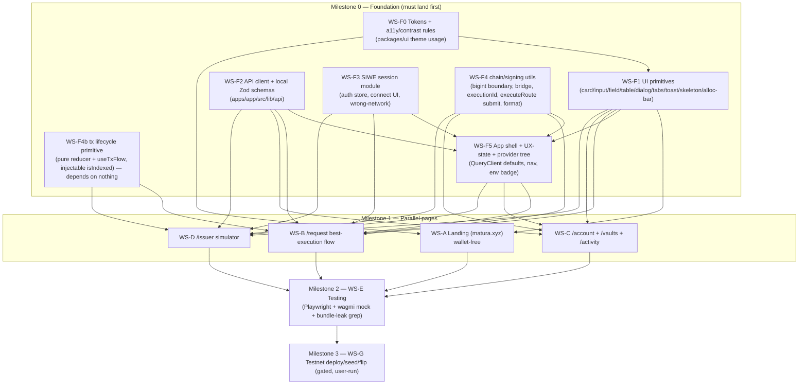

# ✨ Matura Frontends — Landing + Product

## Overview

Build two production-quality Next.js 15 frontends on the existing monorepo scaffolds:

- **`apps/landing` → matura.xyz** — a fast, wallet-free marketing/explanation site (Mist
  light theme, approved copy hierarchy, SEO/OG/sitemap/robots/JSON-LD, Lighthouse Perf ≥90,
  A11y/BP/SEO ≥95).
- **`apps/app` → app.matura.xyz** — the wallet-connected product: SIWE auth, the
  best-execution route-comparison flow, the full transaction lifecycle state machine, an
  issuer simulator, and honest testnet/synthetic disclosures.

Both apps already exist as **honest placeholder shells** (routes, nav, brand tokens,
wagmi + react-query providers wired). This is a **build-to-production task on existing
foundations**, structured so the work runs as **parallel workstreams** after a small shared
foundation lands. All money is base-unit strings (no floats), no `any` (repo lint rule),
tests created/updated throughout.

The **dev loop targets a seeded local hardhat node + local API**; the final gated milestone
deploys+seeds BSC testnet and flips `NEXT_PUBLIC_*` (per brainstorm decisions).

## Enhancement Summary (Deepened 2026-09-26)

Deepened with 7 parallel agents (frontend-design, dataviz, architecture, security, simplicity,
TypeScript-rigor, performance) on top of the 5 planning research passes. Findings are folded
into the workstreams above/below and the sections marked "(deepened)".

**Corrections (factual defects the reviews caught — already applied in the body):**

1. **Landing cannot call `isDeployed(97)`** — `@matura/chain` is lint-banned in landing. Feed
   deployment status as a **build-time constant** (WS-A). (architecture HIGH / perf P0)
2. **Signing-boundary coercion is `BigInt(str)`, NOT `toBaseUnits`** — API money is already
   base units; `toBaseUnits` (human ×10⁶) double-scales and throws on nonce/deadline. (TS P0)
3. **Demo-sign gate** is `DEMO_ISSUER_SIGNING_ENABLED` + issuer key + non-prod (all three), and
   is **not chain-scoped** — add a `CHAIN_ID ∈ {31337,97}` guard before the testnet flip. (sec H1)
4. **Live `--ring` AA bug** — mint focus ring on Mist is 1.56:1; fix to Midnight-on-light. (design)

**Key improvements:**

- **Design system (deepened §):** "instrument-grade clarity" direction; the allocation bar as
  the recurring routing motif; new tokens (`--warning`/`--destructive`/`--font-mono`/vault ramp);
  Deep-Night product sidebar where mint is contrast-legal; full `/request` layout.
- **Dataviz (deepened §):** validated categorical vault palette (mint is accent-only, fails as a
  fill), mandatory colorblind channels (labels + hatch + table twin), 2-tier bar for Request B.
- **Type safety:** a single `bridge.ts` (`getAddress`/`toAddressString`/`toHex32`) strips brands
  to viem types in one place; `executionId` includes the router domain + lowercase compare;
  `satisfies TypedDataDefinition` preserves inference; activity payload = `discriminatedUnion`.
- **Architecture:** pure tx reducer split into its own dependency-free slice (WS-F4b) as a
  per-tx primitive with an injectable `isIndexed`; `packages/ui` gets its own wallet-free lint
  ban; a mirror-vs-API drift guard; freeze only core schemas in F2.
- **Performance:** `QueryClient` defaults + bounded indexing poll (floor 2–3s, cap 60–90s,
  `retry:false`); per-ABI imports; landing byte budget beside the leak grep; countdown isolated
  to a leaf + memoized allocation math.
- **Security:** strict CSP + output-escaping of server strings; rehydrate-time subject check;
  review renders from the signed message; product-app bundle-leak grep; WS-G host hardening.
- **Simplicity (applied where it doesn't fight the approved spec):** generic 422 recovery,
  non-happy paths unit-tested not e2e, `sheet`/`tabs` gated on a named consumer, lighter
  per-primitive tests, simpler 401→re-sign.

**Considered but rejected (approved spec is authoritative):** the simplicity review proposed
collapsing the supporting landing routes to homepage anchors and cutting `/docs` and `/privacy`
— but the feature request **explicitly mandates** `/how-it-works`, `/protocol`, `/for-issuers`,
`/docs`, `/privacy`, `/terms` as routes, so they are kept.

## Problem Statement / Motivation

Matura's differentiator — a deterministic best-execution router that slices claims and
compares competing vault prices — is invisible without a UI that makes it legible and
trustworthy. The product must let a user connect, see verified future payments, request an
amount, **see exactly which claim slices and vaults were chosen and at what cost**, review,
sign, and receive liquidity, with every failure state explained. The marketing site must
build trust through specificity, not hype, and load fast without shipping any wallet code.

## Current State (what exists — do not rebuild)

- **Monorepo:** pnpm + Turborepo. Node 24 keg-only (Hardhat); frontends run on it. Catalog
  pins: react `19.2.0`, viem `2.56.8` (exact), wagmi `^2.14`, `@tanstack/react-query`
  `^5.62`, zod `^4.1.12`, typescript `^5.9.3`.
- **`apps/landing`:** Next `15.5` App Router, wallet-free (lint-enforced ban on
  wagmi/viem/`@matura/chain`/`@tanstack/*` + secret env). Pages exist but **dark-themed with
  wrong copy** (a 6-step flow) — must be rebuilt to the Mist light theme + approved copy.
- **`apps/app`:** Next `15.5`, `moduleResolution: Bundler`, `verbatimModuleSyntax: true`,
  `noUncheckedIndexedAccess`. `transpilePackages: ["@matura/ui","@matura/chain","@matura/shared"]`.
  wagmi config (`src/lib/wagmi.ts`, BSC-testnet only, `ssr:true`, cookieStorage) + providers
  (`src/app/providers.tsx`) + SSR `cookieToInitialState` (`src/app/layout.tsx`) are correct.
  Every page is a placeholder `<Screen>` shell — **no data fetching, no SIWE, no signing yet**.
- **`packages/ui`:** Tailwind v4 `@theme` brand tokens (`--color-midnight #111827`,
  `--color-liquid-mint #42e8b4`, `--color-mist #f4f7f6`, `--color-deep-night #080d17`) +
  light-default shadcn-style semantic layer with `.dark` overrides. Only 4 primitives exist
  (`button`, `badge`, `container`, `stack`) + `cn()`. Vitest + Testing Library + jsdom set
  up; copy `src/components/__tests__/button.test.tsx` as the test pattern.
- **`packages/shared`:** framework-free Zod. **Frontend-importable and reused directly:**
  `ClaimType`/`ClaimState` enums, `OptimizeResult` (+ `RouteResult`, `RouteLeg`,
  `NonExecutableResult`, `RejectedAlternative`, `Explanation`/`ExplanationStep`,
  `RejectionReason` (19 codes) + `REASON_PRECEDENCE`), money/address brands.
- **`packages/chain`:** dual CJS/ESM (subpath imports work in the Bundler-resolution Next
  apps). Exports `./chains` (`bscTestnet`, id 97), `./units` (`fromBaseUnits`/`toBaseUnits`,
  `SETTLEMENT_DECIMALS=6`), `./deployments` (`getManifest`/`isDeployed`/`getDeployment`),
  `./abis` (incl. `maturaRouter`, `claimRegistry`), `./eip712` (`EXECUTION_ROUTE_TYPES`,
  `CLAIM_ATTESTATION_TYPES`, `routerDomain`, `claimRegistryDomain`). **`97.json` manifest is
  all-zero** (not deployed) — `isDeployed(97)` is the gate for "Contracts deploying soon".
- **`apps/api`:** complete authenticated NestJS API at `/api/v1/*` (see § API Surface). DTOs
  are **API-internal (not importable)** — frontend needs new local Zod mirrors for wire
  shapes not already in `@matura/shared`. Header-bearer JWT only (no cookie path).
- **`turbo.json`:** `build`/`lint`/`typecheck`/`test` depend on `^build`; `test:e2e` depends
  on `build` (uncached, **no Playwright wired yet**). `NEXT_PUBLIC_*` vars declared in `build`
  `env` (a new one must be added there or `turbo/no-undeclared-env-vars` fails).

## Key Decisions (carried from the brainstorm)

1. Target = **deploy + seed BSC testnet**, reached via **local-first dev, flip at the end**.
2. API client = **thin typed fetch layer reusing `@matura/shared` Zod**; add only the wire
   schemas the frontend consumes (vaults/activity/execution/quotes/auth/prepare) locally.
3. Sequence = **product app first**, landing second (but landing is fully parallelizable).
4. Brand assets = **user-supplied**; reserve slots + placeholders.
5. SIWE session = **header-bearer JWT, in-memory + `sessionStorage` rehydrate, re-SIWE on
   expiry**; invalidate on disconnect/account/chain switch; bind requests to token subject.
6. Execution = **routes flow only** (`optimize → prepare-execution → sign → self-submit
`executeRoute``); never `/executions/prepare`. `executionId` recomputed client-side.
7. Issuer simulator = **server demo-signing mode**. The exact gate (`env.validation.ts:54`) is
   **`DEMO_ISSUER_SIGNING_ENABLED=true` + non-empty `ISSUER_PRIVATE_KEY` + `NODE_ENV != production`**
   (all three; setting only `NODE_ENV=development` does nothing). **Hardening (add before the
   testnet flip):** the gate is **not chain-scoped** — add a refine so demo-signing is allowed
   only when `CHAIN_ID ∈ {31337, 97}` (never mainnet), use a **dedicated throwaway testnet
   issuer key**, and make "authorized demo issuer" a **server-side** allowlist check, not just a
   UI gate. "Mark as delayed" is a **direct permissionless `markDelayed` contract write** (no API
   prepare endpoint exists).
8. Wallet = **injected / EIP-6963 discovery only** (no WalletConnect/RainbowKit).
9. UI primitives grow in **`packages/ui`**, scoped to what the specified routes use;
   app-specific compositions stay app-local.

## Proposed Solution & Architecture

### Parallel workstream dependency graph



**Parallelism rule:** WS-A (landing) can start immediately alongside the foundation (it only
needs F0 tokens + F1 primitives, no chain/API). WS-B/C/D start once F0–F5 land. WS-E scaffolds
early but its happy-path specs need WS-B. WS-G is the final gated flip.

### Product execution flow (the critical path)

```mermaid
sequenceDiagram
  participant U as User
  participant App as apps/app
  participant API as api /api/v1
  participant W as Wallet (EIP-6963)
  participant Ch as Router (chain)

  U->>App: Connect wallet
  App->>API: GET /auth/nonce
  App->>W: signMessage(SIWE)  %% gasless
  App->>API: POST /auth/verify {message,signature}
  API-->>App: { token, expiresAt }  %% JWT in-memory + sessionStorage
  App->>API: GET /account/:wallet  %% @Public — no Bearer needed (read endpoints are public)
  U->>App: Enter amount → "Find my best route"
  App->>API: POST /routes/optimize (Bearer)
  API-->>App: { routeId, expiresAt(120s), result(OptimizeResult), filteredOut }
  App->>U: EXPLICIT REVIEW (legs, cost, retained, countdown)
  U->>App: "Confirm and receive liquidity"
  App->>API: POST /routes/:routeId/prepare-execution (Bearer, single-use)
  API-->>App: PrepareResponse { steps:[typed-data, submitFunction:executeRoute, nonce, expiry] }
  Note over App: coerce message strings→bigint (zod); executionId = hashTypedData(msg)
  App->>W: signTypedData(ExecutionRoute)  %% gasless
  App->>Ch: executeRoute(route, signature)  %% costs gas
  Ch-->>App: tx hash → waitForTransactionReceipt (status:success)
  loop bounded poll (404 = still indexing)
    App->>API: GET /executions/:executionId
  end
  API-->>App: { status: EXECUTED }  %% only NOW show "Liquidity received"
  App->>API: invalidate /account, /activity
```

## Workstreams

> Filenames below are **proposed** (pseudo). Each workstream ends green on
> `pnpm lint && pnpm typecheck && pnpm build && pnpm test` for its packages.

### Milestone 0 — Foundation (land first; centralize to avoid merge conflicts)

**WS-F0 — Design tokens + accessibility/contrast contract**

- Files: `packages/ui/src/styles/globals.css`, `packages/ui/CONTRAST.md` (token-usage rules),
  light `Mist` layout wrapper, `packages/ui/eslint.config.js` (add wallet-free ban).
- **Fix the live `--ring` AA bug:** `globals.css:43` sets `--ring: liquid-mint` on `:root`
  (1.56:1 focus ring on Mist = AA fail). Change to `:root{--ring:var(--color-midnight)}` /
  `.dark{--ring:var(--color-liquid-mint)}`.
- **Add missing tokens:** `--warning` (amber ≈`oklch(0.75 0.15 75)`) + `--warning-foreground`
  (Deep Night) for **testnet/synthetic/delayed** signals; `--destructive` (red) +
  foreground for **true failures only** (reverted/rejected); `--font-mono` (Geist Mono) for
  addresses/hashes/base-unit amounts; a **4-stop categorical vault ramp** for allocation
  segments (`#42E8B4`, `#1F9E8A`, `#2B3A55`, `#7FB2A6` — one family, all dark-label-safe);
  section rhythm `clamp(4rem, 8vw, 8rem)`.
- Encode the **contrast law**: Liquid Mint **fails AA** as text/icon/focus-ring on Mist/white
  (1.45/1.56) — use it only as a **fill with a Midnight/Deep-Night label** (11.35/12.44 AAA)
  or as text/ring **on dark surfaces**. Focus ring on light = Midnight; on dark = Mint. Mint is
  **reserved for positive/action** — never for the testnet/synthetic signal (that's `--warning`).
- **Push the wallet-free ban into `packages/ui/eslint.config.js`** (`no-restricted-imports`
  wagmi/viem/`@matura/chain`/subpaths) — today only landing lints its own source, so a wallet
  import leaking into a shared primitive is invisible until the bundle-leak grep. Enforce the
  invariant at the layer that must hold it.
- Acceptance: documented pass/fail pairings; primitives consume tokens per the law; `packages/ui`
  lint rejects wallet imports.

**WS-F1 — Shared UI primitives** (`packages/ui/src/components/*` + `__tests__`)

- Build only what the specified screens need, **gated on a named existing consumer** in
  A/B/C/D (don't build a speculative component library): `card`, `input`, `field`/`label`,
  `table`/`row`, `toast`, `skeleton`, extend `badge` (state/testnet/warning). CVA + `cn()`;
  `"use client"` only where interactive; **wallet-free** (now lint-enforced per WS-F0).
- `dialog`: build only its one real consumer (issuer confirm). **Skip `sheet` and `tabs`** until
  a route needs them (the review gate is explicitly "a distinct step, not a dialog"; `/vaults`
  reads fine as two cards; mobile nav is a plain disclosure) — simplicity P2-7.
- **`allocation-bar`: a purely PRESENTATIONAL primitive here** (takes already-computed segments +
  labels as props; no chain/wallet/API deps) so it's shared by **two** consumers — WS-B `/request`
  _and_ the WS-A landing static "best execution" diagram (landing must import it wallet-free). All
  data wiring, BigInt segment math, and the two-branch logic live in WS-B (app-local), not here.
- Tests: **prioritize load-bearing logic** (reducer, executionId golden, money format, reasons
  map, allocation math — mostly in F4/F4b/B) + composite screens; primitives get a light smoke
  spec (role + a11y name + focus-visible), not an exhaustive suite each (simplicity P2-8).

**WS-F2 — API client + local Zod schemas** (`apps/app/src/lib/api/`)

- `client.ts`: typed `fetch` wrapper — base `NEXT_PUBLIC_API_URL`, injects
  `Authorization: Bearer`, parses via zod, throws typed `ApiError` carrying the machine `code`;
  **on 401 clear the session and drop to the connect/re-sign state** (an already-required UX
  state) — simpler than a silent re-SIWE-retry with its reentrancy races (simplicity P2-9).
- **Freeze only the cross-cutting CORE here** (arch LOW-8): `client.ts`, `ApiError`/code
  taxonomy, query-key convention, and the critical-path auth/optimize/prepare/execution schemas.
  **Page-owned schemas live with their workstream** (vault card → WS-C, activity union → WS-C) to
  avoid three streams editing one `schemas.ts`.
- Schemas: **reuse `@matura/shared`** `OptimizeResult` & friends; define NEW local zod for
  `PortfolioDto`/claim item (+ `pending`), `ClaimDetailDto`+`settlement`, `OptimizeResponse`
  wrapper (`routeId`/`expiresAt` nullable, `filteredOut`), `PrepareResponse`/`PrepareStep`,
  `VaultsResponse` (mirror API `VaultSummarySchema`). **⚠ Name collision:** `@matura/shared`
  exports a `VaultSummary` of a **different shape** — do not import it here; name the local one
  `VaultCard`/`ApiVaultSummary` and add a comment at both sites (arch MED-6). `ActivityPage`
  `items[]` → **`z.discriminatedUnion("kind", …)`** with a payload schema per kind (NOT
  `z.unknown()` + per-branch cast — TS P2). `ExecutionDto` (+ status
  `"PENDING"|"EXECUTED"|"FAILED"`), `QuotesResponse`, `NonceResponse`/`SessionResponse` (parse the
  `sessionStorage` token through this — never `as`).
- **Drift guard (arch MED-5):** the mirror can silently diverge from `apps/api` DTOs. Add ONE
  guard — a shared fixture both the `apps/api` DTO test and the `apps/app` schema test parse, OR
  an e2e assertion that parses the **live local API** response through the mirrors. Especially for
  the activity `kind` union — mirror the repo's enum-parity pattern.
- **Per-ABI imports (perf P0):** import `maturaRouter`/`claimRegistry`/`mockUSDT` from their
  specific `@matura/chain/abis` members, **never the barrel** (pulls the other 5 ABIs, ~50KB
  source, into the bundle). Verify `@matura/chain` `sideEffects:false` + tsup tree-shaking.
- `hooks/`: react-query hooks (`useAccountPortfolio`, `useVaults`, `useActivity`, `useOptimize`,
  `usePrepareExecution`, `useExecution`, `useQuotePreview`). Query keys include `address`/`chainId`;
  invalidate **targeted** keys after EXECUTED (never bare `invalidateQueries()`). A small typed
  Zod **env module** validates `NEXT_PUBLIC_*` once (no `!`-assert); add any new `NEXT_PUBLIC_*`
  to `turbo.json` `build.env`.
- Tests: schema parse (happy + malformed), bearer injection + 401→re-sign, error `code` mapping
  (MSW handlers scoped to codes the happy-path + expiry traverse), the drift guard.

**WS-F3 — SIWE session module** (`apps/app/src/lib/auth/`)

- `session.ts`: in-memory token + `sessionStorage` rehydrate; `expiresAt` expiry → re-SIWE;
  `tokenSubject` binding. **On rehydrate, assert `sub === activeAddress` before using the token**
  (user may have switched accounts while the tab was closed) — else re-SIWE (security M3).
- **Note (security M2):** the client guard is UX; the real enforcement is server-side — intents
  are consumed scoped to the JWT `sub` (`routes.service.ts:185`) and the on-chain `ExecutionRoute`
  binds its own beneficiary. Don't weaken those believing the client guard is load-bearing.
- `useSiwe.ts`: nonce → `createSiweMessage` (viem/siwe) → `signMessageAsync` → verify.
- `SessionGuard`/`useAccountEffect`: on `onDisconnect`/account-switch/chain-switch → clear
  token + `queryClient.clear()`; never let a wallet-A token/route be used by wallet-B.
- `ConnectWallet.tsx`: EIP-6963 — map `useConnect().connectors`, key on `connector.uid`.
- `WrongNetwork.tsx`: `useSwitchChain` to `bscTestnet.id`; approved copy.
- Tests: rehydrate, expiry re-auth, account-switch invalidation, subject binding.

**WS-F4 — chain/signing utils** (`apps/app/src/lib/chain/`)

- `typedData.ts`: zod `transform` string→`bigint`/`Hex` per `EXECUTION_ROUTE_TYPES` so the
  **same coerced message** feeds `signTypedData` AND `hashTypedData` (executionId). Never hash
  the JSON-string message (guards the 404-forever bug). **⚠ Coercion is `BigInt(str)`, NOT
  `toBaseUnits`** — API money is already base-unit integer strings; `toBaseUnits` (human ×10⁶)
  would double-scale and throw on `nonce`/`deadline`. Validate with `BaseUnitAmount` then
  `.transform((s) => BigInt(s))`.
- `bridge.ts` (branded→viem, in ONE place, no `as`): `toAddressString` (exists) for
  `EvmAddress`→`Address`; **`getAddress(...)`** for the `string`-typed manifest addresses →
  `Address` (needed by `routerDomain` `verifyingContract` + both `writeContract` `address` args);
  new **`toHex32(id): 0x${string}`** (template literal, not cast) for `ClaimId`/`executionId`→`Hex`.
- `executionId.ts`: `hashTypedData({ domain, types, primaryType, message })` — **must include the
  router `domain`** (chainId + `getAddress(router)`); compare to the server id **case-insensitively**
  (`.toLowerCase()`, viem returns lowercase). Golden fixture asserts against a **server/on-chain**
  id, not a self-computed one.
- `submitRoute.ts`: build the message inline + pin with `satisfies TypedDataDefinition<typeof
EXECUTION_ROUTE_TYPES,"ExecutionRoute">["message"]` (preserves field inference); let
  `writeContract({ abi: maturaRouter, functionName:"executeRoute", args:[route, signature] })`
  **infer** the arg type from the `as const` ABI (never annotate/`as` the struct). `simulateContract`
  pre-flight to catch reverts before signing.
- `format.ts`: wrap **`fromBaseUnits` (display only)** and **`toBaseUnits` (amount-input box
  only)** — these two never touch the signing path; explorer-link helper (chain-gated — local
  hardhat has no explorer); address checksum via `getAddress`.
- `errors.ts`: `classifyTxError(e: unknown): TxErrorKind` — `instanceof BaseError` then `walk()`
  (returns `Error|null` → **re-narrow with `instanceof`**); decode `revert.data?.errorName`
  (`InvalidAccountNonce` → `nonceStale`). Returns a string-literal union the tx hook consumes.
  viem imports use inline `type` qualifiers (`verbatimModuleSyntax`).
- `errors.ts`: `classifyTxError` via `BaseError.walk()` → `UserRejectedRequestError` |
  `ContractFunctionRevertedError` (decode custom `errorName`, incl. `InvalidAccountNonce`).
- Tests (**high value**): bigint round-trip vs golden fixture; `executionId` equals a
  known-good indexed id; `fromBaseUnits`/`toBaseUnits` 6-dp edges (no float); error classifier.

**WS-F4b — Transaction lifecycle primitive** (own slice — depends on nothing; lands parallel
with F1/F2 so B/C/D unblock earlier — architecture MED-3)

- `lib/tx/machine.ts`: a **per-transaction** reducer (NOT one flat 11-state machine): `idle →
awaitingWallet → broadcast → confirmed → [indexed]`, terminal `failed` carrying a
  `TxErrorKind` from `errors.ts` (don't duplicate `rejected/reverted/nonceStale/deadlinePassed`
  as separate states — the classifier names the failure, the machine tracks progress).
- `lib/tx/useTxFlow.ts`: the **actually-reused unit** — an orchestration hook wrapping the
  reducer + wagmi (`useWriteContract`/`useWaitForTransactionReceipt`) + `queryClient.invalidate`,
  **parameterized by an injectable `isIndexed` predicate** so each flow composes it: `/request`
  prepends the `signTypedData` phase and polls `GET /executions/:id` (EXECUTED); **settlement runs
  two instances** (approve → settle); issuer-create has **no sign phase**; `markDelayed` **skips
  indexing**. Do not bake `/request`'s poll into the shared states.
- Tests (high value): reducer transitions incl. 404-while-indexing→EXECUTED; `useTxFlow` with a
  stub `isIndexed`; two-instance settlement sequencing.

**WS-F5 — App shell + UX-state components + provider tree**

- `providers.tsx` (extend — **final provider tree here, then frozen**): add SIWE context +
  Toaster; lazy `useState(()=>…)`; **set `QueryClient` `defaultOptions`** (perf P0):
  `refetchOnWindowFocus:false`, `staleTime` ~15–30s (account/activity) / longer (vaults),
  `gcTime` ~5min. The indexing poll query sets `retry:false`, `refetchIntervalInBackground:false`,
  a **floor interval 2–3s and a hard cap ~60–90s** (then "taking longer than expected"), and
  models 404 as a successful "pending" result (not a thrown error).
- `wagmi.ts`: connector switch (prod injected/EIP-6963 vs test `mock`) behind env, decided now.
- `components/app-shell.tsx`: **Deep-Night sidebar rail** (240px; mint is contrast-legal as
  active nav here) + light content area / compact top+bottom mobile nav (no horizontal
  overflow); persistent **"BNB Chain Testnet"** badge (amber dot, NOT mint-filled); routes in ONE
  config array; **Issuer cordoned** under a "Demo tools" divider with an amber accent.
- `components/states/*`: `Disconnected`, `WrongChain`, `Loading` (layout-matched skeletons,
  incl. an allocation-bar skeleton), `EmptyAccount`, `RpcUnavailable` (amber left-rail, not red),
  `NotDeployed` (`isDeployed(97)` gate) — approved copy, each with a **live CTA**. Reserve
  `--destructive` red strictly for reverted/rejected tx.
- Tests: shell nav keyboard + mobile-close + focus-trap/Esc; state components render approved
  copy + a CTA; `QueryClient` defaults present.

### Milestone 1 — Parallel pages

**WS-A — Landing (matura.xyz)** — _fully parallel; wallet-free_

- Rebuild to **Mist light default** (Midnight copy, Liquid Mint accents; Deep Night only for
  Protocol proof + final CTA). Replace the current dark/6-step content.
- `components/site-nav.tsx`: logo→`/`; links How it works / Protocol / For issuers / Docs;
  secondary CTA "Explore the protocol"; primary "Open Matura" → `NEXT_PUBLIC_APP_URL`;
  **accessible mobile nav that closes after navigation** (focus trap, Esc, `aria-expanded`).
- `app/page.tsx`: 11 approved sections verbatim (Hero → Problem → Unified account → How it
  works [**4 steps**: Verify/Compare/Route/Settle] → Best execution → Why onchain → Issuer →
  Protocol proof → Safety & scope → Final CTA → Footer). Reserve hero-visual slot
  (user-supplied asset) with dimensions to avoid CLS; never put essential meaning only in an image.
- Routes: `how-it-works/`, `protocol/` ("Best-Execution Claim Router"). **Boundary fix
  (architecture HIGH):** landing **cannot import `@matura/chain`** (lint-banned incl. subpaths),
  so it must NOT call `isDeployed(97)`. Feed deployment status + addresses to landing at **build
  time** via a wallet-free source — a `NEXT_PUBLIC_*` var or a small generated wallet-free JSON
  copied into landing — and gate "Contracts deploying soon" on that constant (keeps the route
  statically renderable). `for-issuers/` ("Talk to the team" →
  configured `mailto:`/link or honestly disabled — no dead form), `docs/` (on-site
  getting-started + links to **public** GitHub docs: README/architecture/routing/threat-model),
  `privacy/`, **`terms/`** (new; honest prototype placeholder marked for legal review).
- SEO: `app/layout.tsx` Metadata (title/description per spec, `metadataBase`,
  `alternates.canonical`, `openGraph`, `twitter`), `app/sitemap.ts`, `app/robots.ts`, JSON-LD
  `Organization` (+ `SoftwareApplication` only if truthful — **no** Product/Offer/Rating).
- **Perf levers (target LCP<2.5s, CLS<0.1, TBT<200ms):** `next/font` Manrope+Geist self-hosted,
  `display:swap`, **latin subset + only weights used** (Manrope 400/600/700), variable font, do
  NOT disable `adjustFontFallback` (reintroduces CLS); hero `next/image` with `priority` +
  `fetchPriority="high"` (only the hero, never below fold) + reserved dimensions + `blurDataURL`;
  **fully static** rendering (no `cookies()`/`headers()`/runtime `process.env` — the deployment
  status is a build-time constant per the boundary fix); `"use client"` only on the mobile-nav
  toggle; `packages/ui` `sideEffects:false` for per-primitive tree-shaking.
- **Motion = CSS transitions only** (NOT framer-motion — ~30KB blows the budget); the signature
  motion is the flow-line/allocation "one amount → slices" reveal; **all gated by
  `prefers-reduced-motion`** (renders final state instantly).
- Favicon/app icons/OG from the user-supplied mark (slots reserved).
- Tests: nav + CTA destinations (assert `href` targets app origin), mobile-nav open/close +
  focus, metadata/OG/canonical/JSON-LD present, reduced-motion, headings/landmarks, and the
  **no-wallet-bundle** guard.

**WS-B — `/request` (best-execution flow)** — _critical path, largest_

- Page title "How much do you need today?" + approved supporting copy. Amount input
  (base-unit string, positive, no `parseFloat`); "Advanced preferences" (`maxTotalCost`
  advisory, `maxTotalFace`, `routeDeadlineSeconds`). Primary CTA "Find my best route".
- **Two-branch render on `result.executable`:**
  - _Executable_ (`RouteResult`): the **allocation bar** (dataviz spec below) — a horizontal
    100%-stacked bar, whole=`totalFaceAssigned`, one segment per leg, width ∝ `leg.faceAmount`
    (BigInt ratio `Number((legFace*10000n)/total)/100` — **geometry, never displayed money**),
    fill=**vault identity** (categorical vault ramp; color follows the vault, never rank),
    always-on direct label `Vault · rate%` (`rateBps/100`). A trailing **hatched neutral-gray
    segment = `retainedFace[]`** ("You retain") makes partial financing literal. Beneath: a
    **color-chipped legs table** (Vault|Slice(face)|Rate|Cost|Advance, `tabular-nums`, mono),
    an **"Also considered" strip** for `rejected[]`/next-best (rate + reason chip), and a
    **summary rail** — labels **verbatim from server fields**: "You receive"=`totalAdvance`,
    "Claim value assigned"=`totalFaceAssigned`, "Total cost"=`totalCost`, "Effective cost"=
    `effectiveDiscountBps`, "You retain"=`retainedFace[]`, "Selected vault", "Expected
    settlement". **Never recompute money in JS float.** Disclose `approximation:"greedy"` ("may
    not be the absolute cheapest") when present. **Mandatory colorblind-safe channels** (light
    Mist puts vault hues sub-3:1): always-on rate labels + per-vault hatch texture + a
    **table-view twin** (the WCAG equivalent). **Perf:** `useMemo` segment math keyed on the
    immutable `RouteResult`; isolate the expiry countdown into its own leaf so it doesn't
    re-render the bar every second; coerce/parse once via the query `select`, never per render.
  - _Non-executable_ (`NonExecutableResult`): dedicated UI — "We could only reach
    {maxAchievableAdvance} of {target} (short {shortfallAdvance})"; if `bestFeasiblePartial`
    present, a **"finance the achievable amount instead"** CTA that **re-runs `/optimize`**
    with the lowered target (a partial has **no routeId** — cannot prepare it directly).
    Distinguish `MAX_COST_EXCEEDED` (advisory cap the user set) from `TARGET_UNSATISFIABLE`.
- **Explicit review gate** (distinct step, not a dialog): final legs/advance/cost/retained +
  **live countdown** to `expiresAt`. Only "Confirm and receive liquidity" advances to prepare.
- **Prepare + submit** via WS-F4/F5: quote-loading copy "Comparing eligible Matura Vaults…";
  result heading "Your best executable route"; wallet-pending "Confirm this route in your
  wallet"; chain-pending "Your transaction is being confirmed"; success "Liquidity received"
  (only after EXECUTED). Disclosure block verbatim.
- **Edge cases wired (from SpecFlow):** 120s intent expiry → auto re-optimize + re-review
  before any signature ("This route has expired. Refresh to compare current prices."); prepare
  **422** → **one generic "route no longer available — re-optimize" recovery** that surfaces the
  machine `code`, special-casing only `ROUTER_PAUSED` ("try again later", not re-optimize) — no
  bespoke copy per code (simplicity P1-3); **409 `ROUTE_INTENT_UNAVAILABLE`** (double-submit) →
  disable button on click + "already consumed, re-optimize"; **nonce-stale revert** post-sign →
  back to optimize; deadline warning; account/chain switch mid-flow → tear down route + re-SIWE;
  insufficient-BNB → pre-submit balance check + faucet link; **404 from `GET /executions/:id` =
  still indexing** (bounded poll, not an error) then EXECUTED = success. (Dropped/replaced-tx and
  the full RPC-pathology matrix are unit/component-tested, not hand-built demo UI.)
- `lib/reasons.ts`: exhaustive `Record<RejectionReason, {label,tone}>` (`satisfies` against
  the `@matura/shared` enum so a new reason fails compile). Sort displayed rejections by
  `REASON_PRECEDENCE` (hard-constraint first, economic like `HIGHER_MARGINAL_COST` as
  informational, not red).
- Tests: branch rendering (executable/non-executable/`bestFeasiblePartial`/greedy);
  allocation-bar math from fixtures; rejection map completeness; each prepare-error →
  recovery; retained-balance equals API value; **no dead CTA** in any state.

**WS-C — `/account` + `/vaults` + `/activity`** — _parallel read screens_

- `/account`: title "Your future income, in one place." Totals (total verified / currently
  eligible / financed / next expected payment). Claim cards: source, issuer, face value,
  assigned value, **"Available to route"** (not "Credit available"), maturity, verification
  state, testnet/synthetic badge. Empty state ("No verified payments yet") + `pending` badge
  for read-through-not-yet-projected. Refresh affordance (post-issuer-creation indexing gap).
- `/vaults`: title "Matura Vaults." Stable/Flex policy cards from `VaultsResponse`
  (`supportedTypes`, mandate params, `fundableLiquidity`, `liquidityCap`); utilization
  **computed client-side** (fundable/cap); example quote curves via `POST /quotes/preview`.
  **No public deposit CTA.**
- `/activity`: title "Activity and settlement." Keyset-paginated timeline (`cursor`); per-item
  `kind` narration (narrow `payload`), exact amounts (`fromBaseUnits`), BSC-testnet explorer
  links (chain-gated), delayed/settled states.
- Tests: money formatting, state/testnet badges, utilization calc, pagination, explorer-link
  gating, empty/loading/RPC-error states.

**WS-D — `/issuer` simulator** — _parallel; server demo-signing mode_

- Title "Issuer simulator"; banner "Demo environment — creates synthetic testnet claims
  only." Gate on connected authorized demo issuer / server demo mode; beneficiary field wired
  to a **wallet the demo controls** (else optimize → `NOT_OWNED_BY_WALLET`).
- Actions:
  - **Create payroll / freelance / stream claim** → `POST /claims/registration/prepare`
    (server demo-sign) → returns `registerClaim` calldata → submit tx. Claim-type picker only
    offers types the target mandate supports (Stable = PAYROLL|STREAM, Flex = all); duration ≤
    `maxDurationDays` (else `EXCEEDS_DURATION`). Post-submit "claim pending indexing" state.
  - **Settle claim** → `POST /settlements/:claimId/prepare` = **two-step** (ERC-20 approve
    MockUSDT, then settle) — multi-step tx UI, each with its own receipt.
  - **Mark as delayed** → **direct `markDelayed(claimId)` contract write** via
    `@matura/chain` claimRegistry ABI (permissionless, no API prepare, no signature).
- Reuses the WS-F5 tx machine; the delayed **claim state** already flows into `/account` +
  `/activity` ("Payment is delayed" copy).
- Tests: action gating, claim-type/mandate validation, demo-sign calldata path, two-step
  settle sequencing, `markDelayed` direct-write, pending-indexing state.

### Milestone 2 — WS-E Testing & CI

- **Playwright** (`playwright.config.ts`, wire `test:e2e`): **wagmi `mock` connector** with a
  known key = the seeded demo beneficiary, against **seeded local hardhat + local API + the
  indexer worker running** (worker must be up or `GET /executions/:id` stays 404 forever).
  - Product happy paths: **Request A (partial slice)** and **Request B (multi-claim)** — connect
    → SIWE → optimize → review → prepare → sign → submit → EXECUTED → activity.
  - Non-happy paths (intent-expiry re-optimize, wallet rejection, forced prepare-422) are
    **unit/component-tested** (cheap, deterministic) — not e2e (which needs the seeded-chain +
    worker choreography). Acceptance requires only the landing path + product happy paths A & B.
  - Landing: hero → how-it-works → protocol → **cross-domain "Open Matura"** link asserts app
    origin; nav/CTA/metadata/reduced-motion/a11y.
- **CI bundle-leak grep + byte budget**: assert the landing **build output** contains no
  wagmi/viem/wallet identifiers AND enforce a **first-load JS budget** (≤~90–110KB gzipped via
  `@next/bundle-analyzer` size assertion) — the grep catches obvious leaks, the budget catches
  subtle tree-shaken-but-retained ones and is what actually correlates with Perf. Wired before
  foundation merges. Also grep both apps' output for secret env substrings (security L2).
- **MSW** handlers scoped to the codes the happy-path + expiry traverse (not the full 6-code
  matrix) so state rendering is unit-testable offline.
- Extend CI order after existing steps: `test:e2e` + landing-bundle gate.

### Milestone 3 — WS-G Testnet deploy/seed/flip (gated; user-executed)

- **Prereq (user):** keystore `DEPLOYER_PRIVATE_KEY` + `ISSUER_PRIVATE_KEY`, testnet BNB, RPC.
- **Seed change:** parameterize the seed beneficiary to a wallet the demo controls
  (`packages/contracts/config/demo.ts` / `scripts/seed.ts`) — today it hard-codes Alice→deployer.
- Run `deploy:bsc-testnet` → `seed:bsc-testnet` (writes `97.json`) → set testnet
  `NEXT_PUBLIC_*` (incl. API `NODE_ENV=development` + `ISSUER_PRIVATE_KEY` for demo-sign) →
  rebuild. `isDeployed(97)` now true → real explorer addresses + live account data.
- Verify: Request A/B against live testnet; explorer links resolve; amounts/retained correct.

## Copy System (reference — use verbatim)

Product copy (connect/wrong-network/empty/quote/success/error/delayed) and landing IA copy are
specified in the brainstorm/feature request and must be used **verbatim**. **Banned words for
the claim-purchase flow:** borrow, loan, credit limit, guaranteed, risk-free. (Note: ignore any
research suggestion to use "purchase/buy claim" — keep the approved "receive liquidity" framing.)

## Design System & Route-Comparison Visualization (deepened)

**Aesthetic direction — "instrument-grade financial clarity":** editorial/Swiss precision on
landing, data-terminal density in product. Reject generic crypto (no neon-on-black, no glass
blobs, no purple). The **one memorable motif is the allocation bar** — one amount splitting into
competing vault slices — recurring as the `/request` centerpiece, the landing "best execution"
static diagram, and the mint **flow-line** accent (a hairline branching one line into many).

**Landing (Mist light):** Manrope display / Geist body via `next/font`. Hero display
`clamp(2.5rem,6vw,4.5rem)`/700/`-0.03em`; H2 `clamp(2rem,4vw,3rem)`; eyebrow = Midnight text
with a **mint tick/underline** (never mint text on light). Asymmetric 12-col hero (7 copy / 5
reserved 4:5 image slot). Alternate three band types down the page — plain Mist, raised white
card (`bg-background`+`border`+`shadow-sm`), and **full-bleed Deep Night for Protocol-proof +
Final-CTA only** (the only place mint is legal as text/hairline). 4-step How-it-works connected
by a numbered mint flow-line (horizontal desktop / vertical spine mobile).

**Product shell:** **Deep-Night sidebar rail** (240px — mint legal as active nav: mint text +
2px indicator + `mist/8` fill) + light content area for long-session legibility. Issuer cordoned
under a "Demo tools" divider (amber). "BNB Chain Testnet" badge = outline pill, **amber dot**
(not mint). Dense Geist: control `h-9`, table row 44px, **`tabular-nums` + right-aligned money,
`--font-mono` for base-unit/hash**; page H1 Manrope 1.5rem, everything operational Geist.

**`/request` layout (vertical narrative):** (1) "You asked for" hero number (`targetAdvance`);
(2) the **allocation bar** — see dataviz spec below; (3) **color-chipped legs table**; (4) faded
**"Also considered"** rejected/next-best strip; (5) **summary rail** (verbatim server labels).
Non-executable → **shortfall meter** (track filled to `maxAchievableAdvance`, gap to target).
Review gate = distinct step with a **tabular MM:SS countdown** (no spinning ring). Signature step
(mint-outlined "gasless") visually distinct from the on-chain tx step (solid).

**Allocation-bar dataviz spec (validated):**

- **Form:** horizontal 100%-stacked bar; whole = `totalFaceAssigned`; segment per leg, width ∝
  `leg.faceAmount` (BigInt ratio → CSS %, geometry only). Fill = **vault identity** (color follows
  the vault, not rank). Always-on direct label `Vault · rate%`. Trailing **hatched neutral-gray
  segment = `retainedFace`** ("You retain"). Request A collapses to one bar (financed slice + gray
  retained); Request B = 2-tier (top allocation bar across vaults + per-claim slice bars beneath).
- **Palette (contrast-validated):** Liquid Mint **is NOT a vault fill** (L 0.834, 1.45:1 on Mist)
  — accent/selected-ring only (dark surfaces). Categorical vault set from a **CVD-validated**
  scheme: common 2-vault = blue `#2a78d6` + teal `#1baf7a` (light) / `#3987e5`+`#199e70` (dark);
  4-vault cap uses the validated blue/green/magenta/yellow order; >4 folds to "Other". "You
  retain" = muted gray `#898781`, **always hatched** (reads as non-identity, not a series).
- **Mandatory colorblind-safe channels** (light Mist puts hues sub-3:1): always-on rate labels +
  per-vault **hatch texture** + a **table-view twin** (Vault · Rate · Claim · Slice · You retain,
  totals row) — the WCAG equivalent and the sub-3:1 relief. Text always in ink tokens, never on
  the fill. Legend for ≥2 vaults; per-segment tooltip mirrored on keyboard focus; server strings
  inserted via `textContent`. Theme-aware (both `prefers-color-scheme` + `data-theme`), reflows at
  360px, rate-rail/table in an `overflow-x:auto` container so the page never scrolls sideways.

**State components:** empty = centered `max-w-md` + line-art glyph + one CTA; loading =
layout-matched skeletons (incl. an allocation-bar skeleton); error/RPC = **amber left-rail** (not
red); `--destructive` red reserved for reverted/rejected tx. Every state ships a live next-action.

## Non-custodial / Security invariants

- Server never holds a key; every write is user-signed. Render a dApp-side "exactly what you're
  signing" review before opening the wallet; label the **gasless signature** vs the **gas tx**
  distinctly. Never show success before `receipt.status === "success"` **and** EXECUTED.
- **Review renders from the SAME coerced `message` object that is signed/hashed** (beneficiary,
  per-leg amounts, deadline, nonce, executionId) — not a separate display DTO — so a buggy/
  compromised API can't show benign numbers while a different struct gets signed (security M5).
- **Strict CSP** (locked `script-src`, no inline/`eval`; consider Trusted Types) + **escape all
  server-supplied strings** (issuer/source/`payload`) — never `dangerouslySetInnerHTML`. The
  `sessionStorage` bearer token is XSS-exfiltratable; short TTL (900s) + CSP + escaping bound the
  blast radius (a stolen token still cannot `executeRoute` — that needs the wallet sig) (M1).
- **Disable sign/submit while a signature or tx is in flight** (drive off the tx reducer's
  `awaitingWallet`/`broadcast`) to prevent double-broadcast (security L1).
- Only `NEXT_PUBLIC_*` reach the browser (lint-guarded); no server secrets. Money never float.
  **Bundle-leak grep covers BOTH apps** (build output, not source): no wagmi/viem in landing; no
  `ISSUER_PRIVATE_KEY`/`JWT_SECRET`/`DATABASE_URL` substring in any client chunk of either app (L2).
- Re-fetch SIWE nonce per attempt (single-use). Bind requests to the token subject.
- **WS-G host hardening:** pin `API_CORS_ORIGINS` to the exact `app.matura.xyz` origin (not empty,
  not wildcard — L4); if the testnet API runs `NODE_ENV=development` for demo-sign, gate Swagger
  off + suppress stack traces, or decouple demo-sign from `NODE_ENV` (security H2). Use
  `rel="noopener noreferrer"` on any `target="_blank"` (L3).

## Testing Strategy (summary)

- **Unit (vitest+jsdom+RTL / node):** money format (`BigInt` vs `toBaseUnits`/`fromBaseUnits`
  split), string→bigint boundary + `executionId` **golden fixture vs a server/on-chain id**,
  **tx reducer** (all transitions incl. 404-while-indexing→EXECUTED), rejection-map completeness
  (`satisfies` fails compile on a new reason), `OptimizeResult` branch rendering
  (executable/non-executable/`bestFeasiblePartial`/greedy), allocation-bar segment math,
  prepare-error→recovery, SIWE session lifecycle (incl. rehydrate-mismatch), the **mirror-vs-API
  drift guard**. Non-happy flows are unit-tested here (not e2e).
- **E2E (Playwright + wagmi `mock` connector + seeded local chain + running indexer worker):**
  Request A/B happy paths, landing nav/metadata/cross-domain/reduced-motion. Worker MUST be up or
  `GET /executions/:id` stays 404 forever.
- **CI gates:** bundle-leak grep + **byte budget** (both apps); real signing only via mock
  connector e2e; RPC-down/nonce-race via MSW + viem test transport.

## Risks & Mitigations

| Risk                                                              | Mitigation                                                                                                                         |
| ----------------------------------------------------------------- | ---------------------------------------------------------------------------------------------------------------------------------- |
| `executionId` hash mismatch (string vs bigint) → poll 404 forever | One coerced message feeds sign + hash; golden-fixture test (WS-F4)                                                                 |
| 404 treated as failure during indexing                            | Treat 404 as "still indexing"; bounded poll; only EXECUTED = success                                                               |
| 120s intent expiry across review gate                             | Live countdown + auto re-optimize before signature                                                                                 |
| Single-use 409/422 semantics confusing                            | Generic re-optimize (surface code) + disable-on-click; special-case only `ROUTER_PAUSED` (WS-B)                                    |
| Merge conflicts across parallel streams                           | Freeze provider tree / wagmi config / `app-nav` routes / **core** schemas in foundation; page-owned schemas live with their stream |
| Liquid Mint fails AA on light                                     | Fix `--ring` + encode contrast law in WS-F0; byte-budget + LHCI + review checklist                                                 |
| Wallet code leaks into either bundle                              | Build-output grep + byte budget in CI before foundation merges; `packages/ui` wallet-free lint ban                                 |
| `toBaseUnits` double-scales signed money                          | Signing coercion is `BigInt(str)`; `toBaseUnits`=input only, `fromBaseUnits`=display only (WS-F4)                                  |
| Demo-sign gate activates on mainnet                               | Chain-scope `DEMO_ISSUER_SIGNING_ENABLED` to CHAIN_ID ∈ {31337,97}; dedicated throwaway key (WS-G)                                 |
| Mirror schemas drift from API DTOs                                | Shared fixture or live-API parse guard; mirror the enum-parity pattern (WS-F2)                                                     |
| Indexing poll runs forever / over-polls                           | `retry:false`, floor 2–3s, hard cap 60–90s, `refetchIntervalInBackground:false` (WS-F5)                                            |
| Seed beneficiary ≠ connected wallet                               | Parameterize seed to demo wallet (WS-G) before demo                                                                                |

## Acceptance Criteria

### Functional

- [ ] `matura.xyz` and `app.matura.xyz` are **independently buildable/deployable** (Turbo).
- [ ] Landing copy matches the approved hierarchy; **no dead CTA / invented logo / fabricated
      metric / fake testimonial / unsupported regulatory claim**; `/terms` exists.
- [ ] Product implements all UX states (disconnected → settled) with a live next action each.
- [ ] **Request A visibly uses a partial payroll slice**; **Request B visibly combines ≥2 claims.**
- [ ] Tx links/amounts/costs/retained balances are correct (retained = API `retainedFace`).
- [ ] Issuer simulator creates payroll/freelance/stream claims (demo-sign), settles (2-step),
      marks delayed (direct write); banned words never used in the purchase flow.

### Non-functional

- [ ] Landing Lighthouse Perf ≥90, A11y/BP/SEO ≥95 (production build; treat variance honestly).
- [ ] WCAG 2.2 AA: contrast pairings pass, visible focus, keyboard nav, mobile nav closes,
      semantic headings, form errors announced, responsive from 360px.
- [ ] No wallet/chain/query deps in the landing bundle (CI grep passes).
- [ ] No browser exposure of server secrets; no floating-point money anywhere.
- [ ] No `any` (strictTypeChecked); `import type` under `verbatimModuleSyntax`.

### Quality gates

- [ ] `pnpm lint && pnpm typecheck && pnpm build && pnpm test` green monorepo-wide.
- [ ] Playwright landing path + product happy path (Request A & B) pass.
- [ ] New `NEXT_PUBLIC_*` vars declared in `turbo.json`; ABI/manifest freshness gates unaffected.

## Dependencies & Sequencing

1. **Foundation (WS-F0–F5) first** — freeze provider tree, wagmi config, nav routes, and the
   **core** schemas here (page-owned schemas stay with their stream). WS-F4b (pure tx reducer)
   and WS-A (landing) run in parallel from the start (F4b depends on nothing; landing needs only
   F0+F1). Ordering inside foundation: F0 → F1; F2/F3/F4/F4b in parallel; F5 last (it consumes all).
2. **Parallel:** WS-B, WS-C, WS-D after foundation. WS-E scaffolds early, happy-path after WS-B.
3. **Gated last:** WS-G testnet flip (user-run) — requires the seed-beneficiary change.

## References

### Internal (file:line)

- Routing contract: `docs/routing.md` (§4 two-phase, §5 mirror, §6 cost floor, §8 error codes).
- Shared routing types: `packages/shared/src/routing/{optimize-io,reasons,explanation}.ts`,
  `packages/shared/src/route.ts:13` (`RouteLeg`).
- EIP-712: `packages/chain/src/eip712.ts:44` (`EXECUTION_ROUTE_TYPES`), `:20`
  (`CLAIM_ATTESTATION_TYPES`), `:62` (`routerDomain`).
- Units/deploy gates: `packages/chain/src/units.ts` (`fromBaseUnits`/`toBaseUnits`),
  `packages/chain/src/deployments.ts` (`isDeployed`).
- API: `apps/api/src/common/{dto,prepare}.dto.ts`, `routes/routes.{controller,dto}.ts`,
  `executions/read/executions-read.service.ts` (404-until-indexed),
  `claims/prepare/claims-prepare.service.ts` + `config/env.validation.ts:46` (demo-sign gate),
  `settlements/prepare/settlements-prepare.controller.ts` (approve+settle).
- markDelayed: `packages/chain/src/abis/claimRegistry.ts:691`, `contracts/ClaimRegistry.sol:150`.
- Seed fixtures: `packages/contracts/config/demo.ts` (Request A/B calibration).
- Existing app wiring: `apps/app/src/{lib/wagmi.ts,app/providers.tsx,app/layout.tsx}`,
  `apps/{app,landing}/eslint.config.js`, `packages/typescript-config/{base,nextjs}.json`,
  `turbo.json`, `pnpm-workspace.yaml`. Test pattern: `packages/ui/src/components/__tests__/button.test.tsx`.

### External (2026, pinned majors)

- wagmi SSR / connect / switch-chain / sign-typed-data / wait-receipt / TanStack Query guides —
  https://wagmi.sh (v2). EIP-6963 default discovery.
- viem SIWE (`createSiweMessage`/`verifySiweMessage`), error handling (`BaseError.walk`,
  `ContractFunctionRevertedError`, `UserRejectedRequestError`) — https://viem.sh (2.56.x).
- TanStack Query polling (`refetchInterval` fn → false) — https://tanstack.com/query (v5).
- Next 15 Metadata API / `sitemap.ts` / `robots.ts` / `next/font` / `next/image` —
  https://nextjs.org/docs (App Router). Async `headers()`/`cookies()`.
- WCAG 2.2 AA (2.4.11 focus-not-obscured, 2.5.8 target-size, 3.3.1 error id) —
  https://www.w3.org/TR/WCAG22/. Google structured-data guidelines.
- Playwright dApp testing with wagmi `mock` connector — https://wagmi.sh/core/api/connectors/mock;
  reduced-motion project config — https://playwright.dev.

### Related work

- Brainstorm: `docs/brainstorms/2026-09-26-matura-frontends-brainstorm.md`.
- Prior plans: `docs/plans/2026-09-26-feat-best-execution-router-plan.md`,
  `docs/plans/2026-09-26-feat-api-orchestration-read-model-plan.md`.
- Solutions to heed: `docs/solutions/build-errors/apps-api-cjs-chain-prisma-viem-toolchain.md`
  (chain consumption, strict viem), `.../integration-issues/best-execution-router-mirror-intent-optimizer.md`
  (`Hex` fixtures, monorepo typecheck).
