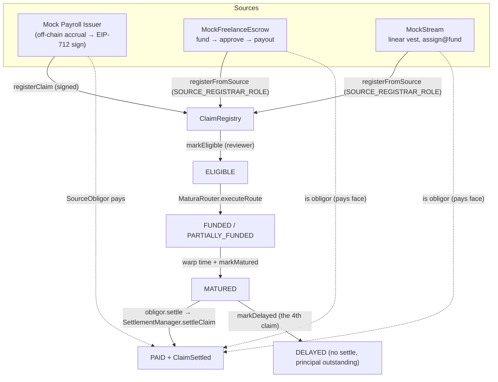
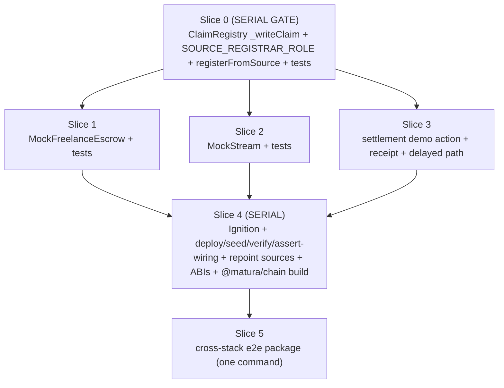

# ✨ Claim-source adapters + full settlement loop + cross-stack reconciliation e2e

## Overview

Make the three claim sources **real** — every claim traceable to an on-chain source action, not
a UI label — and prove the whole loop (source → register → optimize → execute → settle, plus the
delayed path) with one repeatable cross-stack integration test that reconciles **contract events ↔
DB projections ↔ token balance deltas** exactly. No new `ClaimType`; no `any`; structured as
parallel workstreams; tests created/updated throughout.

- **ClaimRegistry**: extract a private `_writeClaim(...)`; add a role-gated `registerFromSource(...)`
  (`SOURCE_REGISTRAR_ROLE`) that re-runs every invariant but skips the EIP-712 signature — leaving
  `registerClaim`'s selector/validations/effect-order/event **byte-behaviour-identical**.
- **MockFreelanceEscrow** + **MockStream**: new stateful adapter contracts that are their own
  issuer entity AND their own obligor; they register claims from their own verified state with
  on-chain payout dedup.
- **Mock Payroll Issuer**: stays the existing signed `registerClaim` path (labeled issuer entity;
  accrual is off-chain demo metadata; only the final face is registered).
- **Settlement**: reuse the built waterfall; add an issuer-simulator demo action, a settlement
  receipt + before/after balances, and the **delayed path** (no false PAID, principal outstanding,
  no reserve reimbursement in P0).
- **Cross-stack e2e**: a new dedicated package, one command, reconciling the full stack.

## Enhancement Summary

**Deepened on:** 2026-09-27 · **Reviews synthesized:** 5 (security-sentinel, architecture-strategist,
kieran-typescript-reviewer, code-simplicity-reviewer, test-design research).

### Key improvements applied

1. **[🔴 security P1-1] `registerFromSource` binds `issuer == msg.sender` + `isActive(msg.sender)`.**
   The re-run checklist silently dropped the _only_ thing the ECDSA path used to bind the `issuer`
   field to an authorization. Without the bind, any role holder can mint a claim attributed to any
   active issuer (e.g. the escrow adapter minting as the payroll issuer) — the exact provenance spoof
   this feature exists to prevent. Fix aligns with Decision 4 (adapter _is_ its own issuer). See Slice 0.
2. **[🔴 security P1-2] Adapter `settle(claimId)` is bound to its engagement, not the blind
   `SourceObligor` drain.** Fund-holding adapters inheriting `SourceObligor`'s unbound permissionless
   `settle` can be drained across engagements (`escrow.settle(claimB)` paid from engagement A's funds).
   Each adapter resolves `claimId → engagementId`, state-gates, and marks the engagement Settled
   **before** the external call. See Slices 1/2 (this reconciles the simplicity "`is SourceObligor`"
   suggestion — reuse the fee mechanics, keep the binding).
3. **[security P2-5 + simplicity] Drop the fee buffer; assert `feeBps()==0` in-contract.** A shared,
   unearmarked buffer is unsound (fuels P1-2, only defers insolvency) — adapter `settle` reverts a
   custom error when `feeBps()!=0` (fail closed). See Decision 2.
4. **[security P2-6] Stream is one-claim-per-stream** (cumulative-face solvency), with explicit
   ordering: `createClaim` requires `assigned`, `withdraw` impossible after `assignToProtocol`. Slice 2.
5. **[🔴 architecture P1] `verify.ts` derives each claim's issuer per-claim** and allowlist-proves
   _each_ adapter on _both_ vaults — the single-issuer calibration (`issuer ??= …`) breaks under
   per-adapter issuers. Slice 4.
6. **[architecture + TS + simplicity] The "11-file manifest sync" was overstated** — under a pure
   _repoint_ (Decision 5) the manifest **shape is unchanged**, so `manifest-types`/`manifest.ts`/
   `read-manifest`/`demo-reset`/committed JSON/parity-test are **untouched**. Real surface is ~6 files.
   Scope-reducing correction. Slice 4.
7. **[architecture] Teardown must rebuild `@matura/chain`** — `dist/` is gitignored, so `git checkout`
   does not restore it; teardown re-runs `@matura/chain build` from restored src. Decision 7 / Slice 5.
8. **[TS] Slice 5 is a standalone Node package with no Hardhat runtime** — use viem `createTestClient`
   (hardhat mode) for `increaseTime`/`mine`, reuse `@matura/chain` `contractAbis`/`createPublicClientFor`
   (no hand-written ABIs, no `network.create()`), and **sign from typed `@matura/chain` EIP-712 inputs
   like `demo-settle.ts`** rather than coercing the API's `unknown` `typedData`. This kills the biggest
   `any`-risk. Full Slice 5 rewrite of the TS shape below.
9. **[test-design] Concrete fast-check strategy** — model-based `fc.commands` for the escrow state
   machine, stream invariants, a 4-layer `registerClaim` differential proof, and the cross-stack triple
   reconciliation keyed by `Map`. Woven into each slice's Tests.

### New considerations discovered (decisions baked in — flag if you disagree)

- **DELAYED-never-PAID is NOT a protocol invariant.** `SettlementManager`/`releaseSlice` accept
  `MATURED || DELAYED`, and the obligor `settle` is permissionless — so a _funded_ delayed claim is
  settleable by anyone. Resolution (Decision 3, split): the **Slice 3** delayed test uses a
  deliberately **unfunded** `SourceObligor` (settle reverts → never-PAID is _real_); the **Slice 5**
  e2e uses a real freelance-adapter claim (satisfies "mark one freelance claim delayed") where
  never-PAID is a **test-controlled** property of the isolated `31337` run (documented, not presented
  as an enforced guarantee; shared-testnet `97` footgun noted in the threat-model).
- **Escrow `refund`/`Refunded` dropped (YAGNI).** No acceptance scenario exercises it; dropping it
  also moots security P2-4 (reject/revoke → locked client funds). If reintroduced for realism, `refund`
  MUST consult the registry terminal state (REJECTED/REVOKED ⇒ payout dead ⇒ refund allowed) while the
  `payoutClaim` mapping still blocks re-registration.
- **Provenance invariant shifts:** source claims are `issuer == adapter`, **no signature**. The
  read-model must distinguish source vs signed by `claimType`, not by signature presence — noted for
  `docs/threat-model.md`.

### Resolved (2026-09-27, user)

- **e2e home = a new dedicated `apps/e2e-stack` package** (brainstorm's choice; placed under `apps/`,
  not `packages/`, per the architecture finding). Owns its own lifecycle script; the net-new spawn/
  teardown/Prisma-dep wiring is budgeted in Slice 5. It may still _reuse_ `@matura/shared`, `@matura/chain`
  accessors, and `startTestDb()`, but the scenario + harness live in the new package (not folded into
  `apps/e2e`).

## Problem Statement / Motivation

Today a claim is pure issuer-signed metadata; the three "sources" are identical, interchangeable
`SourceObligor` balance pools distinguished only by `ClaimType`. Nothing ties a claim to a real
source action, and there is no cross-stack proof that the read-model the product renders matches
on-chain truth. This feature makes provenance real and provable.

## Current State (verified — do not rebuild)

- **`ClaimRegistry.sol`** (`packages/contracts/contracts/ClaimRegistry.sol`): OZ `AccessControl` +
  `EIP712`; `registerClaim` is permissionless-relay + issuer-EIP-712-signed (`:54-114`);
  validation order `SignatureExpired→DupClaimId→DupExternalId→ZeroFace→DueDateInPast→InvalidClaimType→TokenNotSettlement→IssuerInactive`
  (`:55-62`); effects `:87-101` + `emit ClaimRegistered` `:103-113`; claim inits to `ATTESTED`;
  `markEligible` is `CLAIM_REVIEWER_ROLE` (admin); `markMatured` time-gated `block.timestamp>=dueDate`;
  `markDelayed` MATURED→DELAYED; `_freeExternalId` frees externalId on reject/revoke (never clears `_exists`).
- **`SettlementManager.settleClaim`** (`:96-143`): permissionless payer, pulls `faceValue+fee`,
  distributes financed face per vault, `userResidual = faceValue − financed` to beneficiary, fee to
  treasury; conservation-checked; `feeBps` default **0**. `SourceObligor.settle` is the self-obligor pattern.
- **Router only finances ELIGIBLE/PARTIALLY_FUNDED** (`quote-collector.ts:107`, `leg-mirror.ts:61`,
  `MaturaRouter.sol:129`).
- **Indexer** subscribes to 7 events from claimRegistry/router/settlementManager (`indexer/events.ts`);
  `ClaimRegistered`/`ClaimStateChanged`/`ClaimSettled` project into Prisma. `getFrontierBlock` uses
  `blockTag:"finalized"` only when `INDEXER_CONFIRMATIONS==0`.
- **Tests**: Hardhat 3 + `node:test` + `node:assert/strict` + viem; fast-check fuzz;
  `test/helpers/fixtures.ts` `deployProtocol()`; `viem.assertions.revertWithCustomError`;
  `networkHelpers.time.increase`. Testcontainers helper `apps/api/test/db/postgres-testcontainer.ts`
  `startTestDb()`; indexer int test drives exported `applyEvent` directly (no live chain today).
- **Deploy/seed**: `MaturaProtocol.ts` deploys 3 identical `SourceObligor`s; `deploy.ts` writes the
  `sources` manifest + `gen:deployments`; `seed.ts` registers issuer + funds + signs claims.
  `31337.json`/`97.json` committed all-zero, guarded by `manifest-parity.test.ts`.

## Key Decisions (made during planning — objectable)

1. **Source claims register to `ATTESTED`, then a reviewer `markEligible` hop** (not auto-ELIGIBLE) —
   matches the existing trust model + seed pattern; zero new state logic in `registerFromSource`. The
   adapter's own state is the _verification that lets the reviewer approve_; `admin` holds
   `CLAIM_REVIEWER_ROLE`.
2. **`feeBps = 0` is a hard, in-contract precondition** for the source-settlement loop (adapter obligor
   holds exactly the funded face). Each adapter's `settle` **asserts `settlementManager.feeBps() == 0`
   and reverts a custom error** (fail closed) — **no buffer**. _(Revised per security P2-5 + simplicity:
   an unearmarked buffer is unsound — it fuels the P1-2 drain, only defers insolvency, and a nonzero fee
   already reverts loudly at `safeTransferFrom`, never silently.)_ The e2e also asserts `feeBps==0`.
3. **A dedicated 4th claim for the delayed path — with an honest never-PAID story.** Request A consumes
   payroll (partial), Request B combines ≥2 claims; a **second freelance claim** is routed→matured→
   **delayed** and never settled. _(Revised per security P2-3: DELAYED is NOT a protocol invariant —
   `SettlementManager`/`releaseSlice` accept `MATURED || DELAYED` and obligor `settle` is permissionless,
   so a **funded** delayed claim is settleable by anyone.)_ **Split:** the **Slice 3** delayed unit/
   integration test uses a signed claim backed by a deliberately **unfunded** `SourceObligor` (settle
   reverts on transfer → never-PAID is a _real_ guarantee, and this keeps Slice 3 orthogonal to the
   adapters so it runs parallel to 1/2); the **Slice 5** e2e uses a real freelance-adapter claim (matches
   the spec's "mark one freelance claim delayed") where never-PAID is a **test-controlled** property of
   the isolated `31337` run (the harness simply never settles it) — documented as such, not an enforced
   invariant. Shared-testnet (`97`) footgun noted in the threat-model.
4. **Each adapter is its own issuer entity with the adapter address as its signer**, and
   `registerFromSource` **enforces `att.issuer == msg.sender` + `issuerRegistry.isActive(msg.sender)`.**
   _(Revised per security P1-1: the ECDSA path's `isAuthorizedSigner` was the only thing binding the
   `issuer` field to an authorization; the role alone does not — so the second writer must enforce that
   an adapter can mint **only as itself**.)_ The source path never verifies a signature;
   `IssuerRegistry.registerIssuer` just stores the adapter address (one-signer-one-issuer holds via
   distinct adapter addresses; no ECDSA can recover to a contract address — confirmed safe). Adapters
   are **allowlisted on both vaults**.
5. **Repoint the existing `freelance`/`stream` source manifest slots** to the new adapter addresses
   (payroll slot stays `SourceObligor`). No 4th manifest slot; no `AddressBook` change. **The manifest
   _shape_ is unchanged** — `manifest-types.ts`, `manifest.ts` (`Sources`/`zeroManifest`),
   `read-manifest.ts` (`SOURCE_KEYS`), `demo-reset.ts`, the committed `31337.json`/`97.json`, and
   `manifest-parity.test.ts` are all **untouched** (see Slice 4; the earlier "11-file sync" was overstated).
6. **A revoked/rejected source payout is dead-forever for re-registration** — the adapter's
   `mapping(payoutId⇒claimId)` never re-registers, so the freed `externalIdHash` can't mint a second
   claim for that payout. **Escrow `refund`/`Refunded` is dropped (YAGNI)** — no acceptance scenario
   exercises it, and dropping it moots security P2-4 (a kept `refund` that ignored the registry terminal
   state would lock client funds on reject/revoke). If reintroduced, `refund` MUST consult the registry
   state (REJECTED/REVOKED ⇒ payout dead ⇒ refund allowed) while the mapping still blocks re-registration.
7. **e2e manifest isolation:** the e2e deploys to local `31337`, then **restores the committed
   zero-seed `31337.json` + `deployments.generated.ts` via `git checkout` on teardown** (they're
   guarded by `manifest-parity.test.ts`) **and re-runs `pnpm --filter @matura/chain build` from the
   restored src** — _`dist/` is gitignored, so `git checkout` does not restore the compiled addresses
   the next `test`/`typecheck` run reads_ (architecture finding). Teardown is guaranteed (finally block).

## Architecture

### Registration + settlement flow

### `ClaimRegistry` refactor (the crux — keep `registerClaim` byte-behaviour-identical)

- Extract `_writeClaim(claimId, beneficiary, issuer, token, faceValue /*uint256*/, dueDate /*uint256*/, claimType, externalIdHash, evidenceHash)` — a `private` helper covering **only** `:88-113`
  (set `_usedExternalId`, `_claimExternalId`, `_exists`, write the `Claim` struct with
  `SafeCast.toUint64(dueDate)` + `ATTESTED`, `emit ClaimRegistered` with the **raw uint256** dueDate).
  The struct field order (`IClaimRegistry.sol:30-40`) is load-bearing — preserve it.
- `registerClaim`: unchanged validations `:55-62` + signature/nonce `:64-84` + `_usedNonce` write
  `:87` (stays here — signer-dependent), then `_writeClaim(...)`. Selector, order, event unchanged.
- `registerFromSource(...)` `onlyRole(SOURCE_REGISTRAR_ROLE)`: **first enforce `att.issuer == msg.sender`
  (revert e.g. `IssuerNotCaller`)**, then re-run `DupClaimId→DupExternalId→ZeroFace→DueDateInPast→
InvalidClaimType→TokenNotSettlement→IssuerInactive` (skip only `SignatureExpired` + ECDSA + nonce),
  then `_writeClaim(...)`. Terms come from the calling adapter (msg.sender), never arbitrary caller input.
  - **🔴 Why `issuer == msg.sender` is load-bearing (security P1-1):** the signed path's
    `isAuthorizedSigner(att.issuer, recoveredSigner, epoch)` is the _only_ control that binds the
    `issuer` field to an authorization. `IssuerInactive` alone passes for **every** active issuer —
    including the payroll issuer and the _other_ adapter — so without this bind a role holder could mint
    a claim whose on-chain provenance names an issuer it is not (defeating "traceable to a source action").
    Binding to `msg.sender` shrinks blast radius to "an adapter can mint only as itself," which Decision 4
    (adapter _is_ its own registered issuer) satisfies naturally.
- Declare `bytes32 public constant SOURCE_REGISTRAR_ROLE = keccak256("SOURCE_REGISTRAR_ROLE")`; new
  errors in `IClaimRegistry` (`IssuerNotCaller`, plus any adapter-guard errors) as needed. Granting
  happens in the Ignition module (not the constructor).

## Parallel Workstreams

**Serialization points:** Slice 0 blocks everything (both adapters compile against
`registerFromSource`). Slice 4 is a single-owner integration merge (manifest + wiring). Slice 5 needs
4 done. Slices 1∥2∥3 run fully parallel after 0.

**Merge-conflict hotspots (assign one owner each):** `ignition/modules/MaturaProtocol.ts` (role-id,
deploy the 2 adapters, `grantRole`, return — **no** `registerIssuer`; the module is declarative/
deploy-only per its own `:18-21` doc), `deploy.ts` sources literal (repoint), `verify.ts` +
`assert-wiring.ts` (per-claim-issuer derivation + per-adapter allowlist proof + positive
`SOURCE_REGISTRAR_ROLE`-holders assertion + IssuerRegistry load), `seed.ts` (adapter-driven claim
creation **+ adapter `registerIssuer` + vault allowlist** — imperative, belongs here not the module),
**`config/demo.ts`** (the 4th claim, `ALICE_CLAIMS`, `REQUEST_A`/`REQUEST_B` fixtures — touched by
Slices 3/4/5 and relied on positionally by `verify`; single owner), `test/helpers/fixtures.ts` (prefer
per-adapter fixture files, not edits), `export-abis.ts` WANTED set + committed `packages/chain/src/abis/*`.
Never hand-edit `deployments.generated.ts` — always regenerate.

### Slice 0 — ClaimRegistry refactor + source-registrar role (SERIAL GATE)

Files: `contracts/ClaimRegistry.sol`, `contracts/interfaces/IClaimRegistry.sol` (new errors +
`registerFromSource` signature + NatSpec), `config/constants.ts` (ROLES mirror if present),
`test/ClaimRegistry.test.ts` (extend).

- Extract `_writeClaim`; add role + `registerFromSource` (with the `issuer == msg.sender` bind).
- **Tests:** `registerClaim` unchanged (existing tests green, incl. revert-order); `registerFromSource`
  happy path (ATTESTED) + each invariant revert; **`issuer != msg.sender` reverts `IssuerNotCaller`**
  (the P1-1 spoof-prevention test — a role holder cannot register a claim naming a _different_ active
  issuer); **negative role test** (a `SOURCE_REGISTRAR_ROLE` holder cannot call `reserveSlice`/
  `releaseSlice` → `AccessControlUnauthorizedAccount`; a non-holder cannot `registerFromSource`); dup
  payout/externalId; revoke→no re-register.

### Research Insights — `registerClaim` refactor safety (4-layer differential proof)

_(test-design)_ Prove `_writeClaim` extraction is byte-behaviour-identical with complementary layers,
all in the repo's `node:test` + viem style (`viem.assertions.emitWithArgs` / `revertWithCustomError`):

- **Layer A — existing suite is the regression oracle.** Do **not** edit `ClaimRegistry.test.ts`
  during Slice 0; its unchanged passing (happy-path event args, forged/expired sig, dup id+externalId
  order, replayed nonce, zero/past/invalid fields, non-settlement token, inactive issuer, epoch
  rotation) is the primary proof (matches acceptance).
- **Layer B — revert-ORDER differential.** Construct one attestation violating multiple invariants and
  assert the _first_ error wins for each adjacent pair (`face==0`∧`dueDate<=now` ⇒ `ZeroFaceValue`;
  dup id∧dup externalId ⇒ `DuplicateClaimId`; expired∧everything ⇒ `SignatureExpired`). Repeat for
  `registerFromSource` minus the skipped checks (first-error `IssuerNotCaller`, then `DuplicateClaimId`).
- **Layer C — event-args + state snapshot (raw uint256 dueDate).** Fuzz `dueDate ∈ [now+1, 2^64−1]`;
  assert `ClaimRegistered` emits the **full uint256** 9-tuple while `getClaim().dueDate == uint64(dueDate)`
  and the full post-state struct (field order load-bearing) is `{…, financedFaceValue:0, state:ATTESTED,
sliceCount:0}`.
- **Layer D — cross-path equivalence (fast-check property).** Same logical terms via `registerClaim`
  (signed, claim A) and `registerFromSource` (role, claim B); assert `getClaim(A) == getClaim(B)` except
  `claimId`/`externalIdHash`, and identical `ClaimRegistered` arg-shapes — proving `_writeClaim` is the
  single shared effect+event site. `numRuns` 8–12 (each run redeploys `deployProtocol()`; EDR-bound).
- Acceptance: `pnpm --filter @matura/contracts contracts:test` green; `contracts:export-abis` +
  commit refreshed `claimRegistry` ABI (freshness gate).

### Slice 1 — MockFreelanceEscrow (parallel after 0)

File: `contracts/sources/MockFreelanceEscrow.sol` (+ `test/sources/MockFreelanceEscrow.test.ts`).

- Testnet/demo-only NatSpec (mirror `SourceObligor`'s trust-model block). `using SafeERC20`,
  `ReentrancyGuardTransient`, custom errors, immutables (token, claimRegistry, settlementManager).
- **State machine** per engagement: `Funded → Approved → Settled` (forward-only, terminal absorbing;
  `revert BadState()` on every illegal edge). **`Refunded` dropped** (Decision 6 — YAGNI, no acceptance
  scenario). Per-escrow storage accounting (`amount`, `releaseDate`, `state`, `payer`, `beneficiary`) —
  **never `balanceOf`**.
- `fundEngagement` (client `safeTransferFrom`s `amount`), `approveWork`, `createPayout` (legal only in
  `Approved`) → derives `externalIdHash = keccak256(abi.encode(address(this), payoutId))`, `claimId`,
  calls `claimRegistry.registerFromSource(...)` **with `att.issuer = address(this)`** (P1-1 bind),
  `beneficiary`, `faceValue=amount`, `dueDate=releaseDate`, `claimType=FREELANCE_ESCROW`; records
  `payoutClaim[payoutId]=claimId` **and the inverse `claimEngagement[claimId]=engagementId`** (dedup).
- **Obligor — bound `settle(claimId)` (🔴 security P1-2, NOT the blind `SourceObligor` drain):**
  resolve `engagementId = claimEngagement[claimId]` (revert `UnknownClaim` if unset), require that
  engagement `Approved`/registered and **not already `Settled`**, **mark it `Settled` first (CEI)**,
  then `assert settlementManager.feeBps() == 0` (revert `FeeNotZero` — Decision 2, no buffer),
  `forceApprove` exactly `owed`, mature-if-needed, `settleClaim`. Reuse the `SourceObligor` fee/approve
  _mechanics_ (via a shared internal helper or ~5 lines duplicated — do **not** inherit its unbound
  public `settle`; the binding is the whole point). Each `settle` spends only _its_ engagement's funds.

### Research Insights — escrow state machine (model-based fast-check)

_(test-design; textbook `fc.commands` / `fc.asyncModelRun` fit, fast-check 3.x)_ Model the engagement as
a tiny TS state machine (`{state, amount, liveClaim}`) and drive random legal/illegal edges
(`FundCmd(amount)`, `ApproveCmd`, `CreatePayoutCmd`, `SettleCmd` = warp + obligor.settle);
`Command.check(model)` decides legality, `run` calls the contract and asserts:

- **No double-spend / no cross-engagement drain (P1-2 regression):** `escrow.settle(unrelatedClaimId)`
  reverts `UnknownClaim`; settling engagement A can never consume engagement B's funds; `settledCount ≤ 1`
  per engagement (terminal absorbing — every post-`Settled` edge reverts `BadState`).
- **Principal conservation:** `escrow_token_balance == amount` while `∈{Funded,Approved}` with a live
  claim; after `Settled`, escrow paid exactly `faceValue` (mirror `ObligorSettlement.test.ts:57`).
- **Register↔state coupling:** `createPayout` legal only in `Approved`; second `createPayout(payoutId)`
  reverts (dedup, never a second `claimId`); revoke/reject in the registry ⇒ re-`createPayout` still
  reverts (adapter guard strictly stronger than the registry's `_freeExternalId`).
- **Model/real equality** after every command: `engagements(id).state == modelOrdinal`.
- **Additional units:** `dueDate<=now` at register reverts `DueDateInPast`; `feeBps!=0` ⇒ `settle`
  reverts `FeeNotZero`; double-settle reverts. `numRuns` 8–12 (redeploy-bound). A lighter first-pass
  mirror (generate `fc.array(fc.constantFrom("fund","approve","payout","settle"))`, replay vs a JS model,
  branch legal/illegal) matches the repo's `Invariants.property.test.ts` loop style.

### Slice 2 — MockStream (parallel after 0)

File: `contracts/sources/MockStream.sol` (+ `test/sources/MockStream.test.ts`).

- Minimal linear stream: `deposit`, `start`, `stop`, `recipient`, `withdrawn`. Integer math,
  **round DOWN**: `streamed = clamp(now,start,stop) then deposit * elapsed / duration` (multiply before
  divide); `claimable = streamed − withdrawn`; `remaining = deposit − streamed`. Views for vested/remaining.
- **Ordering invariants (make explicit — security P2-6):** `assignToProtocol()` is one-shot guarded
  (`assigned` flag; second call reverts); after assignment `withdraw()` reverts (the pre-assignment
  recipient is locked out — `claimable=streamed−withdrawn` keeps the handoff clean); `createClaim(...)`
  **requires `assigned == true`**.
- **One claim per stream (cumulative-face solvency, security P2-6):** the adapter freezes
  `faceValue = claimable-at-registration` for the _single_ claim; a **second `createClaim` on the same
  stream reverts** (`AlreadyClaimed`). _(Per-call round-down keeps each face ≤ available, but not the
  sum — one-claim-per-stream is the simplest bound that keeps `deposit ≥ face` solvent.)_ `createClaim`
  → `registerFromSource` **with `att.issuer = address(this)`** (P1-1 bind), `dueDate = stop` (or a
  synthetic release), `claimType=STREAM`, adapter-side payout dedup.
- **Obligor — bound `settle(claimId)` (P1-2 + P2-5):** resolve the stream bound to `claimId`, require it
  assigned + not already settled, mark settled first, `assert settlementManager.feeBps()==0`
  (`FeeNotZero`), pay the frozen face (adapter solvent for exactly `deposit ≥ face`). Same bound-settle
  discipline as Slice 1 — no blind `SourceObligor` inheritance.

### Research Insights — stream invariants (fast-check)

_(test-design)_ Generate `deposit` (bigInt), `duration` (integer sec), arrays of warp-deltas and
withdraw attempts; read views after each `networkHelpers.time.increase`:

- **No underflow:** `streamed >= withdrawn` always; `withdraw(x>claimable)` reverts; a legal `withdraw`
  drops `claimable` by exactly `x` and bumps `withdrawn`.
- **Monotonicity + clamp:** `streamed` non-decreasing in `now`, `remaining` non-increasing; `streamed ≤
deposit`, `remaining ≥ 0`; at/after `stop`, `streamed == deposit` exactly (clamp closes rounding).
- **Round-down solvency:** `withdrawn + claimable == streamed ≤ deposit` at every point.
- **Assignment one-shot + lockout:** interleave a random `assign` point; every old-recipient `withdraw`
  after it reverts; second `assignToProtocol` reverts.
- **Face frozen:** registered `getClaim(...).faceValue == claimable` read in the same block, and does
  not move as time advances; second `createClaim` reverts. `numRuns` 8–12.

### Slice 3 — settlement demo action + receipt + delayed path (parallel after 0)

Files: `scripts/demo-settle.ts` (extend to 3 claims + receipt), a shared settlement/receipt helper,
`test/integration/SourceSettlement.test.ts` (new).

- Deterministic issuer-simulator action: warp time (`networkHelpers.time.increase`) → `markMatured` →
  obligor `settle`; print/emit a **settlement receipt** (before/after balances for obligor, each vault,
  beneficiary, treasury; `ClaimSettled` fields).
- **Delayed path (honest, parallel-safe — Decision 3):** route a signed claim backed by a deliberately
  **unfunded** `SourceObligor` → `markMatured` → `markDelayed`; assert state DELAYED, principal
  (`financedFaceValue`) outstanding, and that `obligor.settle` **reverts** (unfunded → `safeTransferFrom`
  fails) so never-PAID is a _real_ guarantee here. Using a signed claim + `SourceObligor` (not the escrow
  adapter) keeps Slice 3 orthogonal to Slices 1/2 so it runs fully parallel. _(The Slice 5 e2e exercises
  the spec's real freelance-adapter delayed claim, where never-PAID is test-controlled.)_
- **Tests:** exact balance deltas with `feeBps=0` (obligor `−face`, vault `+financed`, beneficiary
  `+(face−financed)`, treasury `0`, conservation identity from the `ClaimSettled` event =
  `amountReceived == vaultDistribution + userResidual + protocolFee`); per-vault delta == that leg's
  `financedFaceValue` for multi-vault routes; `outstandingPrincipal()==0` after full-finance settle;
  `markMatured` before dueDate reverts `NotMatured`; double-settle → `AlreadySettled`; delayed claim
  never PAID + `settle` reverts (unfunded).

### Research Insights — exact on-chain reconciliation (feeBps=0)

_(test-design)_ Snapshot balances before obligor `settle` (mirror `ObligorSettlement.test.ts:44-46`),
assert deltas after: obligor `−face`, vault(s) `+financed` (per-leg for Request B), beneficiary
`+(face−financed)`, treasury `0` (precondition `await settlement.read.feeBps()==0n`). The conservation
identity is exactly `Invariants.property.test.ts:116-121` with `feeBps=0`. Read the `ClaimSettled` log
via `publicClient.getContractEvents({ eventName:"ClaimSettled" })` for the event side of the triple
reconciliation (DB + balances in Slice 5).

### Slice 4 — integration wiring (SERIAL, one owner)

**Scope correction (architecture + TS + simplicity):** the earlier "11-file sync" was overstated. Under
a **pure repoint** (Decision 5) the manifest _shape_ is unchanged, so `scripts/lib/manifest-types.ts`,
`packages/chain/src/manifest.ts` (`Sources`/`zeroManifest`), `scripts/lib/read-manifest.ts`
(`SOURCE_KEYS`), `scripts/demo-reset.ts`, the committed `31337.json`/`97.json`, and
`manifest-parity.test.ts` are **UNCHANGED**. The **real surface (~6 files)**:

- `ignition/modules/MaturaProtocol.ts` — deploy the 2 adapters; grant `SOURCE_REGISTRAR_ROLE` to each.
  **No `registerIssuer` / allowlist here** — the module is declarative/deploy-only (its own `:18-21`
  doc); issuer-registration + vault allowlist are imperative and live in `seed.ts` (architecture finding).
- `deploy.ts` — repoint `sources.freelance`/`sources.stream` to the adapter addresses (payroll stays
  `SourceObligor`). Manifest literal shape identical.
- `seed.ts` — register each adapter as an active issuer (`att.issuer = adapter address`), allowlist each
  adapter **on both vaults**, then adapter-driven claim creation (fund escrow/stream → createPayout/
  createClaim → `registerFromSource` → reviewer `markEligible`; payroll stays signed); idempotent
  resume-missing.
- `scripts/verify.ts` — **🔴 derive each claim's issuer per-claim** (do **not** calibrate a single
  `issuer ??= getAddress(c.issuer)` — that breaks under per-adapter issuers) and **allowlist-prove each
  adapter on both vaults**; add `SOURCE_REGISTRAR_ROLE` to the `ROLES` mirror as a `Hex`/`bytes32`
  constant and load IssuerRegistry.
- `scripts/lib/assert-wiring.ts` — add a **named `sourceRegistrars: readonly Address[]`** field to
  `WiringAddresses` (do not overload the positional `sources` bag used for negative spot-checks) and a
  **positive** assertion that `SOURCE_REGISTRAR_ROLE` holders == the two adapters.
- `export-abis.ts` WANTED set (add adapter ABIs) + committed `packages/chain/src/abis/*`.
- **Snapshot `deploymentBlock` BEFORE deploy** (event-scan gotcha). Test deploy→seed→verify **twice**
  (idempotency). Run `gen:deployments` then `@matura/chain build`.
- Update `docs/threat-model.md` for: (a) the new registration authority (second writer to the registry,
  distinct from the ROUTER_ROLE single-writer boundary; bounded by `issuer==msg.sender`); (b) the
  **provenance invariant shift** — source claims are `issuer == adapter` with **no signature**, so the
  read-model distinguishes source vs signed by `claimType`, not by signature presence.
- Acceptance: `contracts:test` + `manifest-parity`/`deployments` tests + ABI/manifest freshness gates green.

### Slice 5 — cross-stack e2e package (after 4)

**Home (resolved):** a new dedicated **`apps/e2e-stack`** package (under `apps/`, not `packages/`), one
command wired into root turbo (`test:e2e:stack`). Reuses `@matura/shared`/`@matura/chain`/`startTestDb()`
but owns its own scenario + lifecycle (not folded into `apps/e2e`).

**🔴 TS shape (kieran review — a standalone Node package has NO Hardhat runtime):**

- **Chain I/O via viem, not Hardhat.** `network.create()` / `networkHelpers.time` / `viem.getContractAt`
  are unavailable. Time-warp + mining: `createTestClient({ chain, mode:"hardhat", transport: http(RPC) })
.extend(publicActions)` → `test.increaseTime({seconds})` / `test.mine({blocks:1})` (typed; never
  `request({method:"evm_mine"})` which leaks `any`). Reads/writes: reuse `@matura/chain` `contractAbis`
  (`as const` → full inference) + `createPublicClientFor` exactly as `chain.service.ts:159-167`. **No
  hand-written ABIs.**
- **Sign from typed `@matura/chain` EIP-712 inputs — do NOT coerce the API's `unknown` `typedData`.**
  Build the `ExecutionRoute` message in TS with `bigint` fields and sign with `EXECUTION_ROUTE_TYPES` /
  `routerDomain` (as `demo-settle.ts:66-72`). Still exercise `optimize`→`prepare` for validation, but
  signing from typed inputs kills the biggest `any`/cast hotspot (the `mock-wallet.ts`
  `types as unknown as TypedData` + `coerceStruct` pattern).
- **Zod-validating `apiRequest<T>({schema})` client** (mirror `apps/app/src/lib/api/client.ts`). The wire
  envelopes (`OptimizeResponse`/`PrepareResponse`/`ExecutionResponse`/`PortfolioResponse.finalizedThrough`)
  live only in `apps/app` internals — **do not import them**; define **thin e2e Zod envelopes reusing
  `@matura/shared`'s `OptimizeResult`** for the nested shape, and validate `finalizedThrough` so the poll
  loop isn't reading `any`. Money crosses the JSON boundary as **strings** — validate outbound bodies too.
- **Reconcile by `Map` keyed on ids, never array position** (`noUncheckedIndexedAccess`): build
  `Map<claimId,…>` for on-chain `ClaimSettled` and the Prisma `SettlementProjection` rows; correlate
  per-vault legs into `Map<vault,bigint>` from `RouteLegExecuted.advanceAmount`. Access
  `manifest.sources` via the `SOURCE_KEYS` keyof union (→ `Address`, not `Address|undefined`); keep a
  typed `source → {abi, contractName}` map (freelance/stream now have **different ABIs** post-repoint).
- **Read Prisma via the API's `startTestDb()` helper** (encapsulates container + `migrate deploy` +
  connected client) — don't re-reach into the generated client path. Boot the **worker process** (not a
  direct `applyEvent` import — `ApplyContext`/`PrismaTx` are not exported); the e2e's type surface stays
  process-env strings. State the package that owns the Prisma dep so generated-client resolution is
  deterministic across the tsup/CJS boundary.
- **Validate spawn env with a Zod object before boot** (`CHAIN_ID`, `RPC_URL`, `INDEXER_CONFIRMATIONS`,
  `DATABASE_URL`, `SIWE_DOMAIN`, `JWT_SECRET`≥32 — all `string|undefined`). Readiness via **typed
  polling** (API health through the Zod client; `publicClient.getBlockNumber()` for the node), not stdout
  scraping. Bounded poll helper `waitFor(pred, {timeoutMs, intervalMs})` — no unbounded `await`.
- **Typed teardown in `finally`, correct order:** a hand-rolled `waitForExit(child): Promise<void>`
  (avoid `node:events` `once()` → `Promise<any[]>`); order = SIGTERM API + worker → **await their exits**
  → `container.stop()` (stopping Postgres before the worker exits spams connection errors) →
  `execFileSync("git", ["checkout","--", "packages/chain/src/deployments/31337.json",
"packages/chain/src/deployments.generated.ts"])` (array-args, as `deploy.ts:90`) → **`execFileSync
("pnpm", ["--filter","@matura/chain","build"])`** to rebuild the gitignored `dist/` (Decision 7).

**Lifecycle:** spawn local hardhat node → `startTestDb()` + `prisma migrate deploy` → deploy + seed
(adapter-driven) → `gen:deployments` + **`@matura/chain build`** (mandatory ordering — API/worker read
compiled addresses) → boot worker (`CHAIN_ID=31337`, `RPC_URL=127.0.0.1:8545`, `INDEXER_CONFIRMATIONS=1`
so `getFrontierBlock` uses `head−N` — local EDR never advances the `finalized` tag —, `DATABASE_URL`=
testcontainer, low `INDEXER_POLL_INTERVAL_MS`) + API (`SIWE_DOMAIN` matching the e2e signer, `JWT_SECRET`
≥32, demo-signing off) → run scenario → guaranteed teardown (above).

**Scenario:** register 3 claims (payroll signed; freelance + stream via adapters) + a 4th freelance for
delayed → API SIWE (test key = **seeded beneficiary = wallet[2]**, `E2E_CHAIN_ID=31337`) →
`optimize`→`prepare`→sign (typed)→`executeRoute` for **Request A** (partial payroll slice) and
**Request B** (≥2 claims) → `increaseTime`+`markMatured`+obligor `settle` → **`mine({blocks:1})`** (so
`head−1 ≥ settlementBlock`) → **poll a read endpoint's `finalizedThrough` until
`BigInt(finalizedThrough) >= settlementBlock`** (the cursor block, not chain head — commits projection +
cursor in one tx, so once it passes the row is guaranteed present) → **triple reconciliation** keyed by
`Map`: on-chain `ClaimSettled` args ↔ Prisma `SettlementProjection` (string fields:
`amountReceived`/`vaultDistribution==financed`/`userResidual==face−financed`/`protocolFee=="0"`,
`claimId`/`beneficiary` lowercased, `blockNumber==settlementBlock`, `txHash`) ↔ token balance deltas
(exact) + `ClaimProjection.state=="PAID"` → mark the 4th claim delayed → mine + poll →
assert `ClaimProjection.state=="DELAYED"`, `SettlementProjection==null`, not PAID (principal outstanding;
never-PAID here is **test-controlled** per Decision 3).

- Acceptance: `pnpm <root e2e command>` passes twice on a clean checkout (repeatable), leaves the tree clean.

## Alternatives Considered

- **ERC-1271 contract-signature** for adapter registration (vs the role-gated path) — rejected:
  conflates signing with state-verification, still changes the core auth path.
- **A 4th manifest source slot** — rejected: repointing `freelance`/`stream` keeps the manifest shape.
- **Direct-calldata e2e** (skip the API) — rejected: wouldn't validate the router or the read-model.

## Acceptance Criteria

### Functional

- [ ] Every displayed claim traces to a contract state + a source action (payroll signed; escrow/stream
      via `registerFromSource` from verified adapter state) — and provenance is un-spoofable:
      `registerFromSource` enforces `issuer == msg.sender` (P1-1), so an adapter mints only as itself.
- [ ] No duplicate financing/settlement: adapter payout mapping + `claimId→engagement` bound `settle`
      (P1-2, no cross-engagement drain) + `DuplicateClaimId`/`DuplicateExternalId` + single-use
      `RouteIntent` + `AlreadySettled`. (Known P0 limitation: no _cross-source_ dedup.)
- [ ] Request A shows a **partial payroll slice**; Request B **combines ≥2 claims**.
- [ ] Token balance reconciliation is **exact** (obligor/vaults/beneficiary/treasury; adapter `settle`
      asserts `feeBps()==0`; per-vault for multi-vault routes; conservation identity from `ClaimSettled`).
- [ ] Delayed claim leaves principal outstanding and is never PAID — as a **real** guarantee in the Slice 3
      unit test (unfunded obligor → `settle` reverts) and a **test-controlled** property in the Slice 5
      e2e (state DELAYED, no SettlementProjection; documented as such, not a protocol invariant).

### Non-functional / quality gates

- [ ] `registerClaim` selector/validations/effect-order/event unchanged; existing ClaimRegistry tests green.
- [ ] No `any`; Solidity house style (custom errors, CEI, SafeERC20, `ReentrancyGuardTransient`, NatSpec).
- [ ] `pnpm lint && typecheck && test && contracts:compile && contracts:test` green; ABI + manifest
      freshness gates pass; enum-parity untouched.
- [ ] The e2e is **one root command**, deterministic, repeatable on a clean env, and self-cleans.
- [ ] `assert-wiring`/`verify` positively assert `SOURCE_REGISTRAR_ROLE` holders == the adapters;
      `docs/threat-model.md` updated.

## Risks & Mitigations (top rework risks, from SpecFlow)

| Risk                                                          | Mitigation                                                                                                                                               |
| ------------------------------------------------------------- | -------------------------------------------------------------------------------------------------------------------------------------------------------- |
| **🔴 Role holder spoofs any issuer's provenance (P1-1)**      | `registerFromSource` enforces `issuer == msg.sender` + `isActive(msg.sender)`; negative test (role holder can't name another issuer)                     |
| **🔴 Fund-holding adapter drained across engagements (P1-2)** | Bound `settle`: resolve `claimId→engagement`, state-gate, mark Settled first; **no** blind `SourceObligor` inheritance; `settle(unrelated)` reverts test |
| Source claims stuck ATTESTED (router needs ELIGIBLE)          | `markEligible` hop in seed/e2e (Decision 1)                                                                                                              |
| Adapter insolvent / bricked when `feeBps>0`                   | adapter `settle` asserts `feeBps()==0` (`FeeNotZero`, fail closed); **no buffer** (buffer fuels P1-2 + only defers) (Decision 2)                         |
| Stream cumulative face > deposit (P2-6)                       | one-claim-per-stream (`AlreadyClaimed`); `createClaim` requires `assigned`; `withdraw` locked after assign                                               |
| `markMatured` needs `now>=dueDate`                            | e2e/demo warp EVM time (`createTestClient.increaseTime`); adapter dueDate>now at register yet reachable                                                  |
| Delayed "never PAID" isn't a protocol invariant (P2-3)        | Slice 3 uses **unfunded** obligor (settle reverts = real); Slice 5 documents it as test-controlled; `97` footgun in threat-model (Decision 3)            |
| Test key ≠ seeded beneficiary; chainId/SIWE-domain drift      | pin `E2E_PRIVATE_KEY`=wallet[2], `E2E_CHAIN_ID`/`CHAIN_ID`=31337, `SIWE_DOMAIN` match                                                                    |
| Stale zero addresses in worker/API                            | mandatory order: deploy→gen:deployments→`@matura/chain build`→boot                                                                                       |
| Local deploy dirties committed `31337.json` → CI/parity fail  | teardown `git checkout` **+ `@matura/chain build`** (dist is gitignored, not restored by checkout) (Decision 7)                                          |
| Slice 5 `any`/unsafe casts (no Hardhat runtime)               | viem `createTestClient` + `@matura/chain` `contractAbis`; sign from typed EIP-712 inputs; Zod `apiRequest<T>`; reconcile by `Map`; typed `waitForExit`   |
| `registerClaim` not byte-identical                            | `_writeClaim` covers only `:88-113`; nonce write stays in `registerClaim`; preserve order + raw-uint256 event; 4-layer differential proof (Slice 0)      |
| Adapter-issuer vs one-signer-one-issuer                       | adapter address as its own signer; no ECDSA recovers to a contract (confirmed safe) (Decision 4)                                                         |
| `verify.ts` single-issuer calibration breaks (arch P1)        | derive each claim's issuer per-claim; allowlist-prove each adapter on both vaults (Slice 4)                                                              |

## References

### Internal (file:line)

- `packages/contracts/contracts/ClaimRegistry.sol:54-114` (registerClaim), `:86-113` (extract target),
  `:20-22` (roles), `:207-210` (`_freeExternalId`).
- `packages/contracts/contracts/SettlementManager.sol:96-143` (settleClaim math).
- `packages/contracts/contracts/sources/SourceObligor.sol:69-83` (obligor pattern).
- `packages/contracts/contracts/interfaces/IClaimRegistry.sol:30-40` (Claim struct), `:42-74` (events/errors).
- `packages/contracts/test/helpers/fixtures.ts` (deployProtocol), `test/integration/{RouteToSettlement,ObligorSettlement}.test.ts`, `EnumParity.test.ts`.
- `ignition/modules/MaturaProtocol.ts:55-94`; `scripts/{deploy,seed,verify,demo-settle,demo-reset}.ts`;
  `scripts/lib/{manifest-types,read-manifest,assert-wiring}.ts`.
- `packages/chain/src/manifest.ts` (`Sources`/`zeroManifest`), `deployments.ts` (`isDeployed`),
  `src/__tests__/manifest-parity.test.ts`.
- `apps/api/src/indexer/{events.ts,indexer.service.ts}` (7 events; `applyEvent`), `chain/chain.service.ts:124-144`
  (`getFrontierBlock`), `auth/auth.service.ts:85` (chainId assert), `test/db/postgres-testcontainer.ts` (`startTestDb`).
- `apps/e2e/support/mock-wallet.ts` (the `coerceStruct`/`types as unknown as TypedData` pattern to
  AVOID — sign from typed `@matura/chain` inputs instead), `apps/app/src/lib/api/{client,schemas}.ts`
  (`apiRequest<T>` to mirror; envelopes to NOT import).
- `packages/contracts/scripts/demo-settle.ts:66-72` (typed EIP-712 route signing to copy in Slice 5).
- Wiring/verify extension + the real (~6-file) repoint surface: see Slice 4.

### External

- OpenZeppelin 5.x — [Access Control](https://docs.openzeppelin.com/contracts/5.x/access-control),
  [Security utils (ReentrancyGuardTransient / Escrow / PullPayment)](https://docs.openzeppelin.com/contracts/5.x/api/utils),
  [SafeERC20](https://docs.openzeppelin.com/contracts/5.x/api/token/erc20#SafeERC20).
- Solidity — [Security Considerations / CEI](https://docs.soliditylang.org/en/latest/security-considerations.html).
- Sablier (reference only, NOT imported) — [stream shapes](https://docs.sablier.com/concepts/lockup/stream-shapes) (round-down / streamed−withdrawn).
- fast-check 3.x — [model-based testing (`fc.commands`/`fc.asyncModelRun`)](https://fast-check.dev/docs/advanced/model-based-testing/)
  (escrow state machine), [arbitraries](https://fast-check.dev/docs/core-blocks/arbitraries/); replay via printed `seed`/`path`.
- viem — `createTestClient` (hardhat mode) for `increaseTime`/`mine`; `getContractEvents` for on-chain log reads.

### Related work

- Brainstorm: `docs/brainstorms/2026-09-27-claim-source-adapters-settlement-brainstorm.md`.
- Solutions to heed: `docs/solutions/deployment-issues/hardhat3-deploy-seed-manifest-pipeline.md`,
  `.../build-errors/hardhat3-viem-node24-toolchain.md`, `.../build-errors/apps-api-cjs-chain-prisma-viem-toolchain.md`,
  `.../integration-issues/best-execution-router-mirror-intent-optimizer.md`.
