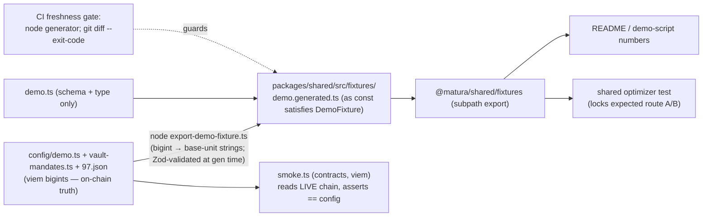
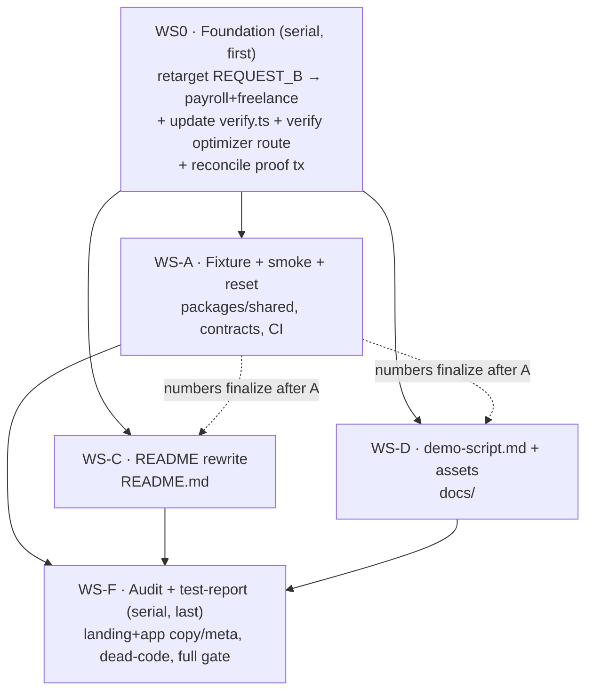

# 📚 Judge & 3-Minute Demo Readiness

> **Scope guardrail:** clarity + reproducibility only. **No new product feature.** Documentation,
> copy, and demo-reliability tooling (fixture, smoke test, reset wrapper) + tests.
> **Never** say "production-ready", fabricate coverage, or fake a transaction.

## Enhancement Summary

**Deepened on:** 2026-09-28 (6 parallel agents: TypeScript, simplicity, architecture, security,
pattern-consistency reviews + external best-practices research).

**Key changes from the deepen pass:**

1. **Cut the in-app fallback mode (former WS-B) entirely** (user decision). Tiers are now **live testnet
   → recorded video**. This removes the largest, most security-sensitive surface (a wallet-app auth
   bypass, a capture tool that would commit a live JWT, prod-leak guards, ~4 test files) at ~zero loss of
   judge-facing value — the smoke gate lowers outage odds and the video covers the RPC-death case.
2. **Fixture is codegen'd as a typed `.ts` const** (`demo.generated.ts`, `as const satisfies DemoFixture`,
   Zod-validated at generation time) behind a **`@matura/shared/fixtures` subpath export** — exactly like
   `@matura/chain`'s `deployments.generated.ts`/`./deployments`. Not a runtime-parsed `.json`, and not on
   the root barrel (keeps the demo artifact out of `apps/api`'s boot graph). This makes the "mirrors the
   ABI/manifest pattern" claim actually true, gives compile-time drift detection via `satisfies`, and
   avoids NodeNext JSON-import friction in the dual CJS/ESM build.
3. **`verify.ts` is now a WS0 blocker** — it hardcodes a parallel copy of Request B (`payroll+stream on
Stable`, :285-305). Retargeting Request B without updating it is a silent single-source-of-truth
   violation that would verify the wrong vault (freelance is Flex-only).
4. Generator = **bare `node`** + plain `writeFileSync` (not `hardhat run`, not atomic-write) so the CI
   freshness gate runs chain-less; template is `gen-deployments.ts`, not `export-abis`.
5. Smoke test tightened: **per-leg** liquidity (Stable ≥ payroll leg, Flex ≥ freelance leg), and trimmed
   to the assertions that actually gate "go".

**New considerations discovered:**

- The committed live proof tx (`0xc753…`) was executed against the _old_ Request B — Beat 5 must
  reconcile (re-execute or re-caption) so the BSCScan link matches the narrated request.
- `@matura/shared` is missing `"sideEffects": false` (chain has it) — add it so the fixture tree-shakes.
- Fixture money fields need `z.string().regex(/^\d+$/)` so a fixture can't encode a non-canonical amount.

---

## Overview

Make the Matura BSC-Testnet MVP legible to hackathon judges and give the operator a **reliable,
reproducible 3-minute demo** driven live against `app.usematura.xyz` → BSC Testnet, with a recorded-video
fallback for network failure. Four deliverables behind one small foundational change, built as **parallel
workstreams**:

1. **README rewrite** (root) — accurate, brand-consistent, numbers reconciled to code.
2. **`docs/demo-script.md`** — a 9-beat, timed, ≤3-minute narrated script with a pre-demo checklist and
   a two-tier fallback plan.
3. **Demo-reliability tooling** — a generated deterministic fixture (single source of truth), a pre-demo
   smoke test, and a one-command local reset wrapper.
4. **Final audit + `docs/test-report.md`** — every claim verified against code, copy/CTA/metadata audit,
   dead-code sweep, and a real, timestamped quality-gate run.

## Problem Statement / Motivation

The repo is technically strong but **not judge-ready**: the root README advertises demo numbers
(`1,000 / 600 / 400`) that contradict the actual seeded state (`20,000 / 15,000 / ~10,000`), there is no
narrated demo script, and no single command to prove the demo is in a good state before presenting. A
judge who cross-checks the README against the live app today will find it lying. This plan closes that gap
without touching protocol behavior.

## Confirmed Decisions

| #   | Decision                                                                                                                                                                                                |
| --- | ------------------------------------------------------------------------------------------------------------------------------------------------------------------------------------------------------- |
| 1   | Primary demo = **live BSC Testnet** (`app.usematura.xyz`); local hardhat stack = reset/rehearsal                                                                                                        |
| 2   | **~~Tiered fallback with in-app recorded mode~~ → REVISED:** two tiers only — **live testnet → recorded video** (`docs/demo-assets/`). The in-app fallback is cut (deepen-pass cost/security analysis). |
| 3   | **Fixture is the single source of truth**, codegen'd from `config/demo.ts`; smoke test asserts chain == fixture                                                                                         |
| 4   | All deliverables in **one plan**, executed as parallel workstreams                                                                                                                                      |
| 5   | Delayed-claim beat = **live-exclude** a real ineligible claim + **optional** local `demo:settle` waterfall                                                                                              |
| 6   | **Request B → `alice-payroll + alice-freelance`** (avoids the recipient-gated `alice-stream` seed skip)                                                                                                 |
| 7   | ~~Fallback flag `NEXT_PUBLIC_DEMO_FALLBACK`~~ — **removed** (WS-B cut)                                                                                                                                  |
| 8   | Leave the **flat text wordmark**; add no logo asset (no-gradient satisfied by construction)                                                                                                             |
| 9   | **Canonical domain = `usematura.xyz` / `app.usematura.xyz`** (live code wins; CLAUDE.md wording is stale)                                                                                               |
| 10  | Audit **adds canonical/OG + `noindex` robots to `apps/app`** (metadata only, not a feature)                                                                                                             |

## Grounded Facts (verified against code)

**Deployed — BSC Testnet (chainId 97), `packages/chain/src/deployments/97.json`, deploymentBlock `133632667`, all 11 verified:**
MockUSDT `0x160d…9377` · IssuerRegistry `0xe28b…b97B` · ClaimRegistry `0x4208…5aA4` ·
VaultRegistry `0xF4d6…FC0e` · MaturaRouter `0xaA68…D955` · SettlementManager `0x74c2…7783` ·
StableVault `0x897f…37c5` · FlexVault `0x1853…276F` · PayrollSource `0x65A4…3416` ·
FreelanceSource `0x510d…147b0` · StreamSource `0x7d6b…59E8`. Live proof txs are in the gitignored
`docs/deployment-runbook.md` (executeRoute `0xc753cf9…`, settleClaim `0x543555b…` → PAID) — **note: these
predate the Request B retarget; see WS0/WS-D reconciliation.**

**Scenario truth — `packages/contracts/config/demo.ts`:** `ALICE_PAYROLL` (:114, face 20,000, PAYROLL,
due 30d) · `ALICE_FREELANCE` (:121, face 15,000, FREELANCE_ESCROW, due 45d) · `ALICE_STREAM` (:129,
deposit 20,000 → ~10,000 vested) · array `ALICE_CLAIMS` (:139). `REQUEST_A` (:214, target 4,800 /
maxFace 6,000 / `["alice-payroll"]`) · `REQUEST_B` (:222, target 24,000 / maxFace 40,000 /
`["alice-payroll","alice-stream"]` → **to be retargeted**). `SCRIPTED_DEPLOYER_PAYROLL` (:151, face
1,000). Mandates — `packages/contracts/config/vault-mandates.ts`: `STABLE_MANDATE` (:30, PAYROLL|STREAM,
50 bps, cap 500k) · `FLEX_MANDATE` (:42, all types, 150 bps, cap 1M). **Feasibility of Decision 6:**
freelance (FREELANCE_ESCROW) is accepted only by Flex; payroll routes to the cheaper Stable — so Request
B genuinely spans two vaults. `seed.ts:341-348` iterates `eligibleClaims` generically → **no reseed
needed**; but `verify.ts:285-305` hardcodes the old pairing → **must be updated (WS0)**.

**Three conflicting number sets to reconcile:** real config (20k/15k/20k) vs README table
(`README.md:138-140`, wrong 1k/600/400) vs landing hero _illustration_ (`page.tsx:354,399-403`,
10k/7.6k/2.4k — keep as clearly-labeled illustration, do not present as live data).

**Existing precedents to copy (verified):** codegen → typed `.ts` const + freshness gate:
`packages/chain/scripts/gen-deployments.ts` → `deployments.generated.ts`, gate at `.github/workflows/ci.yml:57-65`
("Contracts ABI export is fresh", "Deployment manifest loader is fresh"). Generators use plain
`writeFileSync` + sorted keys + bare `node` (`export-abis.ts`, `gen-deployments.ts`). Contracts reach
chain artifacts by **relative fs path, not a module import** (`scripts/lib/read-manifest.ts:8-18`).
Chain-state check template: `packages/contracts/scripts/check-deployment.ts` / `preflight.ts` (hardhat-viem
read-only + `createChecklist`; `MIN_DEPLOYER_BALANCE_WEI`). `@matura/chain` has `"sideEffects": false` +
a `./deployments` subpath export; `@matura/shared` does **not** yet (add it).

## Solution Architecture

### Fixture flow (single source of truth, codegen'd `.ts` — exact `@matura/chain` precedent)

**Why codegen'd `.ts`, not runtime `.json` (deepen correction):** the repo's established pattern for
generated data is _emit a typed `.ts` const and import that; never import JSON at runtime_
(`gen-deployments.ts:56-59` → `export const MANIFESTS = {…} as const satisfies Record<…>`; runtime imports
the `.ts`, only the parity _test_ `.parse()`es raw JSON). This gives (a) Zod validation at generation time
(fail-fast in the generator), (b) **compile-time** re-validation on every `tsc` via `as const satisfies
DemoFixture` — a judge running `pnpm typecheck` catches drift, (c) zero runtime parse cost, (d) no
side-effectful barrel, and (e) no NodeNext `import … with { type: "json" }` friction in the dual
CJS/ESM build consumed by CJS `apps/api`. `@matura/contracts` writes the file by **relative fs path**
(like the ABI/manifest writes) — no `@matura/*` module edge — and the generator **must not import
`@matura/shared`** (would create a real cycle + break the no-deps rule).

**Subpath export, not root barrel:** expose the fixture at `@matura/shared/fixtures` (mirror chain's
`./deployments`), add a `tsup` entry for it, and add `"sideEffects": false` to `@matura/shared`. This keeps
the demo-only artifact out of `apps/api`'s module graph (it imports `OptimizeResult` from the root barrel)
and lets it tree-shake out of any bundle that doesn't use it.

### One fixture (the in-app recorded fixture is gone with WS-B)

`packages/shared/src/fixtures/demo.generated.ts` — **derived** from `config/demo.ts` by the generator;
consumed by the smoke test (indirectly — smoke reads `config/demo.ts` directly, same package), the shared
optimizer test, and as the cited source for README/demo-script numbers. Money as **base-unit integer
strings** validated by `z.string().regex(/^\d+$/)`.

## Workstream Dependency Graph (parallel execution)

**Conflict map (verified single-owner):** `packages/contracts/package.json` and `.github/workflows/ci.yml`
→ **WS-A only** (WS-F only _runs_ `verify`, edits nothing in CI). `packages/shared/src/index.ts` + tsup
config + package.json → WS-A only. `apps/app/src/app/layout.tsx` → **WS-F only now** (banner is gone;
WS-F adds canonical/OG). WS-C (`README.md`) and WS-D (`docs/`) are directory-disjoint. WS-C/WS-D may be
**drafted** in parallel with WS-A but their **numbers finalize after WS-A** lands the fixture + optimizer
result. WS-F runs last (verifies the others, runs the gate).

---

## WS0 · Foundation (serial — must land first)

**Files:** `packages/contracts/config/demo.ts`, **`packages/contracts/scripts/verify.ts`**, a scratch
optimizer check, `docs/deployment-runbook.md` (proof-tx note, gitignored).

- [x] Retarget `REQUEST_B` (`config/demo.ts:222`) `eligibleClaims` → `["alice-payroll","alice-freelance"]`;
      keep `targetAdvance 24000 / maxTotalFace 40000`. Update the NatSpec comment.
- [x] **Update `verify.ts:285-305`** (the top deepen blocker): rewrote the Request-B block to **derive its
      claim set from `REQUEST_B.eligibleClaims`** and finance each claim on its cheapest allowed vault
      (payroll → Stable, freelance → Flex; freelance is Flex-only), asserting `Σadvance ≥ targetAdvance` and
      `Σface ≤ maxTotalFace`. Runs in `demo:local`/`verify:bsc-testnet`.
- [x] Verify the optimizer/route feasibility for the new Request B — confirmed on a real chain via
      `demo:local` → `verify:local`: **all checks pass**, incl. "request B: eligible claims each financeable
      on an allowed vault, within maxTotalFace, reaching targetAdvance" and "no single claim advance reaches
      targetAdvance". (Pure-optimizer route-shape is locked in WS-A A2; real vault pricing is on-chain here.)
- [x] Confirm `seed.ts` still seeds `alice-freelance` ELIGIBLE (escrow path) — verified: all three claims
      seed ELIGIBLE, no testnet reseed required.
- [ ] **Reconcile the live proof tx** (operator step, demo-time): the committed `executeRoute 0xc753…` ran
      the _old_ Request B. At rehearsal, **re-execute Request B on testnet** to capture a matching proof tx,
      OR caption Beat 5 so the BSCScan link's route matches the narrated request. Carried into WS-D Beat 5.
      _(Cannot run here — needs testnet keys/funds.)_

**Acceptance:** `REQUEST_B` = payroll+freelance; `verify.ts` asserts the correct two-vault span and passes;
optimizer returns a deterministic 2-leg route ≥ target; proof-tx reconciliation decided; no contract change.

---

## WS-A · Fixture + smoke test + reset wrapper _(dir: `packages/shared`, `packages/contracts`, CI)_

### A1 — Codegen'd deterministic fixture

**Files:** `packages/contracts/scripts/export-demo-fixture.ts` (new, template = `gen-deployments.ts`),
`packages/shared/src/fixtures/demo.generated.ts` (new, generated), `packages/shared/src/fixtures/demo.ts`
(new — Zod schema + type only), `packages/shared/src/fixtures/index.ts` (barrel),
`packages/shared/package.json` (subpath export + `"sideEffects": false`), `packages/shared/tsup.config.ts`
(entry), `packages/contracts/package.json` (script), `.prettierignore` (add the generated file).

- [ ] Generator reads `ALICE_CLAIMS`, `REQUEST_A`, `REQUEST_B`, `SCRIPTED_DEPLOYER_PAYROLL`,
      `STABLE_MANDATE`, `FLEX_MANDATE`, and the 97 manifest (via `lib/read-manifest.ts`); emits a typed
      `.ts` const `export const DEMO_FIXTURE = { … } as const satisfies DemoFixture` with **money as
      base-unit integer strings** (bigint `.toString()` inline — **do NOT import `@matura/shared`**),
      deterministic key order. Validate with `DemoFixture.parse(...)` **inside the generator** before
      writing ("validated, not trusted", like `gen-deployments.ts`).
- [ ] Wire `"contracts:export-demo-fixture": "node scripts/export-demo-fixture.ts"` (**bare node**, not
      `hardhat run` — the CI gate runs chain-less). Plain `writeFileSync` (not atomic-write). Document the
      fs-write coupling in a header comment like `read-manifest.ts:8-18`; note the file is a **build-time
      input inlined by tsup**, not a runtime asset.
- [ ] `demo.ts`: Zod schema + `type DemoFixture = z.infer<…>`. Money/unit fields
      `z.string().regex(/^\d+$/)`. No runtime `.parse` of the generated const at import (the `satisfies`
      gives compile-time safety).
- [ ] `package.json` subpath export `"./fixtures": { types/import/require → dist/fixtures/* }`;
      `tsup` entry `["src/index.ts", "src/fixtures/index.ts"]`; add `"sideEffects": false`. Do **not** add
      the fixture to `src/index.ts` (keep it off `apps/api`'s boot path).
- [ ] Add `packages/shared/src/fixtures/demo.generated.ts` to `.prettierignore` (else the diff gate flaps).

### A2 — CI freshness gate + optimizer-lock test

**Files:** `.github/workflows/ci.yml` (new step after "Deployment manifest loader is fresh"),
`packages/shared/src/fixtures/__tests__/demo-fixture.test.ts` (new — `__tests__/` is correct for shared).

- [ ] CI step (exact `ci.yml:57-65` shape): `pnpm --filter @matura/contracts contracts:export-demo-fixture`
      then `git diff --exit-code packages/shared/src/fixtures/demo.generated.ts`.
- [ ] Test: (a) `DemoFixture.parse(DEMO_FIXTURE)` validates; (b) run the `@matura/shared` `optimizeRoute` on
      Request A and B and assert the expected route shape (**A** = single leg on Stable, advance ≥ 4,800;
      **B** = 2 legs spanning Stable + Flex, advance ≥ 24,000). This locks the numbers cited in README/script.

### A3 — Pre-demo smoke test

**Files:** `packages/contracts/scripts/smoke.ts` (new; structure after `check-deployment.ts`/`preflight.ts`),
`packages/contracts/package.json` (`smoke:bsc-testnet`, `smoke:local`). Reuse `lib/read-manifest.ts`,
`lib/network-guard.ts` (`assertChainId`), `lib/checklist.ts` (`createChecklist`), `lib/preflight.ts`
(`MIN_DEPLOYER_BALANCE_WEI`). Optional API-liveness leg reuses `apps/e2e/scripts/smoke-api.mjs`.

The **gating** assertions (exit nonzero on miss; **poll with retries** for read-lag; pin reads to the
`finalized` tag so a lagging public-RPC node can't false-fail):

- [ ] chainId == 97; bytecode present at each **demo-relevant** manifest address (router, vaults, sources,
      settlement, claim/issuer registries).
- [ ] `alice-payroll` **and** `alice-freelance` claims are **ELIGIBLE**.
- [ ] **Per-leg available liquidity:** Stable ≥ payroll-leg advance **and** Flex ≥ freelance-leg advance
      (Request B splits across two vaults — a single `≥ 24,000` check would test the wrong pool).
- [ ] Operator/deployer **tBNB balance ≥ `MIN_DEPLOYER_BALANCE_WEI`** (faucet-dry guard; pre-fund ahead of
      the demo, never faucet live).
- [ ] (Optional) if `SMOKE_API_URL` set, run `smoke-api.mjs` for API liveness (`/health`, `/vaults` shape).
- [ ] Print a green/red `createChecklist` summary; nonzero exit blocks "go".
- [ ] _Dropped per deepen (P3):_ the static vault-mandate == config assertion (static-vs-static, mandates
      don't change between demos; a wrong route would surface it anyway).

**Note:** the optimizer-output assertion lives in the A2 shared test (pure, no chain); contracts can't
import the optimizer. Together = "demo-ready".

### A4 — One-command local reset wrapper

**Files:** `packages/contracts/package.json` (`demo:reset:full`).

- [ ] `"demo:reset:full": "pnpm run demo:reset && pnpm run demo:local"` (matches the `&&`-chained `pnpm run`
      idiom of `demo:local`) → wipe → deploy → seed → verify, leaving Alice's claims freshly seeded. Local
      only; document that `hardhat node` must be running for the deploy/seed/verify legs (the wipe runs
      chain-down).

**WS-A acceptance:** fixture codegen's deterministically & the freshness gate is green; `tsc` catches any
`satisfies` drift; the A2 optimizer test pins A/B numbers; `smoke:bsc-testnet` exits 0 against a healthy
stack and nonzero when a claim is ineligible / a leg's liquidity is short / balance is low;
`demo:reset:full` restores a seeded local chain in one command.

---

## WS-C · README rewrite _(dir: root `README.md`)_

**Files:** `README.md` (rewrite in place; preserve the good existing structure).

All claims traceable to code, brand-consistent (**Matura Account / Claims / Vaults / Router / Protocol**),
domain = `usematura.xyz`:

- [ ] One-sentence product statement (verbatim): _"Matura is a best-execution liquidity router that
      aggregates verified future payments, splits only the amount a user needs, and finds the most efficient
      liquidity across competing onchain pools."_
- [ ] Problem · product distinction · **why blockchain is necessary**.
- [ ] Architecture **mermaid** diagram + monorepo map (`apps/{api,app,landing,e2e,e2e-stack}`,
      `packages/{contracts,chain,shared,ui,eslint-config,typescript-config}`).
- [ ] Local quick start with **exact commands** (Node 24 keg-only note; `hardhat node` +
      `demo:local`/`demo:reset:full`; app/api/landing dev; `smoke:bsc-testnet`).
- [ ] BSC-Testnet deployment table (11 addresses from `97.json`) + BSCScan explorer links + deploymentBlock.
- [ ] **Demo scenarios A & B** — reconciled to the fixture (A = 4,800 partial payroll slice on Stable;
      B = 24,000 across payroll + freelance spanning Stable + Flex). **Fix the wrong table at
      `README.md:138-140`.**
- [ ] Contract responsibilities + **trust assumptions** (link `docs/threat-model.md`, `SECURITY.md`).
- [ ] Security / regulatory / **synthetic-data** disclaimers.
- [ ] Test commands + **current results** (filled from WS-F's `docs/test-report.md`; no fabricated %).
- [ ] Explicit scope: **implemented / mocked / future** (the honest-limitations list below).
- [ ] Independent **`usematura.xyz` / `app.usematura.xyz`** deployment note (two Next apps; landing static +
      wallet-free; app wallet-connected).

**WS-C acceptance:** every number matches the fixture; every address matches `97.json`; brand terms
consistent; a judge can go zero → running locally → understanding A/B from the README alone.

---

## WS-D · `docs/demo-script.md` + fallback assets _(dir: `docs/`)_

**Files:** `docs/demo-script.md` (new), `docs/demo-assets/.gitkeep` (tier-2 video slot).
Cross-reference `docs/demo-operator-checklist.md`.

Nine beats, timed **≤3:00**, optional segments marked `(optional)`:

- [ ] **Pre-demo checklist + two-tier fallback plan** — run `smoke:bsc-testnet` (must be green);
      `demo:reset:full` for local rehearsal; tier-1 live → **tier-2 recorded video** in `docs/demo-assets/`.
      Include the SIWE/CORS baked-domain gotcha and "pre-fund the demo wallet" as checklist items.
- [ ] Beat 1 — 30-second problem statement.
- [ ] Beat 2 — Portfolio: Alice's **three claims** (payroll 20k / freelance 15k / stream ~10k).
- [ ] Beat 3 — **Request A**: partial payroll slice (4,800) → cheapest vault (Stable).
- [ ] Beat 4 — **Request B**: multi-claim route (24,000) across **two sources** (payroll + freelance),
      spanning Stable + Flex.
- [ ] Beat 5 — Wallet confirmation + **BSC Testnet BSCScan proof** (executeRoute tx — **must match the
      retargeted Request B**, per WS0 reconciliation).
- [ ] Beat 6 — Settlement waterfall + **retained user balance** _(optional: narrated from local
      `demo:settle` since testnet has no time-travel)_.
- [ ] Beat 7 — **Delayed-claim exception**: live, show the router **excluding** an ineligible/not-yet-due
      claim; _(optional)_ reference the local settle waterfall for the delayed-obligor path.
- [ ] Beat 8/9 — Closing differentiation: **aggregation · partial slicing · best execution**.
- [ ] A timing table (seconds per beat) proving the core path fits 3:00 with optional beats excluded.
- [ ] **Record the tier-2 video** during rehearsal (operator step; store in `docs/demo-assets/`).

**WS-D acceptance:** rehearsable, ≤3:00 on the core path, every on-screen number matches the fixture, every
beat demonstrable on live testnet as written, and the Beat-5 proof link matches the narrated request.

---

## WS-F · Final audit + `docs/test-report.md` _(serial — runs LAST)_

**Files:** `docs/test-report.md` (new), `apps/landing/src/**` (copy/brand fixes),
`apps/app/src/app/layout.tsx` + new `apps/app/src/app/robots.ts` (metadata, Decision 10), various
(dead-code removal). Reuse `apps/e2e/scripts/lib/scan-bundle.mjs` `SECRET_VALUE_PATTERNS` + `check-app-secrets.mjs`.

- [ ] **Verify every README claim against code** (addresses, commands, numbers, scenarios).
- [ ] **Copy-voice audit** (outcome-led, specific, non-hype, accurate about the testnet prototype) across
      landing + app; fix **brand capitalization drift** ("Matura protocol/account" → canonical caps).
- [ ] **CTA / canonical / OG / footer / cross-domain** verification against `apps/landing/src/lib/site.ts`
      (`usematura.xyz` / `app.usematura.xyz`); confirm **baked `NEXT_PUBLIC_*` match API SIWE/CORS
      exact-match** (the exact-match 401 trap). Ensure landing hero numbers are labeled _illustrative_.
- [ ] **App metadata (Decision 10):** add canonical + OG + `robots.ts` (`noindex`) to `apps/app`.
- [ ] **Logo/gradient check:** record "flat text wordmark, 0 gradients, 0 SVG logo assets" (add nothing).
- [ ] **Dead-code / stale-artifact sweep** — remove only provably-unreferenced, behavior-neutral artifacts;
      **report-don't-delete** any workspace package unless build/lint/test proves zero importers.
- [ ] **Clean-checkout command verification** — every `pnpm` workspace command runs from a fresh clone
      (document any needing Docker/Postgres/Node 24).
- [ ] **Secret scan** — reuse `SECRET_VALUE_PATTERNS` verbatim (postgres URL, JWT `eyJ…`, key-adjacent hex);
      **add `Bearer\s+[A-Za-z0-9._-]{20,}`**; **no blanket `0x[0-9a-f]{64}`** (bytecode/tx-hash false positives).
- [ ] **Full quality-gate run → `docs/test-report.md`** with real **timestamps + environment** (Node/pnpm
      versions, OS). Run the **CI `verify`** sequence (build → lint → typecheck → test → contracts:compile →
      contracts:test → ABI-freshness → manifest-freshness → **demo-fixture-freshness** → Playwright), not
      just `turbo test`. **Record actual pass/fail; do not fabricate coverage.**
- [ ] Flag CLAUDE.md's stale `matura.xyz` wording for a follow-up (out of scope to fix here).

**WS-F acceptance:** report shows a real, timestamped gate run; no README claim contradicts code; copy is
brand-consistent; app has canonical/OG/noindex; no behavior changed by the sweep.

---

## SpecFlow — Gap & Edge-Case Analysis (failure modes → mitigations)

| Severity | Failure mode                                              | Mitigation (where handled)                                                                                                                         |
| -------- | --------------------------------------------------------- | -------------------------------------------------------------------------------------------------------------------------------------------------- |
| **High** | Public RPC dies mid-demo                                  | Tier-2 **recorded video** (WS-D `docs/demo-assets/`); smoke gate lowers odds; _(optional, not required)_ multi-provider RPC failover in `wagmi.ts` |
| **High** | Wallet won't connect / wrong network                      | Checklist verifies MetaMask + network before start (WS-D)                                                                                          |
| **High** | Deployer out of tBNB (faucet dry)                         | Smoke asserts operator balance ≥ threshold (WS-A A3); pre-fund + checklist faucet step                                                             |
| **High** | Baked domain ≠ API SIWE/CORS → every login 401            | Audit verifies exact-match baked env (WS-F); checklist item (WS-D)                                                                                 |
| **High** | `verify.ts` verifies stale Request B (SSOT violation)     | WS0 updates `verify.ts` to derive from config + route freelance→Flex                                                                               |
| **Med**  | Beat-5 proof tx doesn't match retargeted Request B        | WS0 re-execute or re-caption; reconcile in runbook + WS-D                                                                                          |
| **Med**  | Indexer lag: execute confirmed but Activity still pending | `useExecutionPoll` handles 404-while-indexing; smoke polls projected state; script notes "wait for indexer"                                        |
| **Med**  | `RouteExpired` from block-timestamp skew                  | Re-optimize (fresh pinned block); script note                                                                                                      |
| **Med**  | A vault leg drawn down below its Request B advance        | Smoke asserts **per-leg** available liquidity (WS-A A3); `demo:reset:full` for local                                                               |
| **Med**  | Generated fixture drifts from `config/demo.ts`            | CI freshness gate + `satisfies` compile check (WS-A A1/A2)                                                                                         |
| **Low**  | Consumed-but-unexpired RouteIntent blocks re-submit       | Prune only expired intents (existing); re-optimize mints fresh intent                                                                              |

**Sequencing risk:** WS0 is genuinely upstream (fixture + README + script + seed + verify all read Request
B). Do it first, alone. WS-A finalizes the numbers WS-C/WS-D cite (draft-parallel, finalize-after-A). WS-F
last, and it re-enters `apps/app/layout.tsx` for metadata.

## Non-Functional Requirements / Constraints

- [ ] **No `any`** anywhere (type-aware ESLint). Fixture safety via `as const satisfies DemoFixture` +
      gen-time `.parse`; smoke/optimizer via typed reads.
- [ ] **Money = base-unit integer strings** at every boundary (`/^\d+$/`); bigints only inside contracts/chain.
- [ ] **Parallelizable**: WS-A/C/D concurrent after WS0, disjoint directories (see conflict map).
- [ ] **Tests updated/created**: shared fixture schema + optimizer-lock test; `verify.ts` change exercised by
      `demo:local`/`verify:bsc-testnet`; smoke script is itself a check.
- [ ] Landing stays **wallet-free**; `@matura/shared` stays **framework-free Zod** (generator writes plain
      `.ts` into it, exactly like the ABI/manifest gates); `@matura/contracts` keeps **no `@matura/*` deps**
      (generator must not import shared).
- [ ] Commits authored `arjunamarcelino` only — **no Claude co-author trailer**; per-workstream commits.

## Risks (ordered by severity)

1. **`verify.ts` SSOT violation** — retargeting Request B without updating `verify.ts:285-305` makes
   `demo:local`/`verify:bsc-testnet` assert the wrong (stale, wrong-vault) pairing. **WS0 blocker.**
2. **Baked-domain SIWE/CORS 401** — any `usematura.xyz` inconsistency between the frontend build and API env
   breaks every demo login; only a rebuild fixes it. WS-F verifies exact-match; checklist includes a live login.
3. **Fixture/optimizer drift** — if the freshness gate or A2 optimizer test is weak, README numbers can lie
   again. A2 must actually run the optimizer and assert the route, not just parse the const.
4. **Beat-5 proof tx mismatch** — the committed `0xc753…` ran the old Request B; unreconciled, the demo's
   explorer proof contradicts the narrated request.
5. **Dead-code sweep changes behavior** — report-don't-delete for packages; run the full gate after.

## Known Limitations (must appear in README + test-report — do not soften)

Mock issuers · mock stablecoin (6-dp MockUSDT) · permissioned vaults · **no legal assignment** of
receivables · **no real KYC/KYB** · **no fiat rails** · limited optimizer scale (bounded exact search +
greedy fallback) · **unaudited contracts** · **BSC-Testnet only**. **Not production-ready.**

## References

**Internal (file:line):**

- Scenario truth: `packages/contracts/config/demo.ts:114-227`, `config/vault-mandates.ts:30-53`
- **`verify.ts:285-305`** (WS0 blocker), `seed.ts:341-348` (generic eligibleClaims iteration)
- Manifest: `packages/chain/src/deployments/97.json`
- Codegen precedent: `packages/chain/scripts/gen-deployments.ts` → `deployments.generated.ts`;
  `packages/chain/src/deployments.ts` (typed accessors); `packages/chain/src/__tests__/manifest-parity.test.ts`
- Generator conventions: `packages/contracts/scripts/export-abis.ts`; fs-coupling doc `scripts/lib/read-manifest.ts:8-18`
- CI gate shape: `.github/workflows/ci.yml:57-65`
- Smoke template: `packages/contracts/scripts/check-deployment.ts`, `preflight.ts` (`MIN_DEPLOYER_BALANCE_WEI`,
  `createChecklist`, `assertChainId`); optional API leg `apps/e2e/scripts/smoke-api.mjs`
- Secret patterns: `apps/e2e/scripts/lib/scan-bundle.mjs`, `check-app-secrets.mjs`
- Domain SoT: `apps/landing/src/lib/site.ts:18-33`; wrong README table `README.md:138-140`
- `@matura/shared` missing `"sideEffects": false`: `packages/shared/package.json`; `tsup.config.ts`

**Institutional learnings (`docs/solutions/`):** cross-stack-e2e-harness (poll projected state, `isSettled`
authoritative, `finalized`-pinned reads, read-lag polling) · bsc-testnet-live-deploy-easypanel
(baked-domain SIWE/CORS exact-match; post-settle read-lag; local `test` ≠ CI `verify`) ·
security-hardening-adversarial-suite (scan for secret **values** not names; share prod bootstrap) ·
best-execution-router-mirror (one shared mirror; PinnedReads determinism).

**External best-practice (2024-2026):** regenerate-and-`git diff --exit-code` fixture gate (Stellar-Index
#1360 false-green trap; nl2time #28) · wallet-free pre-demo smoke: chainId + bytecode-present + seeded
balances/liquidity + intents-unconsumed (credit-ledger #11) · `finalized`-tag pinned reads for public-RPC
pool skew (wwtracker #351) · pre-fund wallets, never faucet live · honest labeled fallback that serves
**real recorded data**, never fabricated tx (Hrutu34 #42).

## Final Response Template (deliverable at end of `/workflows:work`)

Produce: final repository tree · implemented capabilities · explicit mocks/non-goals · deployed chain +
addresses · commands + **real** test results · the exact 3-minute demo path · remaining risks ordered by
severity. **Do not say production-ready.**
